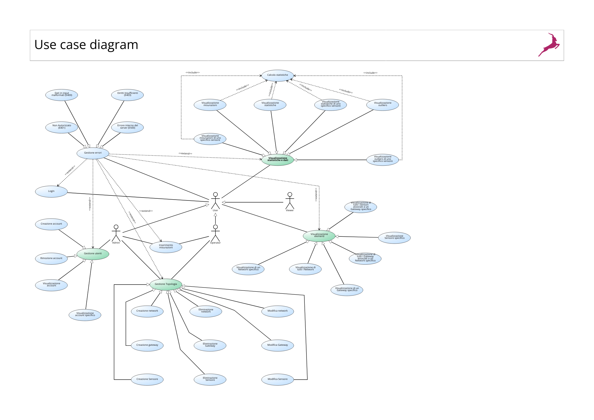
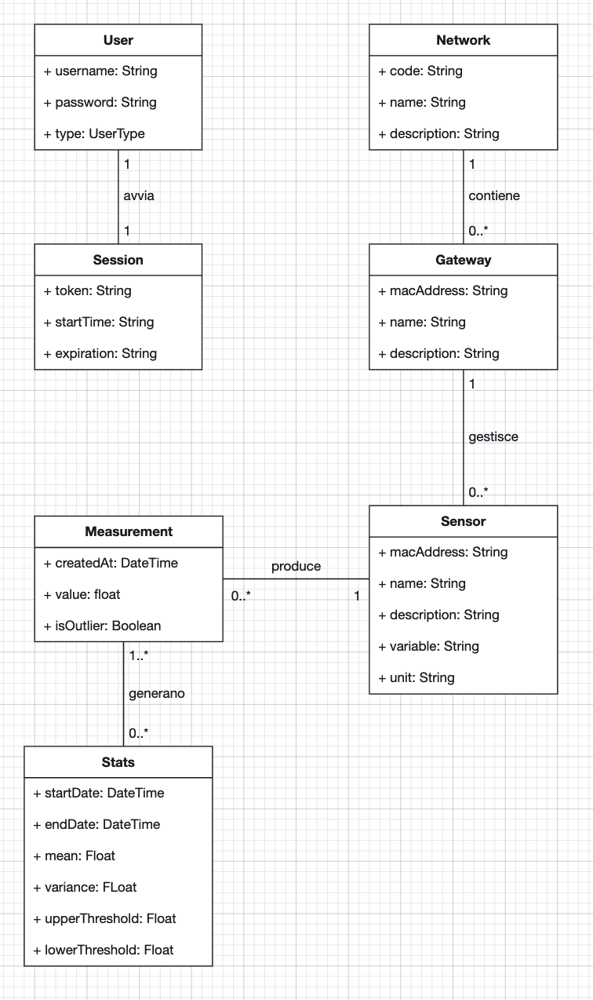
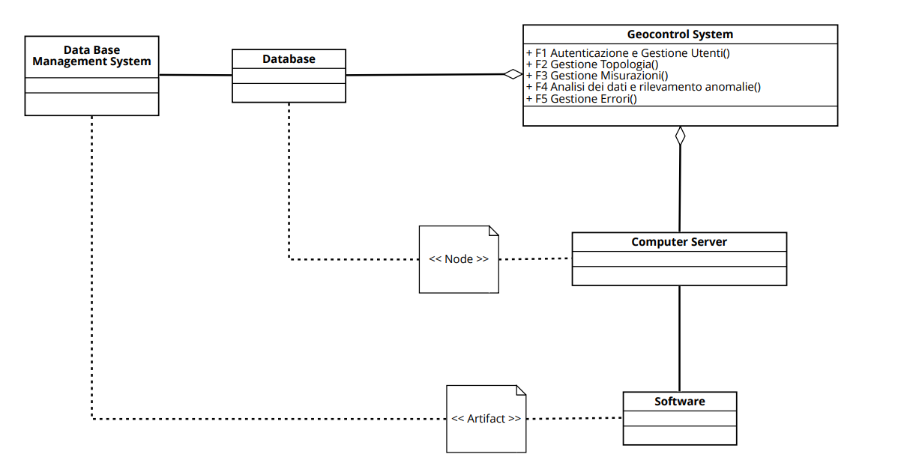

# Requirements Document - GeoControl

Date: 18/04/2025

Version: V1 - description of Geocontrol as described in the swagger

| Version number | Change |
| :------------: | :----: |
|     V1.1           |        |

# Contents

- [Requirements Document - GeoControl](#requirements-document---geocontrol)
- [Contents](#contents)
- [Informal description](#informal-description)
- [Business model](#business-model)
- [Stakeholders](#stakeholders)
- [Context Diagram and interfaces](#context-diagram-and-interfaces)
  - [Context Diagram](#context-diagram)
  - [Interfaces](#interfaces)
- [Stories and personas](#stories-and-personas)
- [Functional and non functional requirements](#functional-and-non-functional-requirements)
  - [Functional Requirements](#functional-requirements)
  - [Non Functional Requirements](#non-functional-requirements)
- [Use case diagram and use cases](#use-case-diagram-and-use-cases)
  - [Use case diagram](#use-case-diagram)
    - [Use Case 1, Login (FR1.1)](#use-case-1-login-fr11)
      - [Scenario 1.1](#scenario-11)
      - [Scenario 1.2](#scenario-12)
    - [Use Case 2, Creazione Account (FR1.2)](#use-case-2-creazione-account-fr12)
      - [Scenario 2.1](#scenario-21)
      - [Scenario 2.2](#scenario-22)
    - [Use Case 3, Rimozione Account (FR1.3)](#use-case-3-rimozione-account-fr13)
      - [Scenario 3.1](#scenario-31)
      - [Scenario 3.2](#scenario-32)
    - [Use Case 4, Visualizzazione Elenco Account (FR1.4)](#use-case-4-visualizzazione-elenco-account-fr14)
      - [Scenario 4.1](#scenario-41)
    - [Use Case 5, Visualizzazione Specifico Account (FR1.5)](#use-case-5-visualizzazione-specifico-account-fr15)
      - [Scenario 5.1](#scenario-51)
    - [Use Case 6, Creazione Network (FR2.1.1)](#use-case-6-creazione-network-fr211)
      - [Scenario 6.1](#scenario-61)
      - [Scenario 6.2](#scenario-62)
    - [Use Case 7, Modifica Network (FR2.1.2)](#use-case-7-modifica-network-fr212)
      - [Scenario 7.1](#scenario-71)
      - [Scenario 7.2](#scenario-72)
      - [Scenario 7.3](#scenario-73)
    - [Use Case 8, Eliminazione Network (FR2.1.3)](#use-case-8-eliminazione-network-fr213)
      - [Scenario 8.1](#scenario-81)
      - [Scenario 8.2](#scenario-82)
    - [Use Case 9, Visualizzazione di tutti i Network (FR2.1.4)](#use-case-9-visualizzazione-di-tutti-i-network-fr214)
      - [Scenario 9.1](#scenario-91)
    - [Use Case 10, Visualizzazione di un Network specifico (FR2.1.4.1)](#use-case-10-visualizzazione-di-un-network-specifico-fr2141)
      - [Scenario 10.1](#scenario-101)
      - [Scenario 10.2](#scenario-102)
    - [Use Case 11, Creazione Gateway (FR2.2.1)](#use-case-11-creazione-gateway-fr221)
      - [Scenario 11.1](#scenario-111)
      - [Scenario 11.2](#scenario-112)
      - [Scenario 11.3](#scenario-113)
    - [Use Case 12, Modifica Gateway (FR2.2.2)](#use-case-12-modifica-gateway-fr222)
      - [Scenario 12.1](#scenario-121)
      - [Scenario 12.2](#scenario-122)
      - [Scenario 12.3](#scenario-123)
    - [Use Case 13, Eliminazione Gateway (FR2.2.3)](#use-case-13-eliminazione-gateway-fr223)
      - [Scenario 13.1](#scenario-131)
      - [Scenario 13.2](#scenario-132)
    - [Use Case 14, Visualizzazione di un Gateway specifico (FR2.2.4)](#use-case-14-visualizzazione-di-un-gateway-specifico-fr224)
      - [Scenario 14.1](#scenario-141)
      - [Scenario 14.2](#scenario-142)
    - [Use Case 15, Visualizzazione di tutti i Gateway associati a un Network specifico (FR2.2.4.1)](#use-case-15-visualizzazione-di-tutti-i-gateway-associati-a-un-network-specifico-fr2241)
      - [Scenario 15.1](#scenario-151)
      - [Scenario 15.2](#scenario-152)
    - [Use Case 16, Creazione Sensore (FR2.3.1)](#use-case-16-creazione-sensore-fr231)
      - [Scenario 16.1](#scenario-161)
      - [Scenario 16.2](#scenario-162)
      - [Scenario 16.3](#scenario-163)
    - [Use Case 17, Modifica Sensore (FR2.3.2)](#use-case-17-modifica-sensore-fr232)
      - [Scenario 17.1](#scenario-171)
      - [Scenario 17.2](#scenario-172)
      - [Scenario 17.3](#scenario-173)
    - [Use Case 18, Eliminazione Sensore (FR2.3.3)](#use-case-18-eliminazione-sensore-fr233)
      - [Scenario 18.1](#scenario-181)
      - [Scenario 18.2](#scenario-182)
    - [Use Case 19, Visualizzazione Sensore specifico (FR2.3.4)](#use-case-19-visualizzazione-sensore-specifico-fr234)
      - [Scenario 19.1](#scenario-191)
      - [Scenario 19.2](#scenario-192)
    - [Use Case 20, Visualizzazione di tutti i Sensori associati a un Gateway specifico (FR2.3.4.1)](#use-case-20-visualizzazione-di-tutti-i-sensori-associati-a-un-gateway-specifico-fr2341)
      - [Scenario 20.1](#scenario-201)
      - [Scenario 20.2](#scenario-202)
    - [Use Case 21, Visualizzazione misurazioni di un network (FR3.2.1, FR3.2.2, FR3.2.3)](#use-case-21-visualizzazione-misurazioni-di-un-network-fr321-fr322-fr323)
      - [Scenario 21.1](#scenario-211)
      - [Scenario 21.2](#scenario-212)
      - [Scenario 21.3](#scenario-213)
      - [Scenario 21.4](#scenario-214)
    - [Use Case 22, Visualizzazione misurazioni di uno specifico sensore (FR3.2.4, FR3.2.5, FR3.2.6)](#use-case-22-visualizzazione-misurazioni-di-uno-specifico-sensore-fr324-fr325-fr326)
      - [Scenario 22.1](#scenario-221)
      - [Scenario 22.2](#scenario-222)
      - [Scenario 22.3](#scenario-223)
      - [Scenario 22.4](#scenario-224)
    - [Use Case 23, Inserimento misurazioni (FR3.3)](#use-case-23-inserimento-misurazioni-fr33)
      - [Scenario 23.1](#scenario-231)
      - [Scenario 23.2](#scenario-232)
    - [Use Case 24, Calcolo Statistiche (FR4.1)](#use-case-24-calcolo-statistiche-fr41)
      - [Scenario 24.1](#scenario-241)
    - [Use Case 25, Visualizzazione Statistiche per un dato Network (FR4.2.1, FR4.2.2)](#use-case-25-visualizzazione-statistiche-per-un-dato-network-fr421-fr422)
      - [Scenario 25.1](#scenario-251)
      - [Scenario 25.2](#scenario-252)
    - [Use Case 26, Visualizzazione Statistiche per un dato Sensore (FR4.2.3, FR4.2.4)](#use-case-26-visualizzazione-statistiche-per-un-dato-sensore-fr423-fr424)
      - [Scenario 26.1](#scenario-261)
      - [Scenario 26.2](#scenario-262)
    - [Use Case 27, Visualizzazione Outliers per un dato Network (FR4.3.1, FR4.3.2)](#use-case-27-visualizzazione-outliers-per-un-dato-network-fr431-fr432)
      - [Scenario 27.1](#scenario-271)
      - [Scenario 27.2](#scenario-272)
    - [Use Case 28, Visualizzazione Outliers per un dato Sensore (FR4.3.3, FR4.3.4)](#use-case-28-visualizzazione-outliers-per-un-dato-sensore-fr433-fr434)
      - [Scenario 28.1](#scenario-281)
      - [Scenario 28.2](#scenario-282)
    - [Use Case E400, Dati in input malformati (FR5.1)](#use-case-e400-dati-in-input-malformati-fr51)
      - [Scenario E400.1](#scenario-e4001)
    - [Use Case E401, Non Autorizzato (FR5.2)](#use-case-e401-non-autorizzato-fr52)
      - [Scenario E401.1](#scenario-e4011)
    - [Use Case E403, Diritti Insufficienti (FR5.3)](#use-case-e403-diritti-insufficienti-fr53)
      - [Scenario E403.1](#scenario-e4031)
    - [Use Case E500, Errore interno del server (FR5.4)](#use-case-e500-errore-interno-del-server-fr54)
      - [Scenario E500.1](#scenario-e5001)
- [Glossary](#glossary)
- [System Design](#system-design)
- [Deployment Diagram](#deployment-diagram)

# Informal description

GeoControl is a software system designed for monitoring physical and environmental variables in various contexts: from hydrogeological analyses of mountain areas to the surveillance of historical buildings, and even the control of internal parameters (such as temperature or lighting) in residential or working environments.

# Business Model

Per rendere il sistema sostenibile e scalabile, la soluzione scelta è stata quella di combinare Public-Private Partnership (PPP), SaaS(Software as a Service) e Vendita Diretta.
In questo modo, si copre il finanziamento iniziale con fondi pubblici e si garantiscono entrate continue con il SaaS, lasciando ai clienti la scelta tra acquistare o noleggiare i sensori.

1 Fase Iniziale: Finanziamento Pubblico (PPP)

L’Unione delle Comunità Montane del Piemonte finanzia lo sviluppo iniziale.
In cambio, l’ente pubblico riceve una licenza perpetua per l’uso del software.
Il progetto nasce senza rischio finanziario per GeoControl.

2 Fase di Espansione: SaaS + Vendita Diretta

I clienti pagano un abbonamento che include l’acquisizione dei sensori e gateway direttamente.

# Stakeholders

|                              Stakeholder name                              |                                              Description                                               |
| :------------------------------------------------------------------------: | :----------------------------------------------------------------------------------------------------: |
|                               UNCEM Piemonte                               |     Committente, in quanto interessata alla gestione dello stato idrogeologico dei suoi territori      |
| Entità pubbliche che richiedono monitoraggio continuo dei parametri fisici |         Gestione delle analisi idrogeologiche delle aree o sorveglianza degli edifici storici          |
|  Entità private che richiedono monitoraggio continuo dei parametri fisici  | Controllo dei parametri interni (come temperatura o luminosità) in ambienti residenziali o industriali |
|                       Fornitori di gateway e sensori                       |                        Forniscono i dispositivi fisici che geocontrol utilizza                         |
|                                Competitors                                 |                    Implicato nel fornire soluzioni nella stessa nicchia di mercato                     |
|                             Geocontrol office                              |                   Responsabili per il design, la gestione e lo sviluppo del sistema                    |
|                      Residenti nelle aree monitorate                       |              Beneficiano indirettamente del monitoraggio del territorio di cui risiedono               |

# Context Diagram and interfaces

## Context Diagram

Admin, operator e viewer rappresentano i clienti che usufruiscono del servizio (UNCEM Piemonte, entità pubbliche e private) offerto dal software.

## Interfaces

|         Actor         |                Logical Interface                |                Physical Interface                 |
| :-------------------: | :---------------------------------------------: | :-----------------------------------------------: |
|      Actor Admin      | Graphical User Interface command line interface |                 Screen, Keyboard                  |
|    Actor Operator     | Graphical User Interface command line interface |                 Screen, Keyboard                  |
|     Actor Viewer      |                    GUI, API                     | Screen, Keyboard , Internet Connection (via APIs) |
| Actor Gateway/sensor  |              API per l'invio dati               |          Internet Connection (via APIs)           |

# Stories and personas

Persona1: lavoratore presso UNCEM, laureato in geologia, 35. 
Storia: Lavora presso UNCEM e utilizza GeoControl per monitorare il rischio idrogeologico nelle valli alpine. Necessita dati costantemente aggiornati per il monitoraggio dei corsi d'acqua.

Persona2: storica d'arte, lavora presso una fondazione privata che si occupa della conservazione di edifici storici. Storia: Necessita di segnalazioni occasionali ma tempestive in caso di anomalie strutturali che superino dei valori di soglia.

Persona3: tecnico del Comune. 
Storia: Usufruisce dei servizi per monitorare il funzionamento dell'illuminazione pubblica. Non ha esperienze pregresse riguardo l'utilizzo di apparati informatici; ha bisogno di un'interfaccia intuitiva e semplice da utilizzare.

Persona4: lavoratore presso un'azienda agricola. 
Storia: Sfrutta i servizi di monitoraggio per mantenere costanti temperatura, umidità e illuminazione per le serre. Uitlizza un server, che riceve i dati da GeoControl via API

# Functional and non functional requirements

## Functional Requirements

|    ID     | Description                                                                             |
| :-------: | --------------------------------------------------------------------------------------- |
|  **FR1**  | **Autenticazione e gestione utenti**                                                    |
|   FR1.1   | Login                                                                                   |
|   FR1.2   | Creazione Account                                                                       |
|   FR1.3   | Rimozione Account                                                                       |
|   FR1.4   | Visualizzazione Elenco Account                                                          |
|   FR1.5   | Visualizza Specifico Account                                                            |
|  **FR2**  | **Gestione Topologia**                                                                  |
|   FR2.1   | Gestione Network                                                                        |
|  FR2.1.1  | Creazione Network                                                                       |
|  FR2.1.2  | Modifica Network                                                                        |
|  FR2.1.3  | Eliminazione Network                                                                    |
|  FR2.1.4  | Visualizzazione di tutti i Network                                                      |
| FR2.1.4.1 | Visualizzazione di un Network specifico                                                 |
|   FR2.2   | Gestione Gateway                                                                        |
|  FR2.2.1  | Creazione Gateway                                                                       |
|  FR2.2.2  | Modifica Gateway                                                                        |
|  FR2.2.3  | Eliminazione Gateway                                                                    |
|  FR2.2.4  | Visualizzazione di un Gateway specifico                                                 |
| FR2.2.4.1 | Visualizzazione di tutti i Gateway associati a un Network specifico                     |
|   FR2.3   | Gestione Sensore                                                                        |
|  FR2.3.1  | Creazione Sensore                                                                       |
|  FR2.3.2  | Modifica Sensore                                                                        |
|  FR2.3.3  | Eliminazione Sensore                                                                    |
|  FR2.3.4  | Visualizzazione Sensore specifico                                                       |
| FR2.3.4.1 | Visualizzazione di tutti i Sensori associati a un Gateway specifico                     |
|   FR2.4   | Associazioni                                                                            |
|  FR2.4.1  | Aggiunta del Gateway a Network                                                          |
|  FR2.4.2  | Rimozione del Gateway da Network                                                        |
|  FR2.4.3  | Aggiunta sensore al Gateway                                                             |
|  FR2.4.4  | Rimozione sensore dal Gateway                                                           |
|  **FR3**  | **Gestione Misurazioni**                                                                |
|   FR3.2   | Visualizzazione misurazioni                                                             |
|  FR3.2.1  | Visualizzazione misurazioni di un network                                               |
|  FR3.2.2  | Visualizzazione filtrata misurazioni di un network                                      |
|  FR3.2.3  | Visualizzazione misurazioni di un network con fuso orario locale                        |
|  FR3.2.4  | Visualizzazione misurazioni di uno specifico sensore                                    |
|  FR3.2.5  | Visualizzazione filtrata misurazioni di uno specifico sensore                           |
|  FR3.2.6  | Visualizzazione misurazioni di uno specifico sensore con fuso orario locale             |
|   FR3.3   | Inserimento misurazioni                                                                 |
|  **FR4**  | **Analisi dei dati e rilevamento anomalie**                                             |
|   FR4.1   | Calcolo della media delle misurazioni in un dato intervallo temporale                   |
|   FR4.2   | Calcolo della varianza delle misurazioni in un dato intervallo temporale                |
|   FR4.3   | Calcolo delle soglie (superiore e inferiore) per identificare potenziali valori anomali |
|  FR4.3.1  | Calcolo sogliaSuperiore = μ + 2σ                                                        |
|  FR4.3.2  | Calcolo sogliaInferiore = μ - 2σ                                                        |
|   FR4.4   | Identificazione outlier                                                                 |
|   FR4.5   | Visualizzazione statistiche                                                             |
|  FR4.5.1  | Visualizzazione statistiche per un insieme di Sensori di un Network specifico           |
|  FR4.5.2  | Visualizzazione statistiche per uno specifico sensore                                   |
|  FR4.5.3  | Visualizzazione outliers per un insieme di Sensori di un Network specifico              |
|  FR4.5.4  | Visualizzazione outliers per uno specifico sensore                                      |
|  **FR5**  | **Gestione Errori**                                                                     |
|   FR5.1   | E400- Dati in input malformati                                                          |
|   FR5.2   | E401- Non Autorizzato                                                                   |
|   FR5.3   | E403- Diritti Insufficienti                                                             |
|   FR5.4   | E500- Errore interno del server                                                         |

## Non Functional Requirements

|  ID  | Type (efficiency, reliability, ..) |                                                                         Description                                                                          | Refers to |
| :--: | :--------------------------------: | :----------------------------------------------------------------------------------------------------------------------------------------------------------: | :-------: |
| NFR1 |            Affidabilità            |                                                     Non più di 6 misurazioni perse per sensore all’anno                                                      |    FR3    |
| NFR2 |            Affidabilità            |                            Implementazione di meccanismi di ritrasmissione automatica in caso di errore nella ricezione dei dati                             |    FR3    |
| NFR3 |            Prestazioni             |                               Il sistema deve garantire prestazioni stabili anche in presenza di molteplici reti e dispositivi                               |    FR3    |
| NFR4 |             Sicurezza              |                              L’accesso al sistema deve essere regolato tramite autenticazione e autorizzazione basata su ruoli                               |    FR1    |
| NFR6 |            Portabilità             |              Compatibilità con diversi modelli di sensori e protocolli di comunicazione, senza necessità di modifiche sostanziali al software.               | FR2, FR3  |
| NFR7 |             Efficienza             |                                              Acquisizione e registrazione dei dati dei sensori ogni 10 minuti.                                               |   FR3.1   |
| NFR8 |           Manutenibilità           | Il sistema deve essere modulare e facilmente estendibile, consentendo interventi di aggiornamento o correzione senza compromettere il funzionamento globale. |   Tutti   |
| NFR9 |            Portabilità             |                           Il sistema deve poter convertire e memorizzare tutti i timestamp in formato ISO 8601 con fuso orario UTC                           | FR2, FR3  |

# Use case diagram and use cases

## Use case diagram

### Use Case 1, Login (FR1.1)

| Actors Involved  |                utente                |
| :--------------: | :----------------------------------: |
|   Precondition   |        L'utente non è loggato        |
|  Post condition  |          L'utente è loggato          |
| Nominal Scenario |             Scenario 1.1             |
|     Variants     |               Nessuna                |
|    Exceptions    | Scenario 1.2, UCE400, UCE401, UCE500 |

#### Scenario 1.1

|  Scenario 1.1  |                                        Login riuscito `(Code 200)`                                        |
| :------------: | :-------------------------------------------------------------------------------------------------------: |
|  Precondition  |                                           L'utente è registrato                                           |
| Post condition |                                            L'utente è loggato                                             |
|     Step#      |                                                Descrizione                                                |
|       1        |                                  Sistema: Chiede `username`, `password`.                                  |
|       2        |                                 utente: Inserisce `username`, `password`.                                 |
|       3        |                                      Sistema: Legge i dati inseriti.                                      |
|       4        |                               Sistema: Dato il nome utente, cerca l’utente.                               |
|       5        | Sistema: Recupera la password, la confronta con quella fornita. I dati coincidono, l’utente è autorizzato |
|       6        |                         Sistema: Associa allo user un token di accesso temporaneo                         |

#### Scenario 1.2

| Scenario 1.3   |                         L'utente non è registrato `(Code 404)`                          |
| -------------- | :-------------------------------------------------------------------------------------: |
| Precondition   |                                L'utente non è registrato                                |
| Post condition |                                 L'utente non è loggato                                  |
| Step#          |                                       Descrizione                                       |
| 1              |                         Sistema: Chiede `username`, `password`.                         |
| 2              |                         User: Inserisce `username`, `password`.                         |
| 3              |                             Sistema: Legge i dati inseriti.                             |
| 4              | Sistema: Cerca l’utente dato il nome utente. Utente non trovato. Utente non autorizzato |
| 5              |                    Sistema: mostra a schermo un messaggio di errore                     |

### Use Case 2, Creazione Account (FR1.2)

| Actors Involved  |                    Admin                     |
| :--------------: | :------------------------------------------: |
|   Precondition   |          L'utente non ha un account          |
|  Post condition  |              Utente registrato               |
| Nominal Scenario |                 Scenario 2.1                 |
|     Variants     |                   Nessuna                    |
|    Exceptions    | Scenario 2.2, UCE400, UCE401, UCE403, UCE500 |

#### Scenario 2.1

|  Scenario 2.1  |                                                     Registrazione `(Code 201)`                                                     |
| :------------: | :--------------------------------------------------------------------------------------------------------------------------------: |
|  Precondition  |                                                     L'utente non ha un account                                                     |
| Post condition |                                                         Utente registrato                                                          |
|     Step#      |                                                            Descrizione                                                             |
|       1        |                                             Admin: Clicca il pulsante di registrazione                                             |
|       2        |                                  Sistema: Verifica la presenza di un token valido nella richiesta                                  |
|       3        |                                               Sistema: Rileva che il token è valido                                                |
|       4        |                                          Sistema: Chiede `username`, `password`, `ruolo`                                           |
|       5        |                                          Admin: Inserisce `username`, `password`, `ruolo`                                          |
|       6        |                                                   Sistema: Legge i dati immessi                                                    |
|       7        | Sistema: Controlla che i dati immessi non siano associati a nessun account esistente. Non esiste già un account per i dati immessi |
|       8        |                                       Sistema: Crea un nuovo user e lo memorizza nel sistema                                       |
|       9        |                                         Sistema: mostra a schermo un messaggio di successo                                         |

#### Scenario 2.2

|  Scenario 2.2  |                         Username già in uso `(Code 409)`                          |
| :------------: | :-------------------------------------------------------------------------------: |
|  Precondition  |  L'admin tenta di creare un account utente con un identificativo già esistente   |
| Post condition |                        Il sistema restituisce l'errore 409                        |
|     Step#      |                                    Descrizione                                    |
|       1        | Admin: Effettua una richiesta di creazione account, inserendo i dati nel sistema |
|       2        |            Sistema: riceve i dati e verifica l'esistenza della risorsa            |
|       3        |           Sistema:Trova la risorsa nel sistema e ne blocca la creazione           |
|       4        |                 Sistema: Restituisce il messaggio di errore 409.                  |

### Use Case 3, Rimozione Account (FR1.3)

| Actors Involved  |                   Admin                   |
| :--------------: | :---------------------------------------: |
|   Precondition   | Almeno un utente è registrato nel sistema |
|  Post condition  |         L'acount utente eliminato         |
| Nominal Scenario |               Scenario 3.1                |
|     Variants     |                  Nessuna                  |
|    Exceptions    |   Scenario 3.2, UCE401, UCE403, UCE500    |

#### Scenario 3.1

|  Scenario 3.1  |                       Eliminazione Utente `(Code 204)`                        |
| :------------: | :---------------------------------------------------------------------------: |
|  Precondition  |                   Almeno un utente è registrato nel sistema                   |
| Post condition |                           Account utente eliminato                            |
|     Step#      |                                  Descrizione                                  |
|       1        |               Admin: Clicca il pulsante di eliminazione account               |
|       2        |       Sistema: Verifica la presenza di un token valido nella richiesta        |
|       3        |                     Sistema: Rileva che il token è valido                     |
|       4        |                          Sistema: Chiede `username`                           |
|       5        |                          Admin: Inserisce `username`                          |
|       6        |                         Sistema: Legge i dati immessi                         |
|       7        | Sistema: Controlla che i dati immessi siano associati a un account esistente. |
|       8        |                          Sistema: Elimina l'account                           |
|       9        |              Sistema: mostra a schermo un messaggio di successo               |

### Scenario 3.2

| Scenario 3.2   |                      L'utente non è registrato `(Code 404)`                       |
| -------------- | :-------------------------------------------------------------------------------: |
| Precondition   |                 L’utente da eliminare non è presente nel sistema                  |
| Post condition |           Nessun account eliminato, Il sistema restituisce l'errore 404           |
| Step#          |                                    Descrizione                                    |
| 1              |                 Admin: Clicca il pulsante di eliminazione account                 |
| 2              |         Sistema: Verifica la presenza di un token valido nella richiesta          |
| 3              |                       Sistema: Rileva che il token è valido                       |
| 4              |                            Sistema: Chiede `username`                             |
| 5              |                            Admin: Inserisce `username`                            |
| 6              |                           Sistema: Legge i dati immessi                           |
| 7              | Sistema: Cerca l’utente con lo `username` specificato, ma non trova alcun account |
| 8              |                  Sistema: Restituisce il messaggio di errore 404                  |

### Use Case 4, Visualizzazione Elenco Account (FR1.4)

| Actors Involved  |                                   Admin                                   |
| :--------------: | :-----------------------------------------------------------------------: |
|   Precondition   |                             L’admin è loggato                             |
|  Post condition  | L’admin visualizza la lista completa degli account registrati nel sistema |
| Nominal Scenario |                               Scenario 4.1                                |
|     Variants     |                                  Nessuna                                  |
|    Exceptions    |                   Scenario 4.2, UCE401, UCE403, UCE500                    |

#### Scenario 4.1

|  Scenario 4.1  |                Visualizzazione elenco account `(Code 200)`                |
| :------------: | :-----------------------------------------------------------------------: |
|  Precondition  |                             L’admin è loggato                             |
| Post condition | L’admin visualizza la lista completa degli account registrati nel sistema |
|     Step#      |                                Descrizione                                |
|       1        |              Admin: Clicca il pulsante di Visualizza Account              |
|       2        |     Sistema: Verifica la presenza di un token valido nella richiesta      |
|       3        |                   Sistema: Rileva che il token è valido                   |
|       4        | Sistema: Recupera dal database la lista completa degli account registrati |
|       6        |          Sistema: mostra a schermo l'elenco degli utenti trovati          |

### Use Case 5, Visualizzazione Specifico Account (FFR1.5)

| Actors Involved  |                      Admin                      |
| :--------------: | :---------------------------------------------: |
|   Precondition   |                L’admin è loggato                |
|  Post condition  | L’admin visualizza uno specifico account Utente |
| Nominal Scenario |                  Scenario 5.1                   |
|     Variants     |                     Nessuna                     |
|    Exceptions    |      Scenario 5.2, UCE401, UCE403, UCE500       |

#### Scenario 5.1

|  Scenario 5.1  |          Visualizzazione specifico account `(Code 200)`          |
| :------------: | :--------------------------------------------------------------: |
|  Precondition  |                        L’admin è loggato                         |
| Post condition |         L’admin visualizza uno specifico account Utente          |
|     Step#      |                           Descrizione                            |
|       1        |         Admin: Accede alla sezione di Visualizza Account         |
|       2        |     Admin: Inserisce lo username dell’utente da visualizzare     |
|       3        | Sistema: Verifica la presenza di un token valido nella richiesta |
|       4        |              Sistema: Rileva che il token è valido               |
|       5        |    Sistema: Recupera dal database l'account utente richiesto     |
|       6        |       Sistema: mostra a schermo l'account utente richiesto       |

### Use Case 6, Creazione Network (FR2.1.2)

| Actors Involved  |                              Admin, Operator                              |
| :--------------: | :-----------------------------------------------------------------------: |
|   Precondition   |          L'utente è autenticato come Admin o Operator           |
|  Post condition  |                       La rete è creata nel sistema                        |
| Nominal Scenario |                               Scenario 6.1                               |
|     Variants     |                                   Nessuna                                   |
|    Exceptions    |  Scenario 6.2, UCE400, UCE401, UCE403, UCE500        |

#### Scenario 6.1

| Scenario 6.1  |                                                               Creazione rete con successo `(Code 201)`                                                               |
| :------------: | :------------------------------------------------------------------------------------------------------------------------------------------------------------------: |
|  Precondition  |                                                             L'utente è autenticato come Admin o Operator                                                             |
| Post condition |                                                            La rete viene creata ed è visibile nel sistema                                                            |
|     Step#      |                                                                             Description                                                                              |
|       1        |                                                     Utente: Accede alla sezione "Gestione Reti" dell’interfaccia                                                     |
|       2        |                                                                 Utente: Seleziona "Crea nuova rete"                                                                  |
|       3        | Utente: Inserisce `code`, `name`, `description` nel modulo. Eventuali campi annidati Gateway o Sensor, se presenti, verranno ignorati. |
|       4        |                                                                 Utente: invia il modulo di creazione                                                                 |
|       5        |                                            Sistema: Valida i dati, registra la rete e restituisce il codice `201 Created`                                            |

#### Scenario 6.2

| Scenario 6.2  |                             Codice rete già esistente `(409 ConflictError)`                              |
| :------------: | :------------------------------------------------------------------------------------------------------: |
|  Precondition  |                      L'utente è autenticato, ma il codice inserito è già registrato                      |
| Post condition |                                        Nessuna rete viene creata                                         |
|     Step#      |                                               Description                                                |
|       1        |                          L'utente compila il modulo con un codice già esistente                          |
|       2        |                                  L'utente invia il modulo di creazione                                   |
|       3        | Il sistema valida i dati, rileva la duplicazione e restituisce il codice di errore `(409 ConflictError)` |

### Use Case 7, Modifica Network (FR2.1.2)

| Actors Involved  |                                     Admin, Operator                                      |
| :--------------: | :--------------------------------------------------------------------------------------: |
|   Precondition   |                  L'utente è autenticato come Admin o Operator                  |
|  Post condition  |                           La rete viene aggiornata nel sistema                           |
| Nominal Scenario |                                      Scenario 11.1                                       |
|     Variants     |                                           None                                           |
|    Exceptions    |  Scenario 7.2, Scenario 7.3, UCE400, UCE401, UCE403, UCE500                            |

#### Scenario 7.1

| Scenario 7.1  |                                                 Modifica rete con successo `(204 No Content)`                                                  |
| :------------: | :--------------------------------------------------------------------------------------------------------------------------------------------: |
|  Precondition  |                                                  L'utente è autenticato come Admin o Operator                                                  |
| Post condition |                                                      La rete viene aggiornata nel sistema                                                      |
|     Step#      |                                                                  Description                                                                   |
|       1        |                                         L'utente accede alla sezione "Gestione Reti" dell’interfaccia                                          |
|       2        |                                                   L'utente seleziona una rete da modificare                                                    |
|       3        | L'utente modifica i campi `code`, `name`, `description` nel modulo. Eventuali campi annidati Gateway o Sensor vengono ignorati e non aggiornati |
|       4        |                                                L'utente invia il modulo di modifica della rete                                                 |
|       5        |                              Il sistema valida i dati, aggiorna la rete e restituisce il codice `204 No Content`                               |

#### Scenario 7.2

| Scenario 7.2  |                Rete non trovata `(404 NotFoundError)`                 |
| :------------: | :-------------------------------------------------------------------: |
|  Precondition  |      L’utente inserisce un codice rete non esistente nel sistema      |
| Post condition |                   Nessuna modifica viene applicata                    |
|     Step#      |                              Description                              |
|       1        |         L'utente seleziona o inserisce un codice rete errato          |
|       2        | Il sistema non trova la rete e restituisce errore `404 NotFoundError` |

#### Scenario 7.3

| Scenario 7.3  |             Codice rete già esistente `(409 ConflictError)`              |
| :------------: | :----------------------------------------------------------------------: |
|  Precondition  |       L’utente modifica il codice della rete con uno già esistente       |
| Post condition |                     Nessuna modifica viene applicata                     |
|     Step#      |                               Description                                |
|       1        | L'utente inserisce un nuovo `code` che identifica una rete già esistente |
|       2        | Il sistema rileva il conflitto e restituisce errore `409 ConflictError`  |

### Use Case 8, Eliminazione Network (FR2.1.3)

| Actors Involved  |                      Admin, Operator                       |
| :--------------: | :--------------------------------------------------------: |
|   Precondition   |   L'utente è autenticato come Admin o Operator   |
|  Post condition  |            La rete viene eliminata dal sistema             |
| Nominal Scenario |                       Scenario 12.1                        |
|     Variants     |                            None                            |
|    Exceptions    |  Scenario 12.2, UCE401, UCE403, UCE500                     |

#### Scenario 8.1

| Scenario 8.1  |                       Eliminazione rete con successo `(204 No Content)`                        |
| :------------: | :--------------------------------------------------------------------------------------------: |
|  Precondition  |                          L'utente è autenticato come Admin o Operator                          |
| Post condition |                              La rete viene eliminata dal sistema                               |
|     Step#      |                                          Description                                           |
|       1        |                 L'utente accede alla sezione "Gestione Reti" dell’interfaccia                  |
|       2        |                    L'utente seleziona una rete esistente e preme "Elimina"                     |
|       3        | Il sistema riceve la richiesta, verifica il parametro `networkCode` e procede all'eliminazione |
|       4        |                       Il sistema restituisce il codice `204 No Content`                        |

#### Scenario 8.2

| Scenario 8.2  |                     Rete non trovata `(404 NotFoundError)`                     |
| :------------: | :----------------------------------------------------------------------------: |
|  Precondition  |               L’utente specifica un `networkCode` non esistente                |
| Post condition |                          Nessuna rete viene eliminata                          |
|     Step#      |                                  Description                                   |
|       1        | L'utente invia la richiesta DELETE con un codice rete non presente nel sistema |
|       2        |     Il sistema non trova la rete e restituisce errore `404 NotFoundError`      |

### Use Case 9, Visualizzazione di tutti i Network (FR2.1.4)

| Actors Involved  |             Admin, Operator, Viewer             |
| :--------------: | :---------------------------------------------: |
|   Precondition   |     L'utente è autenticato con token valido     |
|  Post condition  | L'elenco delle reti viene restituito all’utente |
| Nominal Scenario |                  Scenario 13.1                  |
|     Variants     |                      None                       |
|    Exceptions    |          UCE401, UCE500                         |

#### Scenario 9.1

| Scenario 9.1  |                 Recupero lista reti con successo `(200 OK)`                 |
| :------------: | :-------------------------------------------------------------------------: |
|  Precondition  |                   L'utente è autenticato con token valido                   |
| Post condition |    Il sistema restituisce una lista (anche eventualmente vuota) di reti     |
|     Step#      |                                 Description                                 |
|       1        | L'utente accede alla sezione "Reti" o invia una richiesta GET a `/networks` |
|       2        |                         Il sistema valida il token                          |
|       3        |       Il sistema restituisce la lista delle reti con codice `200 OK`        |

### Use Case 10, Visualizzazione di un Network specifico (FR2.1.4.1)

| Actors Involved  |               Admin, Operator, Viewer               |
| :--------------: | :-------------------------------------------------: |
|   Precondition   |       L'utente è autenticato con token valido       |
|  Post condition  | I dettagli della rete vengono restituiti all’utente |
| Nominal Scenario |                    Scenario 14.1                    |
|     Variants     |                        None                         |
|    Exceptions    |      Scenario 14.2, UCE401, UCE500                  |

#### Scenario 10.1

| Scenario 10.1  |            Recupero rete con successo `(200 OK)`             |
| :------------: | :----------------------------------------------------------: |
|  Precondition  |           L'utente è autenticato con token valido            |
| Post condition |         Il sistema restituisce i dettagli della rete         |
|     Step#      |                         Description                          |
|       1        | L'utente invia una richiesta GET a `/networks/{networkCode}` |
|       2        |         Il sistema riceve e interpreta la richiesta          |
|       3        |                  Il sistema valida il token                  |
|       4        | Il sistema restituisce i dati della rete con codice `200 OK` |

#### Scenario 10.2

| Scenario 10.2  |               Rete non trovata `(404 NotFoundError)`                |
| :------------: | :-----------------------------------------------------------------: |
|  Precondition  |     Il `networkCode` specificato non corrisponde ad alcuna rete     |
| Post condition |                    Nessuna rete viene restituita                    |
|     Step#      |                             Description                             |
|       1        | L'utente invia una richiesta GET con un `networkCode` non esistente |
|       2        |          Il sistema non trova alcuna rete con quel codice           |
|       3        |          Il sistema restituisce errore `404 NotFoundError`          |

### Use Case 11, Creazione Gateway (FR2.2.1)

| Actors Involved  |                Admin, Operator                |
| :--------------: | :-------------------------------------------: |
|   Precondition   | L'utente è autenticato con token come Admin o Operator |
|  Post condition  |            Il gateway viene creato nel sistema            |
| Nominal Scenario |                  Scenario 15.1                 |
|     Variants     |                     None                      |
|    Exceptions    |  Scenario 15.2, Scenario 15.3, UCE400, UCE401, UCE403, UCE500 |

#### Scenario 11.1

| Scenario 11.1  |                                    Creazione gateway con successo `(201 Created)`                                      |
| :------------: | :--------------------------------------------------------------------------------------------------------------------: |
|  Precondition  |                                    L’utente è autenticato come Admin o Operator                                        |
| Post condition |                                 Il gateway viene creato e risulta visibile nel sistema                                 |
|     Step#      |                                                   Description                                                          |
|       1        |                         Utente: Accede alla sezione "Reti" e seleziona la rete di interesse                            |
|       2        |                                     Utente: seleziona "Crea nuovo gateway"                                             |
|       3        | Utente: Compila i campi `macAddress`, `name`, `description`                                                            |
|       4        |                                         Utente: Invia la richiesta di creazione                                        |
|       5        |                  Sistema: Valida i dati, registra il gateway e restituisce il codice `201 Created`                     |

#### Scenario 11.2

| Scenario 11.2  |             Network non trovato `(404 NotFoundError)`             |
| :------------: | :--------------------------------------------------------------: |
|  Precondition  | L’utente fa una richiesta di creazione su un `networkCode` inesistente |
| Post condition |                  Nessun gateway viene creato                     |
|     Step#      |                           Description                            |
|       1        |Utente: Seleziona un `networkCode` non presente nel sistema     |
|       2        | Sistema: Non trova la rete e restituisce `404 NotFoundError`   |

#### Scenario 11.3

| Scenario 11.3  |            MAC address già esistente `(409 ConflictError)`           |
| :------------: | :-----------------------------------------------------------------: |
|  Precondition  | L’utente inserisce un `macAddress` gateway già presente nel sistema |
| Post condition |                  Nessun gateway viene creato                        |
|     Step#      |                             Description                            |
|       1        |   Utente: Compila il modulo con un `macAddress` associato già ad un Gateway esistente         |
|       2        | Sistema: Valida i dati, rileva la duplicazione e riporta un errore `(409 ConflictError)` |

### Use Case 12, Modifica Gateway (FR2.2.2)

| Actors Involved  |                Admin, Operator                |
| :--------------: | :-------------------------------------------: |
|   Precondition   | L'utente è autenticato con token come Admin o Operator |
|  Post condition  |            Il gateway viene aggiornato nel sistema            |
| Nominal Scenario |                  Scenario 16.1                 |
|     Variants     |                     None                      |
|    Exceptions    |  Scenario 16.2, Scenario 16.3, UCE400, UCE401, UCE403, UCE500 |

#### Scenario 12.1

| Scenario 12.1  |                                    Modifica gateway con successo `(204 No Content)`                                    |
| :------------: | :----------------------------------------------------------------------------------------------------------------------: |
|  Precondition  |                                     L’utente è autenticato come Admin o Operator                                        |
| Post condition |                            Il gateway viene aggiornato ed è visibile con i dati aggiornati                              |
|     Step#      |                                                       Description                                                        |
|       1        | Utente: Accede all’elenco dei gateway associati a una determinata rete               |
|       2        | Utente: Seleziona un gateway esistente e sceglie l’opzione "Modifica gateway".                                          |
|       3        | Utente: Aggiorna i campi `macAddress`, `name`, `description` |
|       4        | Utente: Invia la richiesta di modifica con i dati aggiornati.                                                   |
|       5        | Sistema: Valida i dati, aggiorna il gateway e restituisce il codice `204 No Content`.                                   |

#### Scenario 12.2

| Scenario 12.2  |           Network/Gateway non trovato `(404 NotFoundError)`            |
| :------------: | :--------------------------------------------------------------------: |
|  Precondition  | Il `networkCode` o il `gatewayMac` specificati non esistono nel sistema |
| Post condition |                 Nessuna modifica viene applicata                       |
|     Step#      |                                  Description                           |
|       1        |   Utente: Seleziona o inserisce un `networkCode` e/o `gatewayMac` inesistenti.  |
|       2        |   Sistema: Non trova l’elemento corrispondente e restituisce `404 NotFoundError`. |

#### Scenario 12.3

| Scenario 12.3  |            MAC address già esistente `(409 ConflictError)`           |
| :------------: | :-----------------------------------------------------------------: |
|  Precondition  | L’utente aggiorna il `macAddress` del gateway con uno già presente nel sistema |
| Post condition |                  Nessun aggiornamento viene applicato               |
|     Step#      |                             Description                             |
|       1        |   Utente: Inserisce nella richiesta un `macAddress` associato a un altro Gateway    |
|       2        |   Sistema: Rileva il conflitto e restituisce `409 ConflictError`.   |

### Use Case 13, Eliminazione Gateway (FR2.2.3)

| Actors Involved  |                Admin, Operator                |
| :--------------: | :-------------------------------------------: |
|   Precondition   | L'utente è autenticato con token come Admin o Operator |
|  Post condition  |            Il gateway viene eliminato dal sistema            |
| Nominal Scenario |                  Scenario 17.1                 |
|     Variants     |                     None                      |
|    Exceptions    |  Scenario 17.2, UCE401, UCE403, UCE500 |

#### Scenario 13.1

| Scenario 13.1  |                           Eliminazione gateway con successo `(204 No Content)`                            |
| :------------: | :-------------------------------------------------------------------------------------------------------: |
|  Precondition  |              L'utente è autenticato come Admin o Operator e il gateway esiste nel sistema                |
| Post condition |                    Il gateway viene eliminato e non risulta più presente nel sistema               |
|     Step#      |                                              Description                                                 |
|       1        | Utente: Accede alla sezione "Gestione Gateway" e seleziona un gateway da eliminare.      |
|       2        | Utente: Esegue l'azione di eliminazione confermando la rimozione.                               |
|       3        | Sistema: Verifica il `networkCode` e il `gatewayMac`, procede all'eliminazione e restituisce `204 No Content`. |

#### Scenario 13.2

| Scenario 13.2  |               Network/Gateway non trovato `(404 NotFoundError)`               |
| :------------: | :--------------------------------------------------------------------------: |
|  Precondition  | Il `networkCode` o il `gatewayMac` specificati non esistono nel sistema       |
| Post condition |                        Nessun gateway viene eliminato                         |
|     Step#      |                                 Description                                   |
|       1        | Utente: Seleziona un `networkCode` o un `gatewayMac` inesistente             |
|       2        | Sistema: Non trova il gateway e restituisce `404 NotFoundError`              |

### Use Case 14, Visualizzazione di un Gateway specifico (FR2.2.4)

| Actors Involved  |            Admin, Operator, Viewer            |
| :--------------: | :-------------------------------------------: |
|   Precondition   |       L'utente è autenticato con token valido |
|  Post condition  |      Il gateway viene visualizzato            |
| Nominal Scenario |                 Scenario 18.1                 |
|     Variants     |                     None                      |
|    Exceptions    | Scenario 18.2,  UCE401, UCE500          |

#### Scenario 14.1

| Scenario 14.1  |                   Visualizzazione gateway con successo `(200 OK)`                   |
| :------------: | :---------------------------------------------------------------------------------: |
|  Precondition  |         L'utente è autenticato come Admin, Operator o Viewer con token valido          |
| Post condition |         Il sistema restituisce i dettagli del gateway con codice `200 OK`           |
|     Step#      |                                      Description                                    |
|       1        | Utente: Accede all’interfaccia di gestione e seleziona la rete di interesse |
|       2        | Utente: Visualizza l’elenco dei gateway di quella rete e sceglie quello desiderato  |
|       3        | Utente: Invia una richiesta per visualizzare il gateway specifico                   |
|       4        | Sistema: Riceve la richiesta, verifica il token, recupera il gateway e restituisce un payload con `200 OK` |

#### Scenario 14.2

| Scenario 14.2  |           Network/Gateway non trovato `(404 NotFoundError)`            |
| :------------: | :--------------------------------------------------------------------: |
|  Precondition  | Il `networkCode` o il `gatewayMac` specificati non esistono nel sistema |
| Post condition |                   Nessun gateway viene restituito                      |
|     Step#      |                                Description                             |
|       1        | Utente: Effettua la richiesta GET con un `networkCode` o `gatewayMac` inesistente |
|       2        | Sistema: Non trova il gateway e restituisce `404 NotFoundError`        |

### Use Case 15, Visualizzazione di tutti i Gateway associati a un Network specifico (FR2.2.4.1)

| Actors Involved  |                Admin, Operator, Viewer                |
| :--------------: | :---------------------------------------------------: |
|   Precondition   |  L'utente è autenticato con token valido (qualsiasi ruolo) |
|  Post condition  | Viene mostrata la lista dei Gateway appartenenti alla rete richiesta |
| Nominal Scenario |                    Scenario 19.1                       |
|     Variants     |                         None                          |
|    Exceptions    |  Scenario 19.2, UCE401, UCE500                  |

#### Scenario 15.1

| Scenario 15.1  |          Recupero elenco gateway con successo `(200 OK)`          |
| :------------: | :--------------------------------------------------------------: |
|  Precondition  |  L'utente è autenticato (Admin, Operator o Viewer) con token valido |
| Post condition |     Il sistema restituisce una lista (anche vuota) di gateway     |
|     Step#      |                           Description                            |
|       1        | Utente: Accede alla sezione "Reti" e seleziona la rete di interesse |
|       2        | Utente: Sceglie l’operazione "Visualizza gateway" per la rete selezionata |
|       3        | Utente: Invia una richiesta GET a `/networks/{networkCode}/gateways` |
|       4        | Sistema: Verifica il token, recupera i gateway associati alla rete e ritorna `200 OK` con la lista |

#### Scenario 15.2

| Scenario 15.2  |          Network non trovato `(404 NotFoundError)`          |
| :------------: | :---------------------------------------------------------: |
|  Precondition  | L'utente specifica un `networkCode` inesistente nel sistema |
| Post condition |         Nessun elenco di gateway viene restituito           |
|     Step#      |                           Description                       |
|       1        | Utente: Seleziona o inserisce un `networkCode` non presente nel sistema |
|       2        | Sistema: Non trova la rete e restituisce `404 NotFoundError` |

### Use Case 16, Creazione Sensore (FR2.3.1)

| Actors Involved  |                Admin, Operator                |
| :--------------: | :-------------------------------------------: |
|   Precondition   | L'utente è autenticato con token come Admin o Operator |
|  Post condition  |            Il sensore viene creato nel sistema           |
| Nominal Scenario |                  Scenario 20.1                 |
|     Variants     |                     None                      |
|    Exceptions    |  Scenario 20.2, Scenario 20.3, UCE400, UCE401, UCE403, UCE500 |

#### Scenario 16.1

| Scenario 16.1  |                                 Creazione sensore con successo `(201 Created)`                                |
| :------------: | :-----------------------------------------------------------------------------------------------------------: |
|  Precondition  |                                    L’utente è autenticato come Admin o Operator                              |
| Post condition |                                   Il sensore viene creato e risulta visibile nel sistema                     |
|     Step#      |                                                    Description                                               |
|       1        | Utente: Accede alla sezione "Gestione Gateway" per il gateway di interesse          |
|       2        | Utente: Seleziona "Crea nuovo sensore"                                                                      |
|       3        | Utente: Compila i campi `macAddress`, `name`, `description`, `variable`, `unit`  |
|       4        | Utente: Invia la richiesta di creazione POST a `/networks/{networkCode}/gateways/{gatewayMac}/sensors`     |
|       5        | Sistema: Valida i dati, registra il nuovo sensore e restituisce il codice `201 Created`                      |

#### Scenario 16.2

| Scenario 16.2  |               Network/Gateway non trovato `(404 NotFoundError)`                |
| :------------: | :---------------------------------------------------------------------------: |
|  Precondition  | L’utente fa una richiesta di creazione su un `networkCode` o `gatewayMac` inesistente |
| Post condition |                          Nessun sensore viene creato                           |
|     Step#      |                                  Description                                   |
|       1        | Utente: Seleziona un `networkCode` o un `gatewayMac` non presente nel sistema  |
|       2        | Sistema: Non trova gli elementi corrispondenti e restituisce `404 NotFoundError` |

#### Scenario 16.3

| Scenario 16.3  |           MAC address già esistente `(409 ConflictError)`            |
| :------------: | :-----------------------------------------------------------------: |
|  Precondition  | L’utente inserisce un `macAddress` già presente come sensore nel sistema |
| Post condition |                  Nessun sensore viene creato                        |
|     Step#      |                             Description                            |
|       1        | Utente: Compila il modulo con un `macAddress` già registrato per un sensore esistente |
|       2        | Sistema: Valida i dati, rileva la duplicazione e riporta un errore `409 ConflictError` |

### Use Case 17, Modifica Sensore (FR2.3.2)

| Actors Involved  |                Admin, Operator                |
| :--------------: | :-------------------------------------------: |
|   Precondition   | L'utente è autenticato con token come Admin o Operator e il sensore esiste sul gateway indicato |
|  Post condition  |            Il sensore viene aggiornato nel sistema            |
| Nominal Scenario |                  Scenario 21.1                 |
|     Variants     |                     None                      |
|    Exceptions    |  Scenario 21.2, Scenario 21.3, UCE400, UCE401, UCE403, UCE500 |

#### Scenario 17.1

| Scenario 17.1  |                           Modifica sensore con successo `(204 No Content)`                            |
| :------------: | :-----------------------------------------------------------------------------------------------------: |
|  Precondition  |             L'utente è autenticato come Admin o Operator e il sensore esistente è referenziato             |
| Post condition |          Il sistema aggiorna il sensore con i dati forniti           |
|     Step#      |                                          Description                                                     |
|       1        | Utente: Accede alla sezione "Gestione Gateway/Sensori" e seleziona il sensore da modificare (identificato da `sensorMac`) |
|       2        | Utente: Aggiorna i campi `macAddress`, `name`, `description`  |
|       3        | Utente: Invia la richiesta PATCH all’endpoint `/networks/{networkCode}/gateways/{gatewayMac}/sensors/{sensorMac}`   |
|       4        | Sistema: Valida i dati, aggiorna il sensore e restituisce il codice `204 No Content`                         |

#### Scenario 17.2

| Scenario 17.2  |          Network/Gateway/Sensor non trovato `(404 NotFoundError)`          |
| :------------: | :-------------------------------------------------------------------------: |
|  Precondition  | Il `networkCode`, `gatewayMac` o `sensorMac` specificati non corrispondono a un elemento esistente |
| Post condition |                      Nessuna modifica viene applicata                    |
|     Step#      |                                Description                                   |
|       1        | Utente: Invia la richiesta PATCH con un `networkCode`, `gatewayMac` o `sensorMac` inesistenti  |
|       2        | Sistema: Non trova l'elemento corrispondente e restituisce `404 NotFoundError`                 |

#### Scenario 17.3

| Scenario 17.3  |           Sensor mac address già in use `(409 ConflictError)`           |
| :------------: | :---------------------------------------------------------------------: |
|  Precondition  | L'utente tenta di aggiornare il sensore assegnandogli un `macAddress` già usato da un altro sensore nel sistema |
| Post condition |                      Nessuna modifica viene applicata                  |
|     Step#      |                             Description                                  |
|       1        | Utente: Invia la richiesta PATCH con un nuovo `macAddress` già usato da un altro sensore nel sistema   |
|       2        | Sistema: Rileva la duplicazione e restituisce `409 ConflictError`        |

### Use Case 18, Eliminazione Sensore (FR2.3.3)

| Actors Involved  |                Admin, Operator                |
| :--------------: | :-------------------------------------------: |
|   Precondition   | L'utente è autenticato con token come Admin o Operator |
|  Post condition  |              Il sensore viene eliminato dal sistema              |
| Nominal Scenario |                  Scenario 22.1                 |
|     Variants     |                     None                      |
|    Exceptions    |  Scenario 22.2, UCE401, UCE403, UCE500 |

#### Scenario 18.1

| Scenario 18.1  |                         Eliminazione sensore con successo `(204 No Content)`                         |
| :------------: | :-----------------------------------------------------------------------------------------------------: |
|  Precondition  |   L'utente è autenticato come Admin o Operator e il sensore da eliminare esiste   |
| Post condition |      Il sistema elimina il sensore       |
|     Step#      |                                             Description                                                  |
|       1        | Utente: Accede alla sezione "Gestione Gateway/Sensori" e individua il sensore da eliminare, identificato da `sensorMac`  |
|       2        | Utente: Invia la richiesta DELETE all’endpoint `/networks/{networkCode}/gateways/{gatewayMac}/sensors/{sensorMac}`      |
|       3        | Sistema: Verifica il token e i parametri ricevuti                                          |
|       4        | Sistema: Elimina il sensore dal sistema e restituisce il codice `204 No Content`             |

#### Scenario 18.2

| Scenario 18.2  |             Network/Gateway/Sensor non trovato `(404 NotFoundError)`              |
| :------------: | :---------------------------------------------------------------------------------: |
|  Precondition  | Il `networkCode`, `gatewayMac` o `sensorMac` specificati non corrispondono a nessun elemento esistente |
| Post condition |                         Nessun sensore viene eliminato                          |
|     Step#      |                                 Description                                         |
|       1        | Utente: Invia la richiesta DELETE usando un `networkCode`, `gatewayMac` o `sensorMac` inesistenti      |
|       2        | Sistema: Non trova l'elemento corrispondente e restituisce `404 NotFoundError`       |

### Use Case 19, Visualizzazione Sensore specifico (FR2.3.4)

| Actors Involved  |         Admin, Operator, Viewer          |
| :--------------: | :--------------------------------------: |
|   Precondition   | L'utente è autenticato con token valido   |
|  Post condition  | Il sistema restituisce i dettagli del sensore richiesto |
| Nominal Scenario |               Scenario 23.1              |
|     Variants     |                  None                  |
|    Exceptions    |  Scenario 23.2, UCE401, UCE500 |

#### Scenario 19.1

| Scenario 19.1  |          Visualizzazione sensore con successo `(200 OK)`          |
| :------------: | :-----------------------------------------------------------------: |
|  Precondition  | L'utente è autenticato (Admin, Operator o Viewer) con token valido    |
| Post condition | Il sistema restituisce il sensore richiesto  |
|     Step#      |                              Description                              |
|       1        | Utente: Invia una richiesta GET all’endpoint `/networks/{networkCode}/gateways/{gatewayMac}/sensors/{sensorMac}` con i parametri corretti. |
|       2        | Sistema: Verifica il token e controlla che i parametri `networkCode`, `gatewayMac` e `sensorMac` siano validi. |
|       3        | Sistema: Recupera i dettagli del sensore e restituisce il sensore richiesto con codice `200 OK`. |

#### Scenario 19.2

| Scenario 19.2  |         Network/Gateway/Sensor non trovato `(404 NotFoundError)`         |
| :------------: | :-------------------------------------------------------------------------: |
|  Precondition  | Il `networkCode`, `gatewayMac` o `sensorMac` specificati non corrispondono a un elemento esistente |
| Post condition |                         Nessun sensore viene restituito                   |
|     Step#      |                                Description                                   |
|       1        | Utente: Invia la richiesta GET con parametri inesistenti o errati.       |
|       2        | Sistema: Non trova il sensore corrispondente e restituisce `404 NotFoundError`. |

### Use Case 20, Visualizzazione di tutti i Sensori associati a un Gateway specifico (FR2.3.4.1)

| Actors Involved  |        Admin, Operator, Viewer         |
| :--------------: | :------------------------------------: |
|   Precondition   | L'utente è autenticato con token valido |
|  Post condition  | Il sistema restituisce la lista dei sensori associati al gateway richiesto |
| Nominal Scenario |           Scenario 24.1               |
|     Variants     |                None                  |
|    Exceptions    |  Scenario 24.2, UCE401, UCE500 |

#### Scenario 20.1

| Scenario 20.1  |               Recupero elenco sensori con successo `(200 OK)`               |
| :------------: | :---------------------------------------------------------------------------: |
|  Precondition  | L'utente è autenticato (Admin, Operator o Viewer) con token valido          |
| Post condition | Il sistema restituisce la lista dei sensori associati al gateway richiesto    |
|     Step#      |                                Description                                    |
|       1        | Utente: Seleziona la rete di interesse e il relativo gateway  |
|       2        | Utente: Invia una richiesta GET all’endpoint `/networks/{networkCode}/gateways/{gatewayMac}/sensors` |
|       3        | Sistema: Riceve la richiesta, verifica il token e i parametri forniti       |
|       4        | Sistema: Recupera la lista dei sensori associati al gateway e la restituisce con codice `200 OK`. |

#### Scenario 20.2

| Scenario 20.2  |         Network/Gateway non trovato `(404 NotFoundError)`         |
| :------------: | :-----------------------------------------------------------------: |
|  Precondition  | Il `networkCode` o il `gatewayMac` specificati non corrispondono a elementi esistenti. |
| Post condition |                   Nessuna lista di sensori viene restituita            |
|     Step#      |                                Description                                   |
|       1        | Utente: Invia una richiesta GET utilizzando un `networkCode` o un `gatewayMac` inesistenti. |
|       2        | Sistema: Non trova il network o il gateway  e restituisce `404 NotFoundError`.        |

### Use Case 21, Visualizzazione misurazioni di un network (FR3.2.1, FR3.2.2, FR3.2.3)

| Actors Involved  |                    Admin, Operator, Viewer                     |
| :--------------: | :------------------------------------------------------------: |
|   Precondition   | L’utente ha accesso alla sezione "Visualizzazione Misurazioni" |
|  Post condition  |                Le misurazioni vengono mostrate                 |
| Nominal Scenario |                         Scenario 21.1                          |
|     Variants     |                      Scenario 21.2, 21.3                       |
|    Exceptions    |                 Scenario 21.4, UCE401, UCE500                  |

#### Scenario 21.1

| Scenario 21.1  |                Visualizzazione misurazioni di un network `(Code 200)`                 |
| :------------: | :-----------------------------------------------------------------------------------: |
|  Precondition  |            L’utente ha accesso alla sezione "Visualizzazione Misurazioni"             |
| Post condition |                            Le misurazioni vengono mostrate                            |
|     Step#      |                                      Descrizione                                      |
|       1        |           Utente: Accede alla sezione di visualizzazione delle misurazioni            |
|       2        |                             Utente: Seleziona un network                              |
|       3        |            Sistema: Riceve la richiesta e verifica l'esistenza del network            |
|       4        |        Sistema: Recupera le misurazioni dei sensori appartenenenti al network         |
|       5        |                          INCLUDE Calcolo statistiche (UC24)                          |
|       6        |                      Sistema: identifica le misurazioni outlier                       |
|       7        | Sistema: Restituisce le misurazioni e statistiche dei sensori appartenenti al network |

#### Scenario 21.2

| Scenario 21.2  |                         Visualizzazione filtrata misurazioni di un network `(Code 200)`                         |
| :------------: | :-------------------------------------------------------------------------------------------------------------: |
|  Precondition  |                         L’utente ha accesso alla sezione "Visualizzazione Misurazioni"                          |
| Post condition |                                         Le misurazioni vengono mostrate                                         |
|     Step#      |                                                   Descrizione                                                   |
|       1        |                        Utente: Accede alla sezione di visualizzazione delle misurazioni                         |
|       2        |                                          Utente: Seleziona un network                                           |
|       3        |                         Sistema: Riceve la richiesta e verifica l'esistenza del network                         |
|       4        |                     Sistema: Recupera le misurazioni dei sensori appartenenenti al network                      |
|       5        |                                       INCLUDE Calcolo statistiche (UC24)                                       |
|       6        |                                   Sistema: identifica le misurazioni outlier                                    |
|       7        |              Sistema: Restituisce le misurazioni e statistiche dei sensori appartenenti al network              |
|       8        |                     Utente: Seleziona i filtri di interesse (sensori, intervallo di tempo)                      |
|       9        |                   Sistema: Verifica l'esistenza dei sensori e il formato delle date di tempo                    |
|       10       |                     Sistema: Recupera le misurazioni dei sensori appartenenenti al network                      |
|       11       |                                       INCLUDE Calcolo statistiche (UC24)                                       |
|       12       |                                   Sistema: identifica le misurazioni outlier                                    |
|       13       | Sistema: Restituisce le misurazioni e statistiche dei sensori appartenenti al network secondo i filtri indicati |

#### Scenario 21.3

| Scenario 21.3  |                      Visualizzazione misurazioni di un network con fuso orario locale `(Code 200)`                       |
| :------------: | :----------------------------------------------------------------------------------------------------------------------: |
|  Precondition  |                              L’utente ha accesso alla sezione "Visualizzazione Misurazioni"                              |
| Post condition |                                             Le misurazioni vengono mostrate                                              |
|     Step#      |                                                       Descrizione                                                        |
|       1        |                             Utente: Accede alla sezione di visualizzazione delle misurazioni                             |
|       2        |                                               Utente: Seleziona un network                                               |
|       3        |                             Sistema: Riceve la richiesta e verifica l'esistenza del network                              |
|       4        |                          Sistema: Recupera le misurazioni dei sensori appartenenenti al network                          |
|       5        |                                           INCLUDE Calcolo statistiche (UC24)                                            |
|       6        |                                        Sistema: identifica le misurazioni outlier                                        |
|       7        |                  Sistema: Restituisce le misurazioni e statistiche dei sensori appartenenti al network                   |
|       8        |                         Utente: Richiede la visualizzazione dei timestamp con fuso orario locale                         |
|       9        |                    Sistema: Converte i timestamp da fuso orario UTC a fuso orario locale dell'utente                     |
|       10       | Sistema: Restituisce le misurazioni e statistiche dei sensori appartenenti al network con fuso orario locale dell'utente |

### Scenario 21.4

| Scenario 21.4  |                 Network non trovato `(Code 404)`                 |
| :------------: | :--------------------------------------------------------------: |
|  Precondition  |  L’utente ha accesso alla sezione "Visualizzazione Misurazioni"  |
| Post condition |               Il sistema restituisce l'errore 404                |
|     Step#      |                           Descrizione                            |
|       1        | Utente: Accede alla sezione di visualizzazione delle misurazioni |
|       2        |                   Utente: Seleziona un network                   |
|       3        |        Sistema: Riceve la richiesta e ricerca il network         |
|       4        |             Sistema: Non trova il network richiesto              |
|       5        |         Sistema: Restituisce il messaggio di errore 404.         |

### Use Case 22, Visualizzazione misurazioni di uno specifico sensore (FR3.2.4, FR3.2.5, FR3.2.6)

| Actors Involved  |                    Admin, Operator, Viewer                     |
| :--------------: | :------------------------------------------------------------: |
|   Precondition   | L’utente ha accesso alla sezione "Visualizzazione Misurazioni" |
|  Post condition  |                Le misurazioni vengono mostrate                 |
| Nominal Scenario |                         Scenario 22.1                          |
|     Variants     |                      Scenario 22.2, 22.3                       |
|    Exceptions    |                 Scenario 22.4, UCE401, UCE500                  |

#### Scenario 22.1

| Scenario 22.1  |           Visualizzazione misurazioni di uno specifico sensore `(Code 200)`           |
| :------------: | :-----------------------------------------------------------------------------------: |
|  Precondition  |            L’utente ha accesso alla sezione "Visualizzazione Misurazioni"             |
| Post condition |                            Le misurazioni vengono mostrate                            |
|     Step#      |                                      Descrizione                                      |
|       1        |           Utente: Accede alla sezione di visualizzazione delle misurazioni            |
|       2        |                 Utente: Seleziona un network, un gateway e un sensore                 |
|       3        |                Sistema: Verifica l'esistenza delle entità selezionate                 |
|       4        |                     Sistema: Recupera le misurazioni del sensore                      |
|       5        |                          INCLUDE Calcolo statistiche (UC24)                          |
|       6        |                      Sistema: identifica le misurazioni outlier                       |
|       7        | Sistema: Restituisce le misurazioni e statistiche dei sensori appartenenti al network |

#### Scenario 22.2

| Scenario 22.2  |       Visualizzazione filtrata misurazioni di uno specifico sensore `(Code 200)`        |
| :------------: | :-------------------------------------------------------------------------------------: |
|  Precondition  |             L’utente ha accesso alla sezione "Visualizzazione Misurazioni"              |
| Post condition |                             Le misurazioni vengono mostrate                             |
|     Step#      |                                       Descrizione                                       |
|       1        |            Utente: Accede alla sezione di visualizzazione delle misurazioni             |
|       2        |                  Utente: Seleziona un network, un gateway e un sensore                  |
|       3        |                 Sistema: Verifica l'esistenza delle entità selezionate                  |
|       4        |                      Sistema: Recupera le misurazioni del sensore                       |
|       5        |                           INCLUDE Calcolo statistiche (UC24)                           |
|       6        |                       Sistema: identifica le misurazioni outlier                        |
|       7        |  Sistema: Restituisce le misurazioni e statistiche dei sensori appartenenti al network  |
|       8        |              Utente: Seleziona i filtri di interesse (intervallo di tempo)              |
|       9        |                    Sistema: Verifica il formato delle date di tempo                     |
|       10       |                      Sistema: Recupera le misurazioni del sensore                       |
|       11       |                           INCLUDE Calcolo statistiche (UC24)                           |
|       12       |                       Sistema: identifica le misurazioni outlier                        |
|       13       | Sistema: Restituisce le misurazioni e statistiche del sensore secondo i filtri indicati |
|       14       |        Utente: Richiede la visualizzazione dei timestamp con fuso orario locale         |
|       15       |    Sistema: Converte i timestamp da fuso orario UTC a fuso orario locale dell'utente    |
|       16       | Sistema: Restituisce le misurazioni e statistiche del sensore secondo i filtri indicati |

#### Scenario 22.3

| Scenario 22.3  |     Visualizzazione misurazioni di uno specifico sensore con fuso orario locale `(Code 200)`     |
| :------------: | :----------------------------------------------------------------------------------------------: |
|  Precondition  |                  L’utente ha accesso alla sezione "Visualizzazione Misurazioni"                  |
| Post condition |                                 Le misurazioni vengono mostrate                                  |
|     Step#      |                                           Descrizione                                            |
|       1        |                 Utente: Accede alla sezione di visualizzazione delle misurazioni                 |
|       2        |                      Utente: Seleziona un network, un gateway e un sensore                       |
|       3        |                      Sistema: Verifica l'esistenza delle entità selezionate                      |
|       4        |                           Sistema: Recupera le misurazioni del sensore                           |
|       5        |                               INCLUDE Calcolo statistiche (UC24)                                |
|       6        |                            Sistema: identifica le misurazioni outlier                            |
|       7        |                  Sistema: Restituisce le misurazioni e statistiche del sensore                   |
|       8        |             Utente: Richiede la visualizzazione dei timestamp con fuso orario locale             |
|       9        |        Sistema: Converte i timestamp da fuso orario UTC a fuso orario locale dell'utente         |
|       10       | Sistema: Restituisce le misurazioni e statistiche del sensore con fuso orario locale dell'utente |

### Scenario 22.4

| Scenario 22.4  |                       Entità non trovata `(Code 404)`                        |
| :------------: | :--------------------------------------------------------------------------: |
|  Precondition  |        L’utente ha accesso alla sezione "Visualizzazione Misurazioni"        |
| Post condition |                     Il sistema restituisce l'errore 404                      |
|     Step#      |                                 Descrizione                                  |
|       1        |       Utente: Accede alla sezione di visualizzazione delle misurazioni       |
|       2        |            Utente: Seleziona un network, un gateway e un sensore             |
|       3        | Sistema: Riceve la richiesta e verifica l'esistenza delle entità selezionate |
|       4        |  Sistema: Non trova una delle entità richieste (network, gateway, sensore)   |
|       5        |               Sistema: Restituisce il messaggio di errore 404.               |

### Use Case 23, Inserimento misurazioni (FR3.3)

| Actors Involved  |                      Admin, Operator                       |
| :--------------: | :--------------------------------------------------------: |
|   Precondition   | L’utente ha accesso alla sezione "Inserimento Misurazioni" |
|  Post condition  |                    Misurazione inserita                    |
| Nominal Scenario |                       Scenario 23.1                        |
|     Variants     |                          Nessuna                           |
|    Exceptions    |       Scenario 23.2, UCE400, UCE401, UCE403, UCE500        |

#### Scenario 23.1

| Scenario 23.1  |                                               Misurazione creata `(Code 201)`                                               |
| :------------: | :-------------------------------------------------------------------------------------------------------------------------: |
|  Precondition  |                                 L’utente ha accesso alla sezione "Inserimento Misurazioni"                                  |
| Post condition |                                                    Misurazione inserita                                                     |
|     Step#      |                                                         Descrizione                                                         |
|       1        |                                Utente: Accede alla sezione di inserimento della misurazione                                 |
|       2        |                 Utente: Seleziona un network, un gateway e un sensore e inserisce i dati della misurazione                  |
|       3        |           Sistema: Controlla che i dati immessi corrispondano a network, gateway e sensori esistenti e associati            |
|       4        | Sistema: Controlla che il valore della misurazione rientri tra i valori del dominio e che il timestamp abbia formato valido |
|       5        |                                              Sistema: Memorizza la misurazione                                              |
|       6        |                                     Sistema: mostra a schermo un messaggio di successo                                      |

### Scenario 23.2

| Scenario 23.2  |                                    Entità non trovata `(Code 404)`                                     |
| :------------: | :----------------------------------------------------------------------------------------------------: |
|  Precondition  |                       L’utente ha accesso alla sezione "Inserimento Misurazioni"                       |
| Post condition |                                  Il sistema restituisce l'errore 404                                   |
|     Step#      |                                              Descrizione                                               |
|       1        |                      Utente: Accede alla sezione di inserimento della misurazione                      |
|       2        |       Utente: Seleziona un network, un gateway e un sensore e inserisce i dati della misurazione       |
|       3        | Sistema: Controlla che i dati immessi corrispondano a network, gateway e sensore esistenti e associati |
|       4        |               Sistema: Non trova una delle entità richieste (network, gateway, sensore)                |
|       5        |                            Sistema: Restituisce il messaggio di errore 404.                            |

### Use Case 24, Calcolo Statistiche (FR4.1)

| Actors Involved  |                                                           /                                                            |
| :--------------: | :--------------------------------------------------------------------------------------------------------------------: |
|   Precondition   | L'utente ha richiesto una risorsa che necessita il calcolo delle statistiche. Il sistema ha recuperato le misurazioni. |
|  Post condition  |                                           Le statistiche vengono calcolate.                                            |
| Nominal Scenario |                                                      Scenario 24.1                                                      |
|     Variants     |                                                           -                                                            |
|    Exceptions    |                                                    Scenario E500.1                                                     |

#### Scenario 24.1

|  Scenario 24.1  |              Calcolo Statistiche`(Code 200)`               |
| :------------: | :--------------------------------------------------------: |
|  Precondition  |                  L'utente è autenticato.                   |
| Post condition |              L'utente visualizza gli outliers              |
|     Step#      |                        Descrizione                         |
|       1        |        Sistema: calcola la media delle misurazioni         |
|       2        |       Sistema: calcola la varianza delle misurazioni       |
|       3        | Sistema: calcola la soglia superiore e la soglia inferiore |

### Use Case 25, Visualizzazione Statistiche per un dato Network (FR 4.2.1, FR 4.2.2)

| Actors Involved  |                                 User                                 |
| :--------------: | :------------------------------------------------------------------: |
|   Precondition   | L'utente richiede la visualizzazione delle statistiche di un network |
|  Post condition  |             L'utente visualizza le statistiche richieste             |
| Nominal Scenario |                             Scenario 25.1                             |
|     Variants     |                             Scenario 25.2                             |
|    Exceptions    |                    Scenario E401.1, E404, E500.1                     |

#### Scenario 25.1

|  Scenario 25.1  |               Visualizzazione statistiche per un dato Network `(Code 200)`                |
| :------------: | :---------------------------------------------------------------------------------------: |
|  Precondition  |           L'utente richiede la visualizzazione delle statistiche di un network            |
| Post condition |                       L'utente visualizza le statistiche richieste                        |
|     Step#      |                                        Descrizione                                        |
|       1        |                    Sistema: Chiede il codice del network `networkCode`                    |
|       2        |                              User: Inserisce `networkCode`.                               |
|       3        | Sistema: Verifica la presenza di un token valido nella richiesta. Il token risulta valido |
|       4        |                              Sistema: Legge i dati forniti.                               |
|       5        |  Sistema: Ricerca il network avente il codice fornito. Il codice network risulta valido.  |
|       6        |          Sistema: Recupera le misurazioni del network con codice `networkCode`.           |
|       7        |                            INCLUDE Calcolo statistiche (UC E)                             |
|       8        |                         Sistema: invia le statistiche all'utente                          |
|       9        |                          Utente: legge le statistiche richieste                           |

#### Scenario 25.2

|  Scenario 25.2  |                              Visualizzazione statistiche per un dato Network con filtri `(Code 200)`                               |
| :------------: | :--------------------------------------------------------------------------------------------------------------------------------: |
|  Precondition  |                                L'utente richiede la visualizzazione delle statistiche di un network                                |
| Post condition |                                            L'utente visualizza le statistiche richieste                                            |
|     Step#      |                                                            Descrizione                                                             |
|       1        | Sistema: Chiede il codice del network `networkCode` e i possibili campi di filtro [ lista di `sensorMAC`, startDate`, `endDate` ]. |
|       2        |                                        User: Inserisce `networkCode` e i filtri desiderati.                                        |
|       3        |                     Sistema: Verifica la presenza di un token valido nella richiesta. Il token risulta valido                      |
|       4        |                                                   Sistema: Legge i dati forniti.                                                   |
|       5        |                      Sistema: Ricerca il network avente il codice fornito. Il codice network risulta valido.                       |
|       6        |                          Sistema: Se presenti, converte `startDate` e `endDate` da localTimezone a UTC+0                           |
|       7        |             Sistema: Recupera le misurazioni del network con codice `networkCode` e che rispettano i filtri applicati              |
|       8        |                                                 INCLUDE Calcolo statistiche (UC 24)                                                 |
|       9        |                                              Sistema: invia le statistiche all'utente                                              |
|       10       |                                               Utente: legge le statistiche richieste                                               |

### Use Case 26, Visualizzazione Statistiche per un dato Sensore (FR 4.2.3, FR 4.2.4)

| Actors Involved  |                                 User                                 |
| :--------------: | :------------------------------------------------------------------: |
|   Precondition   | L'utente richiede la visualizzazione delle statistiche di un sensore |
|  Post condition  |             L'utente visualizza le statistiche richieste             |
| Nominal Scenario |                             Scenario 26.1                             |
|     Variants     |                             Scenario 26.2                             |
|    Exceptions    |                    Scenario E401.1, E404, E500.1                     |

#### Scenario 26.1

|  Scenario 26.1  |                            Visualizzazione statistiche per un dato Sensore `(Code 200)`                            |
| :------------: | :----------------------------------------------------------------------------------------------------------------: |
|  Precondition  |                        L'utente richiede la visualizzazione delle statistiche di un sensore                        |
| Post condition |                                    L'utente visualizza le statistiche richieste                                    |
|     Step#      |                                                    Descrizione                                                     |
|       1        | Sistema: Chiede il codice del network, il mac del gateway e del sensore (`networkCode`, `gatewayMac`, `sensorMac`) |
|       2        |                             User: Inserisce `networkCode`, `gatewayMac`, `sensorMac`.                              |
|       3        |             Sistema: Verifica la presenza di un token valido nella richiesta. Il token risulta valido              |
|       4        |                                           Sistema: Legge i dati forniti.                                           |
|       5        |              Sistema: Ricerca il network avente il codice fornito. Il codice network risulta valido.               |
|       6        |      Sistema: Ricerca il gateway con il mac fornito all'interno del network. L'indirizzo mac risulta valido.       |
|       7        |  Sistema: Ricerca il sensore con il mac fornito tra quelli associati al gateway. L'indirizzo mac risulta valido.   |
|       8        |                      Sistema: Recupera le misurazioni del sensore con indirizzo `sensorMac`.                       |
|       9        |                                         INCLUDE Calcolo statistiche (UC 24)                                         |
|       10       |                                      Sistema: invia le statistiche all'utente                                      |
|       11       |                                       Utente: legge le statistiche richieste                                       |

#### Scenario 26.2

|  Scenario 26.2  |                                      Visualizzazione statistiche per un dato Sensore con filtri `(Code 200)`                                      |
| :------------: | :-----------------------------------------------------------------------------------------------------------------------------------------------: |
|  Precondition  |                                       L'utente richiede la visualizzazione delle statistiche di un sensore                                        |
| Post condition |                                                   L'utente visualizza le statistiche richieste                                                    |
|     Step#      |                                                                    Descrizione                                                                    |
|       1        | Sistema: Chiede l'id del network, del gateway e del sensore (`networkCode`,`gatewayMac`,`sensorMac`) e i possibili filtri (startDate`,`endDate`). |
|       2        |                                  User: Inserisce `networkCode`, `gatewayMac`, `sensorMac` e i filtri desiderati.                                  |
|       3        |                             Sistema: Verifica la presenza di un token valido nella richiesta. Il token risulta valido                             |
|       4        |                                                          Sistema: Legge i dati forniti.                                                           |
|       5        |                              Sistema: Ricerca il network avente il codice fornito. Il codice network risulta valido.                              |
|       6        |                      Sistema: Ricerca il gateway con il mac fornito all'interno del network. L'indirizzo mac risulta valido.                      |
|       7        |                  Sistema: Ricerca il sensore con il mac fornito tra quelli associati al gateway. L'indirizzo mac risulta valido.                  |
|       8        |                                  Sistema: Se presenti, converte `startDate` e `endDate` da localTimezone a UTC+0                                  |
|       9        |                      Sistema: Recupera le misurazioni del sensore con codice `sensorMac` e che rispettano i filtri applicati                      |
|       10       |                                                        INCLUDE Calcolo statistiche (UC E)                                                         |
|       11       |                                                     Sistema: invia le statistiche all'utente                                                      |
|       12       |                                                      Utente: legge le statistiche richieste                                                       |

### Use Case 27, Visualizzazione Outliers per un dato Network (FR 4.3.1, FR 4.3.2)

| Actors Involved  |                               User                                |
| :--------------: | :---------------------------------------------------------------: |
|   Precondition   | L'utente richiede la visualizzazione degli outliers di un network |
|  Post condition  |     L'utente visualizza le misurazioni outliers di un network     |
| Nominal Scenario |                           Scenario 27.1                            |
|     Variants     |                           Scenario 27.2                            |
|    Exceptions    |                   Scenario E401.1, E404, E500.1                   |

#### Scenario 27.1

|  Scenario 27.1  |                        Visualizzazione outliers per un Network specifico `(Code 200)`                         |
| :------------: | :-----------------------------------------------------------------------------------------------------------: |
|  Precondition  |                       L'utente richiede la visualizzazione degli outliers di un network                       |
| Post condition |                                       L'utente visualizza gli outliers                                        |
|     Step#      |                                                  Descrizione                                                  |
|       1        |                             Sistema: Chiede il codice del network `networkCode`.                              |
|       2        |                                        User: Inserisce `networkCode`.                                         |
|       3        |           Sistema: Verifica la presenza di un token valido nella richiesta. Il token risulta valido           |
|       4        |                                        Sistema: Legge i dati forniti.                                         |
|       5        |            Sistema: Ricerca il network avente il codice fornito. Il codice network risulta valido.            |
|       6        |                    Sistema: Recupera le misurazioni del network con codice `networkCode`.                     |
|       7        |                                      INCLUDE Calcolo statistiche (UC E)                                       |
|       8        |                      Sistema: per ogni misurazione confronta il suo valore con le soglie                      |
|       9        | Sistema: la misurazione viene settata come outlier se è al di fuori dall'intervallo definito dalle due soglie |
|       10       |                      Sistema: converte la data di ogni outlier da UTC+0 a localTimezone                       |
|       11       |                            Sistema: invia le statistiche e gli outliers all'utente                            |
|       12       |                                  Utente: legge le statistiche e gli outliers                                  |

#### Scenario 27.2

|  Scenario 27.2  |                               Visualizzazione outliers per un Network specifico e filtri`(Code 200)`                               |
| :------------: | :--------------------------------------------------------------------------------------------------------------------------------: |
|  Precondition  |                                 L'utente richiede la visualizzazione degli outliers di un network                                  |
| Post condition |                                                  L'utente visualizza gli outliers                                                  |
|     Step#      |                                                            Descrizione                                                             |
|       1        | Sistema: Chiede il codice del network `networkCode` e i possibili campi di filtro [ lista di `sensorMAC`, startDate`, `endDate` ]. |
|       2        |                                        User: Inserisce `networkCode` e i filtri desiderati.                                        |
|       3        |                     Sistema: Verifica la presenza di un token valido nella richiesta. Il token risulta valido                      |
|       4        |                                                   Sistema: Legge i dati forniti.                                                   |
|       5        |                      Sistema: Ricerca il network avente il codice fornito. Il codice network risulta valido.                       |
|       6        |                          Sistema: Se presenti, converte `startDate` e `endDate` da localTimezone a UTC+0                           |
|       7        |             Sistema: Recupera le misurazioni del network con codice `networkCode` e che rispettano i filtri applicati              |
|       8        |                                                 INCLUDE Calcolo statistiche (UC E)                                                 |
|       9        |                                Sistema: per ogni misurazione confronta il suo valore con le soglie                                 |
|       10       |           Sistema: la misurazione viene settata come outlier se è al di fuori dall'intervallo definito dalle due soglie            |
|       11       |                                Sistema: converte la data della misurazione da UTC+0 a localTimezone                                |
|       12       |                                      Sistema: invia le statistiche e gli outliers all'utente                                       |
|       13       |                                            Utente: legge le statistiche e gli outliers                                             |

### Use Case 28, Visualizzazione Outliers per un dato Sensore (FR 4.3.3, FR 4.3.4)

| Actors Involved  |                               User                                |
| :--------------: | :---------------------------------------------------------------: |
|   Precondition   | L'utente richiede la visualizzazione degli outliers di un sensore |
|  Post condition  |     L'utente visualizza le misurazioni outliers di un network     |
| Nominal Scenario |                           Scenario 28.1                            |
|     Variants     |                           Scenario 28.2                            |
|    Exceptions    |                   Scenario E401.1, E404, E500.1                   |

#### Scenario 28.1

|  Scenario 28.1  |                           Visualizzazione outliers per un Sensore specifico `(Code 200)`                           |
| :------------: | :----------------------------------------------------------------------------------------------------------------: |
|  Precondition  |                         L'utente richiede la visualizzazione degli outliers di un sensore                          |
| Post condition |                                          L'utente visualizza gli outliers                                          |
|     Step#      |                                                    Descrizione                                                     |
|       1        | Sistema: Chiede il codice del network, il mac del gateway e del sensore (`networkCode`, `gatewayMac`, `sensorMac`) |
|       2        |                             User: Inserisce `networkCode`, `gatewayMac`, `sensorMac`.                              |
|       3        |             Sistema: Verifica la presenza di un token valido nella richiesta. Il token risulta valido              |
|       4        |                                           Sistema: Legge i dati forniti.                                           |
|       5        |              Sistema: Ricerca il network avente il codice fornito. Il codice network risulta valido.               |
|       6        |      Sistema: Ricerca il gateway con il mac fornito all'interno del network. L'indirizzo mac risulta valido.       |
|       7        |  Sistema: Ricerca il sensore con il mac fornito tra quelli associati al gateway. L'indirizzo mac risulta valido.   |
|       8        |                      Sistema: Recupera le misurazioni del sensore con indirizzo `sensorMac`.                       |
|       9        |                                         INCLUDE Calcolo statistiche (UC E)                                         |
|       10       |                        Sistema: per ogni misurazione confronta il suo valore con le soglie                         |
|       11       |   Sistema: la misurazione viene settata come outlier se è al di fuori dall'intervallo definito dalle due soglie    |
|       12       |                        Sistema: converte la data della misurazione da UTC+0 a localTimezone                        |
|       13       |                              Sistema: invia le statistiche e gli outliers all'utente                               |
|       14       |                                    Utente: legge le statistiche e gli outliers                                     |

#### Scenario 28.2

|  Scenario 28.2  |                                      Visualizzazione outliers per un Network specifico e filtri`(Code 200)`                                      |
| :------------: | :----------------------------------------------------------------------------------------------------------------------------------------------: |
|  Precondition  |                                        L'utente richiede la visualizzazione degli outliers di un sensore                                         |
| Post condition |                                                         L'utente visualizza gli outliers                                                         |
|     Step#      |                                                                   Descrizione                                                                    |
|       1        | Sistema: Chiede l'id del network,del gateway e del sensore (`networkCode`,`gatewayMac`,`sensorMac`) e i possibili filtri (startDate`,`endDate`). |
|       2        |                                 User: Inserisce `networkCode`, `gatewayMac`, `sensorMac` e i filtri desiderati.                                  |
|       3        |                            Sistema: Verifica la presenza di un token valido nella richiesta. Il token risulta valido                             |
|       4        |                                                          Sistema: Legge i dati forniti.                                                          |
|       5        |                             Sistema: Ricerca il network avente il codice fornito. Il codice network risulta valido.                              |
|       6        |                     Sistema: Ricerca il gateway con il mac fornito all'interno del network. L'indirizzo mac risulta valido.                      |
|       7        |                 Sistema: Ricerca il sensore con il mac fornito tra quelli associati al gateway. L'indirizzo mac risulta valido.                  |
|       8        |                                 Sistema: Se presenti, converte `startDate` e `endDate` da localTimezone a UTC+0                                  |
|       9        |                     Sistema: Recupera le misurazioni del sensore con codice `sensorMac` e che rispettano i filtri applicati                      |
|       10       |                                                        INCLUDE Calcolo statistiche (UC E)                                                        |
|       11       |                                       Sistema: per ogni misurazione confronta il suo valore con le soglie                                        |
|       12       |                  Sistema: la misurazione viene settata come outlier se è al di fuori dall'intervallo definito dalle due soglie                   |
|       13       |                                       Sistema: converte la data della misurazione da UTC+0 a localTimezone                                       |
|       14       |                                             Sistema: invia le statistiche e gli outliers all'utente                                              |
|       15       |                                                   Utente: legge le statistiche e gli outliers                                                    |

### Use Case E400, Dati in input malformati (FR5.1)

| Actors Involved  |                       Utente                       |
| :--------------: | :------------------------------------------------: |
|   Precondition   |        L'utente inserisce dati nel sistema.        |
|  Post condition  | Il sistema restituisce il messaggio di errore 400. |
| Nominal Scenario |                       E400.1                       |

### Scenario E400.1

| Scenario E400.1 |                           Dati in input malformati                            |
| :-------------: | :---------------------------------------------------------------------------: |
|  Precondition   |                     L'utente inserisce dati nel sistema.                      |
| Post condition  |              Il sistema restituisce il messaggio di errore 400.               |
|      Step#      |                                  Descrizione                                  |
|        1        |  Utente: Inserisce dati richiesti con un campo mancante o in formato errato.  |
|        2        | Sistema: Verifica i dati immessi dall'uetnte e rileva l'errore 400 BadRequest |
|        3        |               Sistema: Restituisce il messaggio di errore 400.                |

### Use Case E401, Non Autorizzato (FR5.2)

| Actors Involved  |                                Utente                                 |
| :--------------: | :-------------------------------------------------------------------: |
|   Precondition   | L'utente non dispone di un token valido o non ha effettuato il login. |
|  Post condition  |                  Il sistema restituisce l'errore 401                  |
| Nominal Scenario |                                E401.1                                 |

### Scenario E401.1

| Scenario E401.1 |                              Non Autorizzato                               |
| :-------------: | :------------------------------------------------------------------------: |
|  Precondition   |   L'utente non dispone di un token valido o non ha effettuato il login.    |
| Post condition  |                    Il sistema restituisce l'errore 401                     |
|      Step#      |                                Descrizione                                 |
|        1        |      Utente: Invia una richiesta per accedere a una risorsa protetta       |
|        2        | Sistema: Rileva un token non valido o mancante nell’header della richiesta |
|        3        |              Sistema: Restituisce il messaggio di errore 401.              |

### Use Case E403, Diritti Insufficienti (FR5.3)

| Actors Involved  |                           Utente                           |
| :--------------: | :--------------------------------------------------------: |
|   Precondition   | L'utente è autenticato nel sistema ma con ruolo inadeguato |
|  Post condition  |            Il sistema restituisce l'errore 403             |
| Nominal Scenario |                           E403.1                           |

### Scenario E403.1

| Scenario E403.1 |                             Non Autorizzato                             |
| :-------------: | :---------------------------------------------------------------------: |
|  Precondition   |       L'utente è autenticato nel sistema ma con ruolo inadeguato        |
| Post condition  |                   Il sistema restituisce l'errore 403                   |
|      Step#      |                               Descrizione                               |
|        1        | Utente: Tenta di accedere a una risorsa che richiede un ruolo specifico |
|        2        |                 Sistema: Controlla il ruolo dell'utente                 |
|        3        |        Sistema: Rileva che l’utente non ha i permessi necessari         |
|        4        |            Sistema: Restituisce il messaggio di errore 403.             |

### Use Case E500, Errore interno del server (FR5.4)

| Actors Involved  |                 Utente                 |
| :--------------: | :------------------------------------: |
|   Precondition   | L'utente effettua una richiesta valida |
|  Post condition  |  Il sistema restituisce l'errore 500   |
| Nominal Scenario |                 E500.1                 |

### Scenario E500.1

| Scenario E500.1 |              Errore interno del server               |
| :-------------: | :--------------------------------------------------: |
|  Precondition   |        L'utente effettua una richiesta valida        |
| Post condition  |         Il sistema restituisce l'errore 500          |
|      Step#      |                     Descrizione                      |
|        1        |        Utente: Effettua una richiesta valida         |
|        2        | Sistema: La richiesta fallisce per un errore interno |
|        4        |   Sistema: Restituisce il messaggio di errore 500.   |

# Glossary

# System Design

# Deployment Diagram

