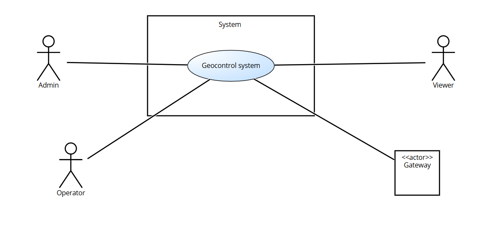

# Requirements Document - GeoControl

Date:

Version: V1 - description of Geocontrol as described in the swagger

| Version number | Change |
| :------------: | :----: |
|                |        |

# Contents

- [Requirements Document - GeoControl](#requirements-document---geocontrol)
- [Contents](#contents)
- [Informal description](#informal-description)
- [Business model](#business-model)
- [Stakeholders](#stakeholders)
- [Context Diagram and interfaces](#context-diagram-and-interfaces)
  - [Context Diagram](#context-diagram)
  - [Interfaces](#interfaces)
- [Stories and personas](#stories-and-personas)
- [Functional and non functional requirements](#functional-and-non-functional-requirements)
  - [Functional Requirements](#functional-requirements)
  - [Non Functional Requirements](#non-functional-requirements)
- [Use case diagram and use cases](#use-case-diagram-and-use-cases)
  - [Use case diagram](#use-case-diagram)
    - [Use case 1, UC1](#use-case-1-uc1)
      - [Scenario 1.1](#scenario-11)
      - [Scenario 1.2](#scenario-12)
      - [Scenario 1.x](#scenario-1x)
    - [Use case 2, UC2](#use-case-2-uc2)
    - [Use case x, UCx](#use-case-x-ucx)
- [Glossary](#glossary)
- [System Design](#system-design)
- [Deployment Diagram](#deployment-diagram)

# Informal description

GeoControl is a software system designed for monitoring physical and environmental variables in various contexts: from hydrogeological analyses of mountain areas to the surveillance of historical buildings, and even the control of internal parameters (such as temperature or lighting) in residential or working environments.

# Business Model

Per rendere il sistema sostenibile e scalabile, la soluzione scelta è stata quella di combinare Public-Private Partnership (PPP), SaaS e Vendita Diretta.
In questo modo, si copre il finanziamento iniziale con fondi pubblici e si garantiscono entrate continue con il SaaS, lasciando ai clienti la scelta tra acquistare o noleggiare i sensori.

1 Fase Iniziale: Finanziamento Pubblico (PPP)

L’Unione delle Comunità Montane del Piemonte finanzia lo sviluppo iniziale.
In cambio, l’ente pubblico riceve una licenza perpetua per l’uso del software.
Il progetto nasce senza rischio finanziario per GeoControl.

2 Fase di Espansione: SaaS + Vendita Diretta

I clienti pagano un abbonamento che include l’acquisizione dei sensori e gateway direttamente.

# Stakeholders

|                              Stakeholder name                              |                                              Description                                               |
| :------------------------------------------------------------------------: | :----------------------------------------------------------------------------------------------------: |
|                               UNCEM Piemonte                               |     Committente, in quanto interessata alla gestione dello stato idrogeologico dei suoi territori      |
| Entità pubbliche che richiedono monitoraggio continuo dei parametri fisici |         Gestione delle analisi idrogeologiche delle aree o sorveglianza degli edifici storici          |
|  Entità private che richiedono monitoraggio continuo dei parametri fisici  | Controllo dei parametri interni (come temperatura o luminosità) in ambienti residenziali o industriali |
|                       Fornitori di gateway e sensori                       |                        Forniscono i dispositivi fisici che geocontrol utilizza                         |
|                                Competitors                                 |                    Implicato nel fornire soluzioni nella stessa nicchia di mercato                     |
|                             Geocontrol office                              |                   Responsabili per il design, la gestione e lo sviluppo del sistema                    |
|                      Residenti nelle aree monitorate                       |              Beneficiano indirettamente del monitoraggio del territorio di cui risiedono               |
|                           Servizio di pagamento                            |        Offre il servizio per gestire le transazioni per l'acquisto delle license e del servizio        |

# Context Diagram and interfaces

## Context Diagram

Admin e operator appartengono al Geocontrol Office.
I viewer rappresentano i clienti che usufruiscono del servizio(UNCEM Piemonte, entità pubbliche e private)

## Interfaces

\<describe here each interface in the context diagram>

|         Actor         |                Logical Interface                |                Physical Interface                 |
| :-------------------: | :---------------------------------------------: | :-----------------------------------------------: |
|      Actor Admin      | Graphical User Interface command line interface |                 Screen, Keyboard                  |
|    Actor Operator     | Graphical User Interface command line interface |                 Screen, Keyboard                  |
|     Actor Viewer      |                    GUI, API                     | Screen, Keyboard , Internet Connection (via APIs) |
| Actor Gateway/sensor  |              API per l'invio dati               |          Internet Connection (via APIs)           |
| Servizio di pagamento |                       API                       |               Connessione internet                |

# Stories and personas

Persona1: lavoratore presso UNCEM, laureato in geologia, 35.
Storia: Lavora presso UNCEM e utilizza GeoControl per monitorare il rischio idrogeologico nelle valli alpine. Necessita dati costantemente aggiornati per il monitoraggio dei corsi d'acqua.

Persona2: storica d'arte, lavora presso una fondazione privata che si occupa della conservazione di edifici storici.
Storia: Necessita di segnalazioni occasionali ma tempestive in caso di anomalie strutturali che superino dei valori di soglia.

Persona3: tecnico del Comune.
Storia: Usufruisce dei servizi per monitorare il funzionamento dell'illuminazione pubblica. Non ha esperienze pregresse riguardo l'utilizzo di apparati informatici; ha bisogno di un'interfaccia intuitiva e semplice da utilizzare.

Persona4: lavoratore presso un'azienda agricola.
Storia: Sfrutta i servizi di monitoraggio per mantenere costanti temperatura, umidità e illuminazione per le serre. Uitlizza un server, che riceve i dati da GeoControl via API

# Functional and non functional requirements

## Functional Requirements

|   ID    | Description                                                                             |
| :-----: | --------------------------------------------------------------------------------------- |
| **FR1** | **Autenticazione e gestione utenti**                                                    |
|  FR1.1  | Login                                                                                   |
|  FR1.2  | Creazione Account                                                                       |
|  FR1.3  | Rimozione Account                                                                       |
|  FR1.4  | Visualizzazione Elenco Account                                                          |
|  FR1.5  | Visualizza Specifico Account                                                            | 
| **FR2** | **Gestione Topologia**                                                                  |
|  FR2.1  | Gestione Network                                                                        |
| FR2.1.1 | Creazione Network                                                                       |
| FR2.1.2 | Modifica Network                                                                        |
| FR2.1.3 | Eliminazione Network                                                                    |
| FR2.1.4 | Visualizzazione di tutti i Network                                                      |
| FR2.1.4.1 | Visualizzazione di un Network specifico                                                 |
|  FR2.2  | Gestione Gateway                                                                        |
| FR2.2.1 | Creazione Gateway                                                                       |
| FR2.2.2 | Modifica Gateway                                                                        |
| FR2.2.3 | Eliminazione Gateway                                                                    |
| FR2.2.4 | Visualizzazione di un Gateway specifico                                                 |
| FR2.2.4.1 | Visualizzazione di tutti i Gateway associati a un Network specifico                     |
|  FR2.3  | Gestione Sensore                                                                        |
| FR2.3.1 | Creazione Sensore                                                                       |
| FR2.3.2 | Modifica Sensore                                                                        |
| FR2.3.3 | Eliminazione Sensore                                                                    |
| FR2.3.4 | Visualizzazione Sensore specifico                                                       |
| FR2.3.4.1 | Visualizzazione di tutti i Sensori associati a un Gateway specifico                     |
|  FR2.4  | Associazioni                                                                            |
| FR2.4.1 | Aggiunta del Gateway a Network                                                          |
| FR2.4.2 | Rimozione del Gateway da Network                                                        |
| FR2.4.3 | Aggiunta sensore al Gateway                                                             |
| FR2.4.4 | Rimozione sensore dal Gateway                                                           |
| FR2.4.5 | Aggiunta associazione tra Gateway                                                       |
| FR2.4.6 | Rimozione associazione tra Gateway                                                      |
| **FR3** | **Gestione Misurazioni**                                                                |
|  FR3.1  | Raccolta delle misurazioni trasmesse dai gateway                                        |
| FR3.1.1 | Associazione della misurazione al corrispondente sensore                                |
| FR3.1.2 | Conversione dal timestamp locale del sensore a UTC                                      |
|  FR3.2  | Archiviazione dei dati convertiti nel sistema                                           |
|  FR3.3  | Visualizzazione misurazioni                                                             |
| FR3.3.1 | Visualizzazione misurazioni per un insieme di sensori di un Network specifico           |
| FR3.3.2 | Visualizzazione misurazioni per un Sensore specifico                                    |
|  FR3.4  | Inserimento misurazioni                                                                 |
|  FR3.5  | Conversione timestamp da UTC a orario locale del viewer                                 |
| **FR4** | **Analisi dei dati e rilevamento anomalie**                                             |
|  FR4.1  | Calcolo della media delle misurazioni in un dato intervallo temporale                   |
|  FR4.2  | Calcolo della varianza delle misurazioni in un dato intervallo temporale                |
|  FR4.3  | Calcolo delle soglie (superiore e inferiore) per identificare potenziali valori anomali |
| FR4.3.1 | Calcolo sogliaSuperiore = μ + 2σ                                                        |
| FR4.3.2 | Calcolo sogliaInferiore = μ - 2σ                                                        |
|  FR4.4  | Identificazione outlier                                                                 |
|  FR4.5  | Visualizzazione statistiche                                                             |
| FR4.5.1 | Visualizzazione statistiche per un insieme di Sensori di un Network specifico           |
| FR4.5.2 | Visualizzazione statistiche per uno specifico sensore                                   |
| FR4.5.3 | Visualizzazione outliers per un insieme di Sensori di un Network specifico              |
| FR4.5.4 | Visualizzazione outliers per uno specifico sensore                                      |
| **FR5** | **Gestione Errori di Sistema**                                                          |
| FR5.1   | E400-	Dati in input malformati                                                          |
| FR5.2   | E401-	Non Autorizzato                                                                   |
| FR5.3   | E403-	Diritti Insufficienti                                                             |
| FR5.4   | E500- Errore interno del server                                                         |

## Non Functional Requirements

\<Describe constraints on functional requirements>

|  ID  | Type (efficiency, reliability, ..) |                                                                         Description                                                                          | Refers to |
| :--: | :--------------------------------: | :----------------------------------------------------------------------------------------------------------------------------------------------------------: | :-------: |
| NFR1 |            Affidabilità            |                                                     Non più di 6 misurazioni perse per sensore all’anno                                                      |    FR3    |
| NFR2 |            Affidabilità            |                            Implementazione di meccanismi di ritrasmissione automatica in caso di errore nella ricezione dei dati                             |    FR3    |
| NFR3 |            Prestazioni             |                               Il sistema deve garantire prestazioni stabili anche in presenza di molteplici reti e dispositivi                               |    FR3    |
| NFR4 |             Sicurezza              |                              L’accesso al sistema deve essere regolato tramite autenticazione e autorizzazione basata su ruoli                               |    FR1    |
| NFR5 |             Sicurezza              |                                             La comunicazione tra gateway e server deve avvenire su canali sicuri                                             |    FR1    |
| NFR6 |            Portabilità             |              Compatibilità con diversi modelli di sensori e protocolli di comunicazione, senza necessità di modifiche sostanziali al software.               | FR2, FR3  |
| NFR7 |             Efficienza             |                                              Acquisizione e registrazione dei dati dei sensori ogni 10 minuti.                                               |   FR3.1   |
| NFR8 |           Manutenibilità           | Il sistema deve essere modulare e facilmente estendibile, consentendo interventi di aggiornamento o correzione senza compromettere il funzionamento globale. |   Tutti   |

# Use case diagram and use cases

## Use case diagram

\<define here UML Use case diagram UCD summarizing all use cases, and their relationships>

\<next describe here each use case in the UCD>

### Use Case 1, Login (FR1.1)

| Actors Involved  |           utente                       |
| :--------------: | :----------------------:               |
|   Precondition   | L'utente non è loggato                 |
|  Post condition  |   L'utente è loggato                   |
| Nominal Scenario |       Scenario 1.1                     |
|     Variants     |         Nessuna                        |
|    Exceptions    |  Scenario 1.2, UCE400, UCE401, UCE500  |

#### Scenario 1.1

|  Scenario 1.1  |                                        Login riuscito `(Code 200)`                                        |
| :------------: | :-------------------------------------------------------------------------------------------------------: |
|  Precondition  |                                              L'utente è registrato                                               |
| Post condition |                                                L'utente è loggato                                                |
|     Step#      |                                                Descrizione                                                |
|       1        |                                  Sistema: Chiede `username`, `password`.                                  |
|       2        |                                  utente: Inserisce `username`, `password`.                                  |
|       3        |                                      Sistema: Legge i dati inseriti.                                      |
|       4        |                               Sistema: Dato il nome utente, cerca l’utente.                               |
|       5        | Sistema: Recupera la password, la confronta con quella fornita. I dati coincidono, l’utente è autorizzato |
|       6        |                         Sistema: Associa allo user un token di accesso temporaneo                         |

#### Scenario 1.2

| Scenario 1.3   |                         L'utente non è registrato `(Code 404)`                          |
| -------------- | :-------------------------------------------------------------------------------------: |
| Precondition   |                                   L'utente non è registrato                                    |
| Post condition |                                     L'utente non è loggato                                     |
| Step#          |                                       Descrizione                                       |
| 1              |                         Sistema: Chiede `username`, `password`.                         |
| 2              |                         User: Inserisce `username`, `password`.                         |
| 3              |                             Sistema: Legge i dati inseriti.                             |
| 4              | Sistema: Cerca l’utente dato il nome utente. Utente non trovato. Utente non autorizzato |
| 5              |                    Sistema: mostra a schermo un messaggio di errore                     |

### Use Case 2, Creazione Account (FR1.2)

| Actors Involved  |            Admin                                 |
| :--------------: | :--------------------------:                     |
|   Precondition   | L'utente non ha un account                       |
|  Post condition  |       Utente registrato                          |
| Nominal Scenario |         Scenario 2.1                             |
|     Variants     |           Nessuna                                |
|    Exceptions    | Scenario 2.2, UCE400, UCE401, UCE403, UCE500     |

#### Scenario 2.1

|  Scenario 2.1  |                                                     Registrazione `(Code 201)`                                                     |
| :------------: | :--------------------------------------------------------------------------------------------------------------------------------: |
|  Precondition  |                                                        L'utente non ha un account                                                  |
| Post condition |                                                            Utente registrato                                                       |
|     Step#      |                                                            Descrizione                                                             |
|       1        |                                             Admin: Clicca il pulsante di registrazione                                             |
|       2        |                                  Sistema: Verifica la presenza di un token valido nella richiesta                                  |
|       3        |                                               Sistema: Rileva che il token è valido                                                |
|       4        |                                          Sistema: Chiede `username`, `password`, `ruolo`                                           |
|       5        |                                          Admin: Inserisce `username`, `password`, `ruolo`                                          |
|       6        |                                                   Sistema: Legge i dati immessi                                                    |
|       7        | Sistema: Controlla che i dati immessi non siano associati a nessun account esistente. Non esiste già un account per i dati immessi |
|       8        |                                       Sistema: Crea un nuovo user e lo memorizza nel sistema                                       |
|       9        |                                         Sistema: mostra a schermo un messaggio di successo                                         |

#### Scenario 2.2

|  Scenario 2.2  |                                             username già in uso  `(Code 409)`                                    |
| :------------: | :-------------------------------------------------------------------------------------------------------------:  |
|  Precondition  |             L’utente tenta di creare un account utente con un identificativo già esistente                       |
| Post condition |                                     Il sistema restituisce l'errore 409                                          |
|     Step#      |                                                   Descrizione                                                    |
|       1        |                        Utente: Effettua una richiesta di creazione account, inserendo i dati nel sistema         |
|       2        |                        Sistema: riceve i dati e verifica l'esistenza della risorsa                               |
|       3        |                        Sistema:Trova la risorsa nel sistema e ne blocca la creazione                             |
|       4        |                                         Sistema:  Restituisce il messaggio di errore 409.                        |

### Use Case 4, Rimozione Account (FR1.3)

| Actors Involved  |                Admin                         |
| :--------------: | :----------------------------------:         |
|   Precondition   |  Almeno un utente è registrato nel sistema   |
|  Post condition  | L'acount utente eliminato                    |
| Nominal Scenario |             Scenario 4.1                     |
|     Variants     |               Nessuna                        |
|    Exceptions    | Scenario 4.2, UCE401, UCE403, UCE500         |

#### Scenario 4.1

|  Scenario 4.1  |                       Eliminazione Utente `(Code 204)`                        |
| :------------: | :---------------------------------------------------------------------------: |
|  Precondition  |              Almeno un utente è registrato nel sistema                        |
| Post condition |                           Account utente eliminato                            |
|     Step#      |                                  Descrizione                                  |
|       1        |               Admin: Clicca il pulsante di eliminazione accuont               |
|       2        |       Sistema: Verifica la presenza di un token valido nella richiesta        |
|       3        |                     Sistema: Rileva che il token è valido                     |
|       4        |                          Sistema: Chiede `username`                           |
|       5        |                          Admin: Inserisce `username`                          |
|       6        |                         Sistema: Legge i dati immessi                         |
|       7        | Sistema: Controlla che i dati immessi siano associati a un account esistente. |
|       8        |                          Sistema: Elimina l'account                           |
|       9        |              Sistema: mostra a schermo un messaggio di successo               |

### Scenario 4.2

| Scenario 4.2   |                         L'utente non è registrato `(Code 404)`                                       |
| -------------- | :-------------------------------------------------------------------------------------:              |  
| Precondition   |     L’utente da eliminare non è presente nel sistema                                                 |
| Post condition |    Nessun account eliminato,  Il sistema restituisce l'errore 404                                    |
| Step#          |                                       Descrizione                                                    |
| 1              |                         Admin: Clicca il pulsante di eliminazione account                            |
| 2              |                        Sistema: Verifica la presenza di un token valido nella richiesta              |
| 3              |                           Sistema: Rileva che il token è valido                                      |
| 4              |                           Sistema: Chiede `username`                                                 |
| 5              |                   Admin: Inserisce `username`                                                        |
| 6              |                   Sistema: Legge i dati immessi                                                      |
| 7              |                  Sistema: Cerca l’utente con lo `username` specificato, ma non trova alcun account   |
| 8              |                  Sistema: Restituisce il messaggio di errore 404                                      |

### Use Case 5, Visualizzazione Elenco Account (FR1.4)

| Actors Involved  |                                   Admin                                   |
| :--------------: | :-----------------------------------------------------------------------: |
|   Precondition   |                L’admin è loggato e ha i permessi necessari                |
|  Post condition  | L’admin visualizza la lista completa degli account registrati nel sistema |
| Nominal Scenario |                               Scenario 5.1                                |
|     Variants     |                                    Nessuna                                |
|    Exceptions    |        Scenario 5.2, UCE401, UCE403, UCE500                               |

#### Scenario 5.1

|  Scenario 5.1  |                Visualizzazione elenco account `(Code 200)`                |
| :------------: | :-----------------------------------------------------------------------: |
|  Precondition  |                L’admin è loggato e ha i permessi necessari                |
| Post condition | L’admin visualizza la lista completa degli account registrati nel sistema |
|     Step#      |                                Descrizione                                |
|       1        |              Admin: Clicca il pulsante di Visualizza Account              |
|       2        |     Sistema: Verifica la presenza di un token valido nella richiesta      |
|       3        |                   Sistema: Rileva che il token è valido                   |
|       4        |  Sistema:  Recupera dal database la lista completa degli account registrati  |
|       6        |          Sistema: mostra a schermo l'elenco degli utenti trovati          |

### Use Case 6, Visualizzazione Specifico Account (FFR1.5)

| Actors Involved  |                                   Admin                                   |
| :--------------: | :-----------------------------------------------------------------------: |
|   Precondition   |                L’admin è loggato e ha i permessi necessari                |
|  Post condition  |                L’admin visualizza uno specifico account Utente            |
| Nominal Scenario |                               Scenario 6.1                                |
|     Variants     |                                    Nessuna                                |
|    Exceptions    |        Scenario 6.2, UCE401, UCE403, UCE500                               |

#### Scenario 6.1

|  Scenario 6.1  |                Visualizzazione specifico account `(Code 200)`             |
| :------------: | :-----------------------------------------------------------------------: |
|  Precondition  |                L’admin è loggato e ha i permessi necessari                |
| Post condition |                 L’admin visualizza uno specifico account Utente           |
|     Step#      |                                Descrizione                                |
|       1        |              Admin: Accede alla sezione di  Visualizza Account            |
|       2        |              Admin: Inserisce lo username dell’utente da visualizzare     |
|       3        |     Sistema: Verifica la presenza di un token valido nella richiesta      |
|       4        |                   Sistema: Rileva che il token è valido                   |
|       5        |  Sistema:  Recupera dal database l'account utente richiesto               |
|       6        |          Sistema: mostra a schermo l'account utente richiesto              |

### Use Case 10, Creazione Network (UC10)

| Actors Involved  |                              Admin, Operator                              |
| :--------------: | :-----------------------------------------------------------------------: |
|   Precondition   |          L'utente è autenticato con token come Admin o Operator           |
|  Post condition  |                       La rete è creata nel sistema                        |
| Nominal Scenario |                               Scenario 10.1                               |
|     Variants     |                                   None                                    |
|    Exceptions    | Scenario 10.2, Scenario 10.3, Scenario 10.4, Scenario 10.5, Scenario 10.6 |

#### Scenario 10.1

| Scenario 10.1  |                                                               Creazione rete con successo `(Code 201)`                                                                |
| :------------: | :-------------------------------------------------------------------------------------------------------------------------------------------------------------------: |
|  Precondition  |                                                             L'utente è autenticato come Admin o Operator                                                              |
| Post condition |                                                            La rete viene creata ed è visibile nel sistema                                                             |
|     Step#      |                                                                              Description                                                                              |
|       1        |                                                     Utente: Accede alla sezione "Gestione Reti" dell’interfaccia                                                     |
|       2        |                                                                 Utente: Seleziona "Crea nuova rete"                                                                  |
|       3        | Utente: Inserisce `code`, `name`, `description` nel modulo (es. NET01, Alp Monitor, ...). Eventuali campi annidati Gateway o Sensor, se presenti, verranno ignorati. |
|       4        |                                                                 Utente: invia il modulo di creazione                                                                 |
|       5        |                                           Sistema: Valida i dati, registra la rete e restituisce il codice `201 Created`                                            |

#### Scenario 10.2

| Scenario 10.2  |                               Dati mancanti o input non valido `(400 BadRequest)`                                |
| :------------: | :--------------------------------------------------------------------------------------------------------------: |
|  Precondition  |                          L'utente è autenticato ma il modulo è incompleto o malformato                           |
| Post condition |                                            Nessuna rete viene creata                                             |
|     Step#      |                                                   Description                                                    |
|       1        |          L’utente omette uno o più campi obbligatori (ad esempio `code`) o inserisce valori non validi           |
|       2        |                                      L'utente invia il modulo di creazione                                       |
|       3        | Il sistema valida i dati, rileva la mancanza del campo `code` e restituisce il codice di errore `400 BadRequest` |

#### Scenario 10.3

| Scenario 10.3  |                  Token assente o non valido `(401 UnauthorizedError)`                   |
| :------------: | :-------------------------------------------------------------------------------------: |
|  Precondition  |   L'utente non ha effettuato il login oppure il token è assente, scaduto o malformato   |
| Post condition |                                Nessuna rete viene creata                                |
|     Step#      |                                       Description                                       |
|       1        |               L'utente tenta di inviare una richiesta per creare una rete               |
|       2        | La richiesta è priva di header `Authorization` oppure il token ha un formato non valido |
|       3        |      Il sistema intercetta la richiesta, verifica il token e lo considera invalido      |
|       4        |           Il sistema restituisce il codice di errore `401 UnauthorizedError`            |

#### Scenario 10.4

| Scenario 10.4  |              Ruolo non autorizzato `(403 InsufficientRightsError)`               |
| :------------: | :------------------------------------------------------------------------------: |
|  Precondition  |   L'utente è autenticato correttamente con un token valido, ma ha ruolo Viewer   |
| Post condition |                            Nessuna rete viene creata                             |
|     Step#      |                                   Description                                    |
|       1        |  L'utente accede all’interfaccia come Viewer e apre il modulo “Crea nuova rete”  |
|       2        | L'utente compila i campi e invia la richiesta per la creazione di una nuova rete |
|       3        |                    Il sistema verifica che il token è valido                     |
|       4        |      Il sistema controlla il ruolo utente e rileva i permessi insufficienti      |
|       5        |    Il sistema restituisce il codice di errore `(403 InsufficientRightsError)`    |

#### Scenario 10.5

| Scenario 10.5  |                             Codice rete già esistente `(409 ConflictError)`                              |
| :------------: | :------------------------------------------------------------------------------------------------------: |
|  Precondition  |                      L'utente è autenticato, ma il codice inserito è già registrato                      |
| Post condition |                                        Nessuna rete viene creata                                         |
|     Step#      |                                               Description                                                |
|       1        |                          L'utente compila il modulo con un codice già esistente                          |
|       2        |                                  L'utente invia il modulo di creazione                                   |
|       3        | Il sistema valida i dati, rileva la duplicazione e restituisce il codice di errore `(409 ConflictError)` |

#### Scenario 10.6

| Scenario 10.6  |                Errore interno del server `(500 InternalServerError)`                |
| :------------: | :---------------------------------------------------------------------------------: |
|  Precondition  |        L’utente è autenticato, ma si verifica un errore inatteso lato server        |
| Post condition |                              Nessuna rete viene creata                              |
|     Step#      |                                     Description                                     |
|       1        |            L'utente compila il modulo correttamente e invia la richiesta            |
|       2        | Durante l'elaborazione della richiesta si verifica un errore imprevisto lato server |
|       3        |       Il sistema restituisce il codice di errore `(500 InternalServerError)`        |

### Use Case 11, Modifica Network (UC11)

| Actors Involved  |                                     Admin, Operator                                      |
| :--------------: | :--------------------------------------------------------------------------------------: |
|   Precondition   |                  L'utente è autenticato con token come Admin o Operator                  |
|  Post condition  |                           La rete viene aggiornata nel sistema                           |
| Nominal Scenario |                                      Scenario 11.1                                       |
|     Variants     |                                           None                                           |
|    Exceptions    | Scenario 11.2, Scenario 11.3, Scenario 11.4, Scenario 11.5, Scenario 11.6, Scenario 11.7 |

#### Scenario 11.1

| Scenario 11.1  |                                                 Modifica rete con successo `(204 No Content)`                                                  |
| :------------: | :--------------------------------------------------------------------------------------------------------------------------------------------: |
|  Precondition  |                                                  L'utente è autenticato come Admin o Operator                                                  |
| Post condition |                                                      La rete viene aggiornata nel sistema                                                      |
|     Step#      |                                                                  Description                                                                   |
|       1        |                                         L'utente accede alla sezione "Gestione Reti" dell’interfaccia                                          |
|       2        |                                                   L'utente seleziona una rete da modificare                                                    |
|       3        | L'utente modifica i campi `code`, `name`, `description` nel modulo.Eventuali campi annidati Gateway o Sensor vengono ignorati e non aggiornati |
|       4        |                                                L'utente invia il modulo di modifica della rete                                                 |
|       5        |                              Il sistema valida i dati, aggiorna la rete e restituisce il codice `204 No Content`                               |

#### Scenario 11.2

| Scenario 11.2  |           Dati mancanti o input non valido `(400 BadRequest)`            |
| :------------: | :----------------------------------------------------------------------: |
|  Precondition  |      L'utente è autenticato ma il modulo è incompleto o malformato       |
| Post condition |                     Nessuna modifica viene applicata                     |
|     Step#      |                               Description                                |
|       1        |               L'utente omette uno o più campi obbligatori                |
|       2        |            L'utente invia la richiesta di modifica della rete            |
|       3        | Il sistema valida i dati, rileva l’errore e restituisce `400 BadRequest` |

#### Scenario 11.3

| Scenario 11.3  |                 Token assente o non valido `(401 UnauthorizedError)`                 |
| :------------: | :----------------------------------------------------------------------------------: |
|  Precondition  | L'utente non ha effettuato il login oppure il token è assente, scaduto o malformato  |
| Post condition |                           Nessuna modifica viene applicata                           |
|     Step#      |                                     Description                                      |
|       1        | L'utente tenta di inviare una richiesta di modifica della rete senza un token valido |
|       2        |    Il sistema intercetta la richiesta, verifica il token e lo considera invalido     |
|       3        |          Il sistema restituisce il codice di errore `401 UnauthorizedError`          |

#### Scenario 11.4

| Scenario 11.4  |          Ruolo non autorizzato `(403 InsufficientRightsError)`           |
| :------------: | :----------------------------------------------------------------------: |
|  Precondition  |       L'utente è autenticato con token valido, ma ha ruolo Viewer        |
| Post condition |                     Nessuna modifica viene applicata                     |
|     Step#      |                               Description                                |
|       1        |              L'utente Viewer apre la sezione modifica rete               |
|       2        |       L'utente compila e invia la richiesta di modifica della rete       |
|       3        | Il sistema verifica il token e il ruolo, rileva i permessi insufficienti |
|       4        | Il sistema restituisce il codice di errore `403 InsufficientRightsError` |

#### Scenario 11.5

| Scenario 11.5  |                Rete non trovata `(404 NotFoundError)`                 |
| :------------: | :-------------------------------------------------------------------: |
|  Precondition  |      L’utente inserisce un codice rete non esistente nel sistema      |
| Post condition |                   Nessuna modifica viene applicata                    |
|     Step#      |                              Description                              |
|       1        |         L'utente seleziona o inserisce un codice rete errato          |
|       2        | Il sistema non trova la rete e restituisce errore `404 NotFoundError` |

#### Scenario 11.6

| Scenario 11.6  |             Codice rete già esistente `(409 ConflictError)`              |
| :------------: | :----------------------------------------------------------------------: |
|  Precondition  |       L’utente modifica il codice della rete con uno già esistente       |
| Post condition |                     Nessuna modifica viene applicata                     |
|     Step#      |                               Description                                |
|       1        | L'utente inserisce un nuovo `code` che identifica una rete già esistente |
|       2        | Il sistema rileva il conflitto e restituisce errore `409 ConflictError`  |

#### Scenario 11.7

| Scenario 11.7  |                Errore interno del server `(500 InternalServerError)`                 |
| :------------: | :----------------------------------------------------------------------------------: |
|  Precondition  |        L’utente è autenticato, ma si verifica un errore inatteso lato server         |
| Post condition |                           Nessuna modifica viene applicata                           |
|     Step#      |                                     Description                                      |
|       1        | L'utente compila correttamente il modulo e invia la richiesta di modifica della rete |
|       2        | Durante l'elaborazione della richiesta si verifica un errore imprevisto lato server  |
|       3        |        Il sistema restituisce il codice di errore `(500 InternalServerError)`        |

### Use Case 12, Eliminazione Network (UC12)

| Actors Involved  |                      Admin, Operator                       |
| :--------------: | :--------------------------------------------------------: |
|   Precondition   |   L'utente è autenticato con token come Admin o Operator   |
|  Post condition  |            La rete viene eliminata dal sistema             |
| Nominal Scenario |                       Scenario 12.1                        |
|     Variants     |                            None                            |
|    Exceptions    | Scenario 12.2, Scenario 12.3, Scenario 12.4, Scenario 12.5 |

#### Scenario 12.1

| Scenario 12.1  |                       Eliminazione rete con successo `(204 No Content)`                        |
| :------------: | :--------------------------------------------------------------------------------------------: |
|  Precondition  |                          L'utente è autenticato come Admin o Operator                          |
| Post condition |                              La rete viene eliminata dal sistema                               |
|     Step#      |                                          Description                                           |
|       1        |                 L'utente accede alla sezione "Gestione Reti" dell’interfaccia                  |
|       2        |                    L'utente seleziona una rete esistente e preme "Elimina"                     |
|       3        | Il sistema riceve la richiesta, verifica il parametro `networkCode` e procede all'eliminazione |
|       4        |                       Il sistema restituisce il codice `204 No Content`                        |

#### Scenario 12.2

| Scenario 12.2  |                Token assente o non valido `(401 UnauthorizedError)`                 |
| :------------: | :---------------------------------------------------------------------------------: |
|  Precondition  | L'utente non ha effettuato il login oppure il token è assente, scaduto o malformato |
| Post condition |                            Nessuna rete viene eliminata                             |
|     Step#      |                                     Description                                     |
|       1        | L'utente invia la richiesta di eliminazione senza un header `Authorization` valido  |
|       2        |                Il sistema verifica il token e lo considera invalido                 |
|       3        |              Il sistema restituisce il codice `401 UnauthorizedError`               |

#### Scenario 12.3

| Scenario 12.3  |          Ruolo non autorizzato `(403 InsufficientRightsError)`           |
| :------------: | :----------------------------------------------------------------------: |
|  Precondition  |       L'utente è autenticato con token valido, ma ha ruolo Viewer        |
| Post condition |                       Nessuna rete viene eliminata                       |
|     Step#      |                               Description                                |
|       1        |               L'utente Viewer tenta di eliminare una rete                |
|       2        |   Il sistema verifica il ruolo utente e rileva permessi insufficienti    |
|       3        | Il sistema restituisce il codice di errore `403 InsufficientRightsError` |

#### Scenario 12.4

| Scenario 12.4  |                     Rete non trovata `(404 NotFoundError)`                     |
| :------------: | :----------------------------------------------------------------------------: |
|  Precondition  |               L’utente specifica un `networkCode` non esistente                |
| Post condition |                          Nessuna rete viene eliminata                          |
|     Step#      |                                  Description                                   |
|       1        | L'utente invia la richiesta DELETE con un codice rete non presente nel sistema |
|       2        |     Il sistema non trova la rete e restituisce errore `404 NotFoundError`      |

#### Scenario 12.5

| Scenario 12.5  |                Errore interno del server `(500 InternalServerError)`                |
| :------------: | :---------------------------------------------------------------------------------: |
|  Precondition  |        L’utente è autenticato, ma si verifica un errore inatteso lato server        |
| Post condition |                            Nessuna rete viene eliminata                             |
|     Step#      |                                     Description                                     |
|       1        |                 L'utente invia una richiesta valida di eliminazione                 |
|       2        | Durante l'elaborazione della richiesta si verifica un errore imprevisto lato server |
|       3        |        Il sistema restituisce il codice di errore `500 InternalServerError`         |

### Use Case 13, Visualizzazione di tutti i Network (UC13)

| Actors Involved  |             Admin, Operator, Viewer             |
| :--------------: | :---------------------------------------------: |
|   Precondition   |     L'utente è autenticato con token valido     |
|  Post condition  | L'elenco delle reti viene restituito all’utente |
| Nominal Scenario |                  Scenario 13.1                  |
|     Variants     |                      None                       |
|    Exceptions    |          Scenario 13.2, Scenario 13.3           |

#### Scenario 13.1

| Scenario 13.1  |                 Recupero lista reti con successo `(200 OK)`                 |
| :------------: | :-------------------------------------------------------------------------: |
|  Precondition  |                   L'utente è autenticato con token valido                   |
| Post condition |    Il sistema restituisce una lista (anche eventualmente vuota) di reti     |
|     Step#      |                                 Description                                 |
|       1        | L'utente accede alla sezione "Reti" o invia una richiesta GET a `/networks` |
|       2        |                         Il sistema valida il token                          |
|       3        |       Il sistema restituisce la lista delle reti con codice `200 OK`        |

#### Scenario 13.2

| Scenario 13.2  |      Token assente o non valido `(401 UnauthorizedError)`       |
| :------------: | :-------------------------------------------------------------: |
|  Precondition  |  L'utente non ha effettuato il login o ha un token non valido   |
| Post condition |                 Nessuna lista viene restituita                  |
|     Step#      |                           Description                           |
|       1        | L'utente invia la richiesta senza header `Authorization` valido |
|       2        | Il sistema rileva che il token è assente, scaduto o malformato  |
|       3        |      Il sistema restituisce errore `401 UnauthorizedError`      |

#### Scenario 13.3

| Scenario 13.3  |        Errore interno del server `(500 InternalServerError)`         |
| :------------: | :------------------------------------------------------------------: |
|  Precondition  |     L'utente è autenticato, ma si verifica un errore imprevisto      |
| Post condition |                    Nessuna lista viene restituita                    |
|     Step#      |                             Description                              |
|       1        |     L'utente invia una richiesta valida per la lista delle reti      |
|       2        |    Il sistema riscontra un errore interno durante l'elaborazione     |
|       3        | Il sistema restituisce il codice di errore `500 InternalServerError` |

### Use Case 14, Visualizzazione di un Network specifico (UC14)

| Actors Involved  |               Admin, Operator, Viewer               |
| :--------------: | :-------------------------------------------------: |
|   Precondition   |       L'utente è autenticato con token valido       |
|  Post condition  | I dettagli della rete vengono restituiti all’utente |
| Nominal Scenario |                    Scenario 14.1                    |
|     Variants     |                        None                         |
|    Exceptions    |     Scenario 14.2, Scenario 14.3, Scenario 14.4     |

#### Scenario 14.1

| Scenario 14.1  |            Recupero rete con successo `(200 OK)`             |
| :------------: | :----------------------------------------------------------: |
|  Precondition  |           L'utente è autenticato con token valido            |
| Post condition |         Il sistema restituisce i dettagli della rete         |
|     Step#      |                         Description                          |
|       1        | L'utente invia una richiesta GET a `/networks/{networkCode}` |
|       2        |         Il sistema riceve e interpreta la richiesta          |
|       3        |                  Il sistema valida il token                  |
|       4        | Il sistema restituisce i dati della rete con codice `200 OK` |

#### Scenario 14.2

| Scenario 14.2  |      Token assente o non valido `(401 UnauthorizedError)`       |
| :------------: | :-------------------------------------------------------------: |
|  Precondition  |  L'utente non ha effettuato il login o ha un token non valido   |
| Post condition |                  Nessuna rete viene restituita                  |
|     Step#      |                           Description                           |
|       1        | L'utente invia la richiesta senza header `Authorization` valido |
|       2        | Il sistema rileva che il token è assente, scaduto o malformato  |
|       3        |      Il sistema restituisce errore `401 UnauthorizedError`      |

#### Scenario 14.3

| Scenario 14.3  |               Rete non trovata `(404 NotFoundError)`                |
| :------------: | :-----------------------------------------------------------------: |
|  Precondition  |     Il `networkCode` specificato non corrisponde ad alcuna rete     |
| Post condition |                    Nessuna rete viene restituita                    |
|     Step#      |                             Description                             |
|       1        | L'utente invia una richiesta GET con un `networkCode` non esistente |
|       2        |          Il sistema non trova alcuna rete con quel codice           |
|       3        |          Il sistema restituisce errore `404 NotFoundError`          |

#### Scenario 14.4

| Scenario 14.4  |     Errore interno del server `(500 InternalServerError)`      |
| :------------: | :------------------------------------------------------------: |
|  Precondition  |  L’utente è autenticato, ma si verifica un errore lato server  |
| Post condition |                 Nessuna rete viene restituita                  |
|     Step#      |                          Description                           |
|       1        | L'utente invia una richiesta valida per il recupero della rete |
|       2        |        Il sistema riscontra un errore interno inatteso         |
|       3        |    Il sistema restituisce errore `500 InternalServerError`     |

### Use Case 25, Associazione della misurazione al corrispondente sensore (UC25)

(da finire)
| Actors Involved | Gateway |
| :--------------: | :------------------------------: |
| Precondition | Il sensore deve essere registrato |
| Post condition | La misurazione viene salvata |
| Nominal Scenario | Scenario 25.1 |
| Variants | Nessuna |
| Exceptions | |

#### Scenario 25.1

| Scenario 25.1  |                                       Associazione della misurazione al sensore con successo                                       |
| :------------: | :--------------------------------------------------------------------------------------------------------------------------------: |
|  Precondition  |                                                 I sensori devono essere registrati                                                  |
| Post condition |                                                    La misurazione viene salvata                                                    |
|     Step#      |                                                            Descrizione                                                             |
|       1        |                                             Gateway: Invia i dati al sistema                                         |
|       4        |                                          Sistema: Verifica che il MAC del gateway è registrato                                          |
|       5        |                                 Sistema: Verifica che il MAC del sensore                          |
|       6        |                                                   Sistema: Legge i dati immessi                                                    |
|       7        | Sistema: Controlla che i dati immessi non siano associati a nessun account esistente. Non esiste già un account per i dati immessi |
|       8        |                                       Sistema: Crea un nuovo user e lo memorizza nel sistema                                       |
|       9        |                                         Sistema: mostra a schermo un messaggio di successo                                         |

### Use Case 26, Inserimento misurazioni (UC26)

| Actors Involved  |            Admin, Operator            |
| :--------------: | :-----------------------------------: |
|   Precondition   |        Il sensore è registrato        |
|  Post condition  |         Misurazione inserita          |
| Nominal Scenario |             Scenario 26.1             |
|     Variants     |                Nessuna                |
|    Exceptions    | Scenario 26.2, 26.3, 26.4, 26.5, 26.6 |

(ci vuole il controllo sul timestamp?)

#### Scenario 26.1

| Scenario 26.1  |                                                Misurazione creata `(Code 201)`                                                |
| :------------: | :---------------------------------------------------------------------------------------------------------------------------: |
|  Precondition  |                                                    Il sensore è registrato                                                    |
| Post condition |                                                     Misurazione inserita                                                      |
|     Step#      |                                                          Descrizione                                                          |
|       1        |                                  Utente: Clicca il pulsante di inserimento della misurazione                                  |
|       2        |                               Sistema: Verifica la presenza di un token valido nella richiesta                                |
|       3        |                                             Sistema: Rileva che il token è valido                                             |
|       4        |                     Sistema: Chiede `codice network`, `mac gateway`, `mac sensore`, `valore misurazione`                      |
|       5        | Utente: Inserisce `codice network`, `mac gateway`, `mac sensore`, `valore misurazione` (da tastiera o tramite menù a tendina) |
|       6        |                                                 Sistema: Legge i dati immessi                                                 |
|       7        |            Sistema: Controlla che i dati immessi corrispondano a network, gateway e sensori esistenti e associati             |
|       8        |                      Sistema: Controlla che il valore della misurazione rientri tra i valori del dominio                      |
|       9        |                                         Sistema: Memorizza la misurazione nel sistema                                         |
|       10       |                                      Sistema: mostra a schermo un messaggio di successo                                       |

| Scenario 26.2  |                                              Dati di input invalidi `(Code 400)`                                              |
| :------------: | :---------------------------------------------------------------------------------------------------------------------------: |
|  Precondition  |                                                    Il sensore è registrato                                                    |
| Post condition |                                             Inserimento della misurazione fallita                                             |
|     Step#      |                                                          Descrizione                                                          |
|       1        |                                  Utente: Clicca il pulsante di inserimento della misurazione                                  |
|       2        |                               Sistema: Verifica la presenza di un token valido nella richiesta                                |
|       3        |                                             Sistema: Rileva che il token è valido                                             |
|       4        |                     Sistema: Chiede `codice network`, `mac gateway`, `mac sensore`, `valore misurazione`                      |
|       5        | Utente: Inserisce `codice network`, `mac gateway`, `mac sensore`, `valore misurazione` (da tastiera o tramite menù a tendina) |
|       6        |                                                 Sistema: Legge i dati immessi                                                 |
|       7        |                      Sistema: Controlla che il valore della misurazione rientri tra i valori del dominio                      |
|       8        |                                       Sistema: mostra a schermo un messaggio di errore                                        |

| Scenario 26.3  |                   Non autorizzato `(Code 401)`                   |
| :------------: | :--------------------------------------------------------------: |
|  Precondition  |                     Il sensore è registrato                      |
| Post condition |              Inserimento della misurazione fallita               |
|     Step#      |                           Descrizione                            |
|       1        |   Utente: Clicca il pulsante di inserimento della misurazione    |
|       2        | Sistema: Verifica la presenza di un token valido nella richiesta |
|       3        |            Sistema: Rileva che il token non è valido             |
|       9        |         Sistema: mostra a schermo un messaggio di errore         |

### Use Case A, Visualizzazione Statistiche (UCA)

| Actors Involved  |                            User                            |
| :--------------: | :--------------------------------------------------------: |
|   Precondition   |            L'utente è autenticato correttamente            |
|  Post condition  | L'utente visualizza le statistiche di un network richieste |
| Nominal Scenario |                        Scenario A.1                        |
|     Variants     |                        Scenario A.4                        |
|    Exceptions    |                Scenario A.2, A.3, A.5, A.6                 |

#### Scenario A.1

|  Scenario A.1  |                          Visualizzazione statistiche per un dato Network `(Code 200)`                           |
| :------------: | :-------------------------------------------------------------------------------------------------------------: |
|  Precondition  |                                             L'utente è autenticato.                                             |
| Post condition |                                  L'utente visualizza le statistiche richieste                                   |
|     Step#      |                                                   Descrizione                                                   |
|       1        |    Sistema: Chiede il codice del network `networkCode` e l'intervallo temporale [ `startDate`, `endDate` ].     |
|       2        |                              User: Inserisce `networkCode`,`startDate`, `endDate`.                              |
|       3        |            Sistema: Verifica la presenza di un token valido nella richiesta. Il token risulta valido            |
|       4        |                                         Sistema: Legge i dati forniti.                                          |
|       5        |             Sistema: Ricerca il network avente il codice fornito. Il codice network risulta valido.             |
|       6        |                       Sistema: Converte `startDate` e `endDate` da localTimezone a UTC+0                        |
|       7        | Sistema: Recupera le misurazioni del network con codice `networkCode` ed effettuate tra `startDate` e `endDate` |
|       8        |                               Sistema: calcola media e varianza delle misurazioni                               |
|       9        |                           Sistema: calcola la soglia superiore e la soglia inferiore                            |
|       10       |                                    Sistema: invia le statistiche all'utente                                     |
|       11       |                                     Utente: legge le statistiche richieste                                      |

#### Scenario A.2

|  Scenario A.2  |                                 Token mancante o malformato `(Code 401)`                                 |
| :------------: | :------------------------------------------------------------------------------------------------------: |
|  Precondition  |                                         L'utente è autenticato.                                          |
| Post condition |                               Visualizzazione statistiche non autorizzata                                |
|     Step#      |                                               Descrizione                                                |
|       1        | Sistema: Chiede il codice del network `networkCode` e l'intervallo temporale [ `startDate`, `endDate` ]. |
|       2        |                          User: Inserisce `networkCode`,`startDate`, `endDate`.                           |
|       3        |                    Sistema: Verifica la presenza di un token valido nella richiesta.                     |
|       4        |                            Sistema: Non trova un token valido corrispondente                             |
|       5        |                           Sistema: Blocca la visualizzazione delle statistiche                           |

#### Scenario A.3

|  Scenario A.3  |                                     Network non trovato `(Code 404)`                                     |
| :------------: | :------------------------------------------------------------------------------------------------------: |
|  Precondition  |                                         L'utente è autenticato.                                          |
| Post condition |                        Network di interesse non trovato, nessuna visualizzazione                         |
|     Step#      |                                               Descrizione                                                |
|       1        | Sistema: Chiede il codice del network `networkCode` e l'intervallo temporale [ `startDate`, `endDate` ]. |
|       2        |                          User: Inserisce `networkCode`,`startDate`, `endDate`.                           |
|       3        |        Sistema: Verifica la presenza di un token valido nella richiesta. Il token risulta valido         |
|       4        |                                      Sistema: Legge i dati forniti.                                      |
|       5        |                          Sistema: Ricerca il network avente il codice fornito.                           |
|       6        |                         Sistema: Non trova nessun network con il codice fornito                          |
|       7        |                            Sistema: Avvisa l'utente che il network non esiste                            |

#### Scenario A.4

|  Scenario A.4  |                                         Visualizzazione statistiche per un Sensore specifico `(Code 200)`                                         |
| :------------: | :-----------------------------------------------------------------------------------------------------------------------------------------------: |
|  Precondition  |                                                              L'utente è autenticato.                                                              |
| Post condition |                                                   L'utente visualizza le statistiche richieste                                                    |
|     Step#      |                                                                    Descrizione                                                                    |
|       1        | Sistema: Chiede il codice del network `networkCode`, l'indirizzo MAC del sensore `sensorMAC` e l'intervallo temporale [ `startDate`, `endDate` ]. |
|       2        |                                        User: Inserisce `networkCode`,`networkCode`,`startDate`, `endDate`.                                        |
|       3        |                             Sistema: Verifica la presenza di un token valido nella richiesta. Il token risulta valido                             |
|       4        |                                                          Sistema: Legge i dati forniti.                                                           |
|       5        |                              Sistema: Ricerca il network avente il codice fornito. Il codice network risulta valido.                              |
|       6        |                       Sistema: Ricerca il sensore avente il MAC fornito all'interno del network. Il sensore viene trovato.                        |
|       7        |                                        Sistema: Converte `startDate` e `endDate` da localTimezone a UTC+0                                         |
|       8        |                  Sistema: Recupera le misurazioni del network con codice `networkCode` ed effettuate tra `startDate` e `endDate`                  |
|       9        |                                                Sistema: calcola media e varianza delle misurazioni                                                |
|       10       |                                            Sistema: calcola la soglia superiore e la soglia inferiore                                             |
|       11       |                                                     Sistema: invia le statistiche all'utente                                                      |
|       12       |                                                      Utente: legge le statistiche richieste                                                       |

#### Scenario A.5

|  Scenario A.5  |                               Visualizzazione statistiche per un Sensore, Token mancante o malformato `(Code 401)`                                |
| :------------: | :-----------------------------------------------------------------------------------------------------------------------------------------------: |
|  Precondition  |                                                              L'utente è autenticato.                                                              |
| Post condition |                                                   L'utente visualizza le statistiche richieste                                                    |
|     Step#      |                                                                    Descrizione                                                                    |
|       1        | Sistema: Chiede il codice del network `networkCode`, l'indirizzo MAC del sensore `sensorMAC` e l'intervallo temporale [ `startDate`, `endDate` ]. |
|       2        |                                        User: Inserisce `networkCode`,`networkCode`,`startDate`, `endDate`.                                        |
|       3        |                                         Sistema: Verifica la presenza di un token valido nella richiesta.                                         |
|       4        |                                                 Sistema: Non trova un token valido corrispondente                                                 |
|       5        |                                               Sistema: Blocca la visualizzazione delle statistiche                                                |

#### Scenario A.6

|  Scenario A.6  |                            Visualizzazione statistiche per un Sensore, Network/Gateway/Sensor non trovato `(Code 404)`                            |
| :------------: | :-----------------------------------------------------------------------------------------------------------------------------------------------: |
|  Precondition  |                                                              L'utente è autenticato.                                                              |
| Post condition |                                        Network o sensore di interesse non trovato, nessuna visualizzazione                                        |
|     Step#      |                                                                    Descrizione                                                                    |
|       1        | Sistema: Chiede il codice del network `networkCode`, l'indirizzo MAC del sensore `sensorMAC` e l'intervallo temporale [ `startDate`, `endDate` ]. |
|       2        |                                        User: Inserisce `networkCode`,`networkCode`,`startDate`, `endDate`.                                        |
|       3        |                             Sistema: Verifica la presenza di un token valido nella richiesta. Il token risulta valido                             |
|       4        |                                                          Sistema: Legge i dati forniti.                                                           |
|       5        |                                             Sistema: Ricerca del network e del sensore corrispondenti                                             |
|       6        |                                                    Sistema: Non trova il network o il sensore                                                     |
|       7        |                                      Sistema: Avvisa l'utente che la combinazione network/sensore non esiste                                      |

### Use Case B, Visualizzazione Outliers (UCB)

| Actors Involved  |                           User                            |
| :--------------: | :-------------------------------------------------------: |
|   Precondition   |           L'utente è autenticato correttamente            |
|  Post condition  | L'utente visualizza le misurazioni outliers di un network |
| Nominal Scenario |                       Scenario B.1                        |
|     Variants     |                       Scenario B.4                        |
|    Exceptions    |                Scenario B.2, B.3, B.5, B.6                |

#### Scenario B.1

|  Scenario B.1  |                         Visualizzazione outliers per un Network specifico `(Code 200)`                          |
| :------------: | :-------------------------------------------------------------------------------------------------------------: |
|  Precondition  |                                             L'utente è autenticato.                                             |
| Post condition |                                        L'utente visualizza gli outliers                                         |
|     Step#      |                                                   Descrizione                                                   |
|       1        |    Sistema: Chiede il codice del network `networkCode` e l'intervallo temporale [ `startDate`, `endDate` ].     |
|       2        |                              User: Inserisce `networkCode`,`startDate`, `endDate`.                              |
|       3        |            Sistema: Verifica la presenza di un token valido nella richiesta. Il token risulta valido            |
|       4        |                                         Sistema: Legge i dati forniti.                                          |
|       5        |             Sistema: Ricerca il network avente il codice fornito. Il codice network risulta valido.             |
|       6        |                       Sistema: Converte `startDate` e `endDate` da localTimezone a UTC+0                        |
|       7        | Sistema: Recupera le misurazioni del network con codice `networkCode` ed effettuate tra `startDate` e `endDate` |
|       8        |                               Sistema: calcola media e varianza delle misurazioni                               |
|       9        |                           Sistema: calcola la soglia superiore e la soglia inferiore                            |
|       10       |                       Sistema: per ogni misurazione confronta il suo valore con le soglie                       |
|       11       |  Sistema: la misurazione viene settata come outlier se è al di fuori dall'intervallo definito dalle due soglie  |
|       12       |                      Sistema: converte la data della misurazione da UTF-0 a localTimezone                       |
|       13       |                             Sistema: invia le statistiche e gli outliers all'utente                             |
|       14       |                                   Utente: legge le statistiche e gli outliers                                   |

#### Scenario B.2

|  Scenario B.2  |                                 Token mancante o malformato `(Code 401)`                                 |
| :------------: | :------------------------------------------------------------------------------------------------------: |
|  Precondition  |                                         L'utente è autenticato.                                          |
| Post condition |                                 Visualizzazione outliers non autorizzata                                 |
|     Step#      |                                               Descrizione                                                |
|       1        | Sistema: Chiede il codice del network `networkCode` e l'intervallo temporale [ `startDate`, `endDate` ]. |
|       2        |                          User: Inserisce `networkCode`,`startDate`, `endDate`.                           |
|       3        |                    Sistema: Verifica la presenza di un token valido nella richiesta.                     |
|       4        |                            Sistema: Non trova un token valido corrispondente                             |
|       5        |                            Sistema: Blocca la visualizzazione degli outliers                             |

#### Scenario B.3

|  Scenario B.3  |                                     Network non trovato `(Code 404)`                                     |
| :------------: | :------------------------------------------------------------------------------------------------------: |
|  Precondition  |                                         L'utente è autenticato.                                          |
| Post condition |                        Network di interesse non trovato, nessuna visualizzazione                         |
|     Step#      |                                               Descrizione                                                |
|       1        | Sistema: Chiede il codice del network `networkCode` e l'intervallo temporale [ `startDate`, `endDate` ]. |
|       2        |                          User: Inserisce `networkCode`,`startDate`, `endDate`.                           |
|       3        |        Sistema: Verifica la presenza di un token valido nella richiesta. Il token risulta valido         |
|       4        |                                      Sistema: Legge i dati forniti.                                      |
|       5        |                          Sistema: Ricerca il network avente il codice fornito.                           |
|       6        |                         Sistema: Non trova nessun network con il codice fornito                          |
|       7        |                            Sistema: Avvisa l'utente che il network non esiste                            |

#### Scenario B.4

|  Scenario B.4  |                                          Visualizzazione outliers per un Sensore specifico `(Code 200)`                                           |
| :------------: | :-----------------------------------------------------------------------------------------------------------------------------------------------: |
|  Precondition  |                                                              L'utente è autenticato.                                                              |
| Post condition |                                                         L'utente visualizza gli outliers                                                          |
|     Step#      |                                                                    Descrizione                                                                    |
|       1        | Sistema: Chiede il codice del network `networkCode`, l'indirizzo MAC del sensore `sensorMAC` e l'intervallo temporale [ `startDate`, `endDate` ]. |
|       2        |                                        User: Inserisce `networkCode`,`networkCode`,`startDate`, `endDate`.                                        |
|       3        |                             Sistema: Verifica la presenza di un token valido nella richiesta. Il token risulta valido                             |
|       4        |                                                          Sistema: Legge i dati forniti.                                                           |
|       5        |                              Sistema: Ricerca il network avente il codice fornito. Il codice network risulta valido.                              |
|       6        |                       Sistema: Ricerca il sensore avente il MAC fornito all'interno del network. Il sensore viene trovato.                        |
|       7        |                                        Sistema: Converte `startDate` e `endDate` da localTimezone a UTC+0                                         |
|       8        |                  Sistema: Recupera le misurazioni del network con codice `networkCode` ed effettuate tra `startDate` e `endDate`                  |
|       9        |                                                Sistema: calcola media e varianza delle misurazioni                                                |
|       10       |                                            Sistema: calcola la soglia superiore e la soglia inferiore                                             |
|       11       |                                        Sistema: per ogni misurazione confronta il suo valore con le soglie                                        |
|       12       |                   Sistema: la misurazione viene settata come outlier se è al di fuori dall'intervallo definito dalle due soglie                   |
|       13       |                                       Sistema: converte la data della misurazione da UTF-0 a localTimezone                                        |
|       14       |                                              Sistema: invia le statistiche e gli outliers all'utente                                              |
|       15       |                                                    Utente: legge le statistiche e gli outliers                                                    |

#### Scenario B.5

|  Scenario B.5  |                                                     Token mancante o malformato `(Code 401)`                                                      |
| :------------: | :-----------------------------------------------------------------------------------------------------------------------------------------------: |
|  Precondition  |                                                              L'utente è autenticato.                                                              |
| Post condition |                                                     Visualizzazione outliers non autorizzata                                                      |
|     Step#      |                                                                    Descrizione                                                                    |
|       1        | Sistema: Chiede il codice del network `networkCode`, l'indirizzo MAC del sensore `sensorMAC` e l'intervallo temporale [ `startDate`, `endDate` ]. |
|       2        |                                        User: Inserisce `networkCode`,`networkCode`,`startDate`, `endDate`.                                        |
|       3        |                                         Sistema: Verifica la presenza di un token valido nella richiesta.                                         |
|       4        |                                                 Sistema: Non trova un token valido corrispondente                                                 |
|       5        |                                                 Sistema: Blocca la visualizzazione degli outliers                                                 |

#### Scenario B.6

|  Scenario B.6  |                                                         Network non trovato `(Code 404)`                                                          |
| :------------: | :-----------------------------------------------------------------------------------------------------------------------------------------------: |
|  Precondition  |                                                              L'utente è autenticato.                                                              |
| Post condition |                                             Network di interesse non trovato, nessuna visualizzazione                                             |
|     Step#      |                                                                    Descrizione                                                                    |
|       1        | Sistema: Chiede il codice del network `networkCode`, l'indirizzo MAC del sensore `sensorMAC` e l'intervallo temporale [ `startDate`, `endDate` ]. |
|       2        |                                        User: Inserisce `networkCode`,`networkCode`,`startDate`, `endDate`.                                        |
|       3        |                             Sistema: Verifica la presenza di un token valido nella richiesta. Il token risulta valido                             |
|       4        |                                                          Sistema: Legge i dati forniti.                                                           |
|       5        |                                             Sistema: Ricerca del network e del sensore corrispondenti                                             |
|       6        |                                                    Sistema: Non trova il network o il sensore                                                     |
|       7        |                                      Sistema: Avvisa l'utente che la combinazione network/sensore non esiste                                      |

### Use Case C, Calcolo della media (UCC)

| Actors Involved  |                  User                   |
| :--------------: | :-------------------------------------: |
|   Precondition   |  L'utente è autenticato correttamente   |
|  Post condition  | L'utente ottiene il calcolo della media |
| Nominal Scenario |              Scenario C.1               |
|     Variants     |              Scenario C.5               |
|    Exceptions    |         Scenario C.2, C.3, C.4          |

#### Scenario C.1

|  Scenario C.1  |                              Visualizzazione media misurazioni per un dato Network                              |
| :------------: | :-------------------------------------------------------------------------------------------------------------: |
|  Precondition  |                                             L'utente è autenticato.                                             |
| Post condition |                                  L'utente visualizza le statistiche richieste                                   |
|     Step#      |                                                   Descrizione                                                   |
|       1        |    Sistema: Chiede il codice del network `networkCode` e l'intervallo temporale [ `startDate`, `endDate` ].     |
|       2        |                              User: Inserisce `networkCode`,`startDate`, `endDate`.                              |
|       3        |            Sistema: Verifica la presenza di un token valido nella richiesta. Il token risulta valido            |
|       4        |                                         Sistema: Legge i dati forniti.                                          |
|       5        |             Sistema: Ricerca il network avente il codice fornito. Il codice network risulta valido.             |
|       6        |                       Sistema: Converte `startDate` e `endDate` da localTimezone a UTC+0                        |
|       7        | Sistema: Recupera le misurazioni del network con codice `networkCode` ed effettuate tra `startDate` e `endDate` |
|       8        |         Sistema: Verifica che ci sia almeno una misurazione. Il sistema recupera almeno una misurazione         |
|       9        |                                            Sistema: calcola la media                                            |
|       10       |                                       Sistema: invia la media all'utente                                        |
|       11       |                                             Utente: legge la media                                              |

#### Scenario C.2

|  Scenario C.2  |                                       Token mancante o malformato                                        |
| :------------: | :------------------------------------------------------------------------------------------------------: |
|  Precondition  |                                         L'utente è autenticato.                                          |
| Post condition |                                  Visualizzazione media non autorizzata                                   |
|     Step#      |                                               Descrizione                                                |
|       1        | Sistema: Chiede il codice del network `networkCode` e l'intervallo temporale [ `startDate`, `endDate` ]. |
|       2        |                          User: Inserisce `networkCode`,`startDate`, `endDate`.                           |
|       3        |                    Sistema: Verifica la presenza di un token valido nella richiesta.                     |
|       4        |                            Sistema: Non trova un token valido corrispondente                             |
|       5        |                           Sistema: Blocca la visualizzazione delle statistiche                           |

#### Scenario C.3

|  Scenario C.3  |                                           Network non trovato                                            |
| :------------: | :------------------------------------------------------------------------------------------------------: |
|  Precondition  |                                         L'utente è autenticato.                                          |
| Post condition |                        Network di interesse non trovato, nessuna visualizzazione                         |
|     Step#      |                                               Descrizione                                                |
|       1        | Sistema: Chiede il codice del network `networkCode` e l'intervallo temporale [ `startDate`, `endDate` ]. |
|       2        |                          User: Inserisce `networkCode`,`startDate`, `endDate`.                           |
|       3        |        Sistema: Verifica la presenza di un token valido nella richiesta. Il token risulta valido         |
|       4        |                                      Sistema: Legge i dati forniti.                                      |
|       5        |                          Sistema: Ricerca il network avente il codice fornito.                           |
|       6        |                         Sistema: Non trova nessun network con il codice fornito                          |
|       7        |                            Sistema: Avvisa l'utente che il network non esiste                            |

#### Scenario C.4 ??

|  Scenario C.4  |                                           Nessuna misurazione trovata                                           |
| :------------: | :-------------------------------------------------------------------------------------------------------------: |
|  Precondition  |                                             L'utente è autenticato.                                             |
| Post condition |                                          Nessuna media da visualizzare                                          |
|     Step#      |                                                   Descrizione                                                   |
|       1        |    Sistema: Chiede il codice del network `networkCode` e l'intervallo temporale [ `startDate`, `endDate` ].     |
|       2        |                              User: Inserisce `networkCode`,`startDate`, `endDate`.                              |
|       3        |            Sistema: Verifica la presenza di un token valido nella richiesta. Il token risulta valido            |
|       4        |                                         Sistema: Legge i dati forniti.                                          |
|       5        |             Sistema: Ricerca il network avente il codice fornito. Il codice network risulta valido.             |
|       6        |                       Sistema: Converte `startDate` e `endDate` da localTimezone a UTC+0                        |
|       7        | Sistema: Recupera le misurazioni del network con codice `networkCode` ed effettuate tra `startDate` e `endDate` |
|       8        |                              Sistema: Verifica che ci sia almeno una misurazione.                               |
|       9        |                            Sistema: non recupera nessuna misurazione nell'intervallo                            |
|       10       |                      Sistema: comunica l'assenza di misurazioni nell'intervallo richiesto                       |

#### Scenario C.5

|  Scenario C.5  |                                                  Visualizzazione media per un Sensore specifico                                                   |
| :------------: | :-----------------------------------------------------------------------------------------------------------------------------------------------: |
|  Precondition  |                                                              L'utente è autenticato.                                                              |
| Post condition |                                                           L'utente visualizza la media                                                            |
|     Step#      |                                                                    Descrizione                                                                    |
|       1        | Sistema: Chiede il codice del network `networkCode`, l'indirizzo MAC del sensore `sensorMAC` e l'intervallo temporale [ `startDate`, `endDate` ]. |
|       2        |                                        User: Inserisce `networkCode`,`networkCode`,`startDate`, `endDate`.                                        |
|       3        |                             Sistema: Verifica la presenza di un token valido nella richiesta. Il token risulta valido                             |
|       4        |                                                          Sistema: Legge i dati forniti.                                                           |
|       5        |                              Sistema: Ricerca il network avente il codice fornito. Il codice network risulta valido.                              |
|       6        |                       Sistema: Ricerca il sensore avente il MAC fornito all'interno del network. Il sensore viene trovato.                        |
|       7        |                                        Sistema: Converte `startDate` e `endDate` da localTimezone a UTC+0                                         |
|       8        |                  Sistema: Recupera le misurazioni del network con codice `networkCode` ed effettuate tra `startDate` e `endDate`                  |
|       9        |                                                             Sistema: calcola la media                                                             |
|       11       |                                                        Sistema: invia la media all'utente                                                         |
|       12       |                                                         Utente: legge la media richieste                                                          |

### Use Case E400, Dati in input malformati (FR5.1)

| Actors Involved  |                           Utente                             |
| :--------------: | :-------------------------------------------------------:    |
|   Precondition   |          L'utente inserisce dati nel sistema.                |
|  Post condition  |          Il sistema restituisce il messaggio di errore 400.             |
| Nominal Scenario |    E400.1                                                    |

### Scenario E400.1

|  Scenario E400.1|                                              Dati in input malformati                                           |
| :------------: | :-------------------------------------------------------------------------------------------------------------: |
|  Precondition  |                                             L'utente inserisce dati nel sistema.                                |
| Post condition |                                         Il sistema restituisce il messaggio di errore 400.            |
|     Step#      |                                                   Descrizione                                                   |
|       1        |                              Utente: Inserisce dati richiesti  con un campo mancante o in formato errato.       |
|       2        |            Sistema: Verifica i dati immessi dall'uetnte e rileva l'errore 400 BadRequest                        |
|       3        |                                         Sistema: Restituisce il messaggio di errore 400.                           |

### Use Case E401, Non Autorizzato (FR5.2)

| Actors Involved  |                           Utente                             |
| :--------------: | :-------------------------------------------------------:    |
|   Precondition   | L'utente non dispone di un token valido o non ha effettuato il login. |
|  Post condition  | Il sistema restituisce l'errore 401     |
| Nominal Scenario |    E401.1                                                    |

### Scenario E401.1

|  Scenario E401.1|                                              Non Autorizzato                                           |
| :------------: | :-------------------------------------------------------------------------------------------------------------: |
|  Precondition  |            L'utente non dispone di un token valido o non ha effettuato il login.                                |
| Post condition |                                         Il sistema restituisce l'errore 401      |
|     Step#      |                                                   Descrizione                                                   |
|       1        |                              Utente: Invia una richiesta per accedere a una risorsa protetta                    |
|       2        |            Sistema: Rileva un token non valido o mancante nell’header della richiesta                                              |
|       3        |                                         Sistema: Restituisce il messaggio di errore 401.                        |

### Use Case E403, Diritti Insufficienti (FR5.3)

| Actors Involved  |                           Utente                             |
| :--------------: | :-------------------------------------------------------:    |
|   Precondition   |  L'utente è autenticato nel sistema ma con ruolo inadeguato  |
|  Post condition  | Il sistema restituisce l'errore 403  |
| Nominal Scenario |    E403.1                                                    |

### Scenario E403.1

|  Scenario E403.1|                                              Non Autorizzato                                           |
| :------------: | :-------------------------------------------------------------------------------------------------------------: |
|  Precondition  |                                L'utente è autenticato nel sistema ma con ruolo inadeguato                       |
| Post condition |                                          Il sistema restituisce l'errore 403      |
|     Step#      |                                                   Descrizione                                                   |
|       1        |          Utente: Tenta di accedere a una risorsa che richiede un ruolo specifico                                |
|       2        |            Sistema: Controlla il ruolo dell'utente                                                                |
|       3        |                                Sistema:  Rileva che l’utente non ha i permessi necessari                        |
|       4        |                                         Sistema:  Restituisce il messaggio di errore 403.                       |

### Use Case E500, Errore interno del server (FR5.4)

| Actors Involved  |                           Utente                             |
| :--------------: | :-------------------------------------------------------:    |
|   Precondition   |  L'utente effettua una richiesta valida                         |
|  Post condition  | Il sistema restituisce l'errore 500  |
| Nominal Scenario |    E500.1                                                    |

### Scenario E500.1

|  Scenario E500.1|                                             Errore interno del server                                          |
| :------------: | :-------------------------------------------------------------------------------------------------------------: |
|  Precondition  |                                 L'utente effettua una richiesta valida                                          |
| Post condition |                  Il sistema restituisce l'errore 500                |
|     Step#      |                                                   Descrizione                                                   |
|       1        |                                Utente: Effettua una richiesta valida                                            |
|       2        |                        Sistema: La richiesta fallisce per un errore interno                            |
|       4        |                                         Sistema:  Restituisce il messaggio di errore 500.                       |

### Scenario E404

|  Scenario E404|                                             Risorsa non trovata                                          |
| :------------: | :-------------------------------------------------------------------------------------------------------------: |
|  Precondition  |             L’utente effettua una richiesta verso una risorsa X                                                  |
| Post condition |                  Il sistema restituisce l'errore 404                |
|     Step#      |                                                   Descrizione                                                   |
|       1        |                                Utente: Effettua una richiesta per la risorsa X                                            |
|       2        |                        Sistema: Riceve la richiesta e ricerca la risorsa X                           |
|       3        |                        Sistema: Non trova la risorsa richiesta                            |
|       4        |                                         Sistema:  Restituisce il messaggio di errore 404.                       |

### Scenario E409

|  Scenario E409|                                             Risorsa già in uso                                         |
| :------------: | :-------------------------------------------------------------------------------------------------------------: |
|  Precondition  |             L’utente tenta di creare/modificare una risorsa X con un identificativo già esistente                                                  |
| Post condition |                  Il sistema restituisce l'errore 409                |
|     Step#      |                                                   Descrizione                                                   |
|       1        |                                Utente: Effettua una richiesta di creazione/modifica per la risorsa X                                            |
|       2        |                        Sistema: riceve i dati e verifica l'esistenza della risorsa                        |
|       3        |                        Sistema:Trova la risorsa nel sistema e ne blocca la creazione/modifica                            |
|       4        |                                         Sistema:  Restituisce il messaggio di errore 409.                       |

# Glossary

\<use UML class diagram to define important terms, or concepts in the domain of the application, and their relationships>

\<concepts must be used consistently all over the document, ex in use cases, requirements etc>

# System Design

\<describe here system design>

\<must be consistent with Context diagram>

# Deployment Diagram

\<describe here deployment diagram >
