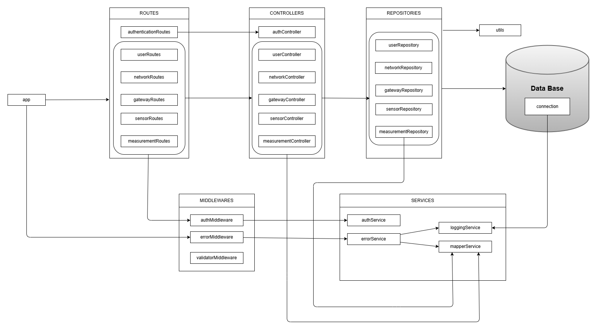
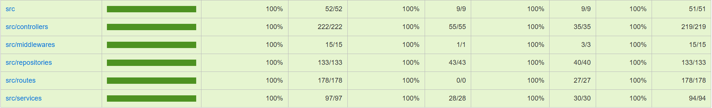

# Test Report

<The goal of this document is to explain how the application was tested, detailing how the test cases were defined and what they cover>

# Contents

- [Test Report](#test-report)
- [Contents](#contents)
- [Dependency graph](#dependency-graph)
- [Integration approach](#integration-approach)
- [Tests](#tests)
- [Coverage](#coverage)
  - [Coverage of FR](#coverage-of-fr)
  - [Coverage white box](#coverage-white-box)

# Dependency graph

# Integration approach

**General approach:**

Abbiamo adottato un approcciodi tipo Bottom-Up, combinando tecniche white-box e black-box, seguendo una progressione strutturata:

Bottom-Up white-box per unit test e integration test interni (Repository/Service → Controller → Route), e black-box per i test end-to-end.

Questo ci ha permesso di testare in modo approfondito sia le singole componenti, sia il sistema nel suo insieme, assicurandoci che tutto funzionasse correttamente sia a livello interno che dal punto di vista dell’utente.

**Vantaggi**

• Affidabilità progressiva: ogni componente viene testata singolarmente prima di essere integrata, riducendo il rischio di errori non localizzati.

• Copertura completa: combinando white-box e black-box, abbiamo ottenuto una copertura sia della logica interna che del comportamento esterno del sistema.

• Individuazione rapida degli errori: i test white-box aiutano a trovare bug a livello di implementazione, mentre i test end-to-end evidenziano problemi nei flussi reali.

**Svantaggi**

• Tempo e complessità maggiori: scrivere test su più livelli (unitari, di integrazione e e2e) richiede più tempo e gestione accurata dei casi.

• Manutenzione: modifiche interne possono richiedere aggiornamenti su più livelli di test, specie quelli white-box.

• E2E più lenti e fragili: i test end-to-end, pur essendo utili, sono spesso più lenti da eseguire e più sensibili a cambiamenti nei dati.

• Limitata visione d'insieme: non permette di avere una visione d’insieme immediata su come le diverse componenti interagiscono tra loro, almeno fino a quando non si arriva ai test delle parti più esterne del sistema.

**Sequenza di testing:**

**Step 1:**
Unit testing (white-box) delle Repositories e dei Services, testando in isolamento i metodi che interagiscono con il database e le funzioni che implementano la logica di business.

**Step 2:**
Integration testing (white-box) dei Controllers, verificandone il comportamento integrato con i Services.

**Step 3:**
Integration testing (white-box) delle Routes, testando i flussi tra Route, Controller e Repository.

**Step 4:**
End-to-End testing (black-box), che hanno permesso di validare i flussi di controllo e di verificare, in ambiente non grafico, le funzionalità offerte dal back-end e confrontando i risultati ottenuti con quelli attesi, senza conoscere l’implementazione interna.

# Tests

### DAO unit test

|                  Test case name                   |   Object(s) tested    | Test level |     Technique used     |
| :-----------------------------------------------: | :-------------------: | :--------: | :--------------------: |
|              **User DAO unit test**               |                       |            |                        |
|               Create user - success               |    UserRepository     |    Unit    | WB/ Statement Coverage |
|                Create user - error                |    UserRepository     |    Unit    |      WB/ Boundary      |
|          Find user by username - success          |    UserRepository     |    Unit    | WB/ Statement Coverage |
|           Find user by username - error           |    UserRepository     |    Unit    |      WB/ Boundary      |
|              Get all users - success              |    UserRepository     |    Unit    | WB/ Statement Coverage |
|               Get all users - error               |    UserRepository     |    Unit    |      WB/ Boundary      |
|               Delete user - success               |    UserRepository     |    Unit    | WB/ Statement Coverage |
|                Delete user -error                 |    UserRepository     |    Unit    |   WB/ Boundary - EP    |
|           **Measurement DAO unit test**           |                       |            |                        |
|           Create measurement - success            | MeasurementRepository |    Unit    | WB/ Statement Coverage |
|            Create measurement - error             | MeasurementRepository |    Unit    |      WB/ Boundary      |
|       Get measurement by network - success        | MeasurementRepository |    Unit    | WB/ Statement Coverage |
|        Get measurement by network - error         | MeasurementRepository |    Unit    |      WB/ Boundary      |
| Get measurement by network with filters - success | MeasurementRepository |    Unit    | WB/ Statement Coverage |
|  Get measurement by network with filters - error  | MeasurementRepository |    Unit    |      WB/ Boundary      |
|        Get measurement by sensor - success        | MeasurementRepository |    Unit    | WB/ Statement Coverage |
|         Get measurement by sensor - error         | MeasurementRepository |    Unit    |      WB/ Boundary      |
| Get measurement by sensor with filters - success  | MeasurementRepository |    Unit    | WB/ Statement Coverage |
|  Get measurement by sensor with filters - error   | MeasurementRepository |    Unit    |      WB/ Boundary      |
|             **Network DAO unit test**             |                       |            |
|             Create network - success              |   NetworkRepository   |    Unit    | WB/ Statement Coverage |
|              Create network - error               |   NetworkRepository   |    Unit    |      WB/ Boundary      |
|            Get all networks - success             |   NetworkRepository   |    Unit    | WB/ Statement Coverage |
|             Get all networks - error              |   NetworkRepository   |    Unit    |      WB/ Boundary      |
|           Get network by code - success           |   NetworkRepository   |    Unit    | WB/ Statement Coverage |
|            Get network by code - error            |   NetworkRepository   |    Unit    |      WB/ Boundary      |
|             Update network - success              |   NetworkRepository   |    Unit    | WB/ Statement Coverage |
|              Update network - error               |   NetworkRepository   |    Unit    |      WB/ Boundary      |
|             Delete network - success              |   NetworkRepository   |    Unit    | WB/ Statement Coverage |
|              Delete network - error               |   NetworkRepository   |    Unit    |      WB/ Boundary      |
|             **Gateway DAO unit test**             |                       |            |
|             Create gateway - success              |   GatewayRepository   |    Unit    | WB/ Statement Coverage |
|              Create gateway - error               |   GatewayRepository   |    Unit    |      WB/ Boundary      |
|            Get all gateways - success             |   GatewayRepository   |    Unit    | WB/ Statement Coverage |
|             Get all gateways - error              |   GatewayRepository   |    Unit    |      WB/ Boundary      |
|        Get gateway by macAddress - success        |   GatewayRepository   |    Unit    | WB/ Statement Coverage |
|         Get gateway by macAddress - error         |   GatewayRepository   |    Unit    |      WB/ Boundary      |
|             Update gateway - success              |   GatewayRepository   |    Unit    | WB/ Statement Coverage |
|              Update gateway - error               |   GatewayRepository   |    Unit    |      WB/ Boundary      |
|             Delete gateway - success              |   GatewayRepository   |    Unit    | WB/ Statement Coverage |
|              Delete gateway - error               |   GatewayRepository   |    Unit    |      WB/ Boundary      |
|             **Sensor DAO unit test**              |                       |            |
|              Create sensor - success              |   SensorRepository    |    Unit    | WB/ Statement Coverage |
|               Create sensor - error               |   SensorRepository    |    Unit    |      WB/ Boundary      |
|        Get sensor by macAddress - success         |   SensorRepository    |    Unit    | WB/ Statement Coverage |
|         Get sensor by macAddress - error          |   SensorRepository    |    Unit    |      WB/ Boundary      |
|       Get all sensors by network - success        |   SensorRepository    |    Unit    | WB/ Statement Coverage |
|        Get all sensors by network - error         |   SensorRepository    |    Unit    |      WB/ Boundary      |
|              Update sensor - success              |   SensorRepository    |    Unit    | WB/ Statement Coverage |
|               Update sensor - error               |   SensorRepository    |    Unit    |      WB/ Boundary      |
|              Delete sensor - success              |   SensorRepository    |    Unit    | WB/ Statement Coverage |
|               Delete sensor - error               |   SensorRepository    |    Unit    |      WB/ Boundary      |

### INTEGRATION TEST - CONTROLLER

|                        Test case name                         |                   Object(s) tested                   | Test level  |        Technique used        |
| :-----------------------------------------------------------: | :--------------------------------------------------: | :---------: | :--------------------------: |
|             **User Controller Integration test**              |                                                      |             |
|                     Create user - success                     |        UserController + Utils + mapperService        | Integration |    WB/ Statement Coverage    |
|                      Create user - error                      |        UserController + Utils + mapperService        | Integration |         WB/ Boundary         |
|                Get user by username - success                 |        UserController + Utils + mapperService        | Integration |    WB/ Statement Coverage    |
|                 Get user by username - error                  |        UserController + Utils + mapperService        | Integration |         WB/ Boundary         |
|                    Get all users - success                    |        UserController + Utils + mapperService        | Integration |    WB/ Statement Coverage    |
|                     Get all users - error                     |        UserController + Utils + mapperService        | Integration |         WB/ Boundary         |
|                     Delete user - success                     |        UserController + Utils + mapperService        | Integration |    WB/ Statement Coverage    |
|                      Delete user - error                      |        UserController + Utils + mapperService        | Integration |         WB/ Boundary         |
|              MapperService integration - success              |        UserController + Utils + mapperService        | Integration |    WB/ Statement Coverage    |
|               MapperService integration - error               |        UserController + Utils + mapperService        | Integration |         WB/ Boundary         |
|      Gestione caratteri speciali nell'username - success      |        UserController + Utils + mapperService        | Integration |    WB/ Statement Coverage    |
|       Gestione caratteri speciali nell'username - error       |        UserController + Utils + mapperService        | Integration |         WB/ Boundary         |
|              Gestione username lunghi - success               |        UserController + Utils + mapperService        | Integration |    WB/ Statement Coverage    |
|               Gestione username lunghi - error                |        UserController + Utils + mapperService        | Integration |         WB/ Boundary         |
|          **Measurement Controller Integration test**          |                                                      |             |
|               getMeasurementsByNetwork: success               |    MeasurementController + Utils + mapperService     |    Unit     |    WB/ Statement Coverage    |
|    getMeasurementsByNetwork: success (con filtri per date)    |    MeasurementController + Utils + mapperService     |    Unit     |         WB/ Boundary         |
| getMeasurementsByNetwork: success (con filtri per sensorMacs) |    MeasurementController + Utils + mapperService     |    Unit     | WB/ Equivalence Partitioning |
|         getMeasurementsByNetwork: network inesistente         |    MeasurementController + Utils + mapperService     |    Unit     |         WB/ Boundary         |
| getMeasurementsByNetwork: nessun sensore associato alla rete  |    MeasurementController + Utils + mapperService     |    Unit     |    WB/ Statement Coverage    |
|               getMeasurementsBySensor: success                |    MeasurementController + Utils + mapperService     |    Unit     |    WB/ Statement Coverage    |
|    getMeasurementsBySensor: success (con filtri per date)     |    MeasurementController + Utils + mapperService     |    Unit     |         WB/ Boundary         |
|          getMeasurementsBySensor: sensor inesistente          |    MeasurementController + Utils + mapperService     |    Unit     |         WB/ Boundary         |
|                  getStatsByNetwork: success                   |    MeasurementController + Utils + mapperService     |    Unit     |    WB/ Statement Coverage    |
|       getStatsByNetwork: success (con filtri per date)        |    MeasurementController + Utils + mapperService     |    Unit     |         WB/ Boundary         |
|    getStatsByNetwork: success (con filtri per sensorMacs)     |    MeasurementController + Utils + mapperService     |    Unit     | WB/ Equivalence Partitioning |
|            getStatsByNetwork: network inesistente             |    MeasurementController + Utils + mapperService     |    Unit     |         WB/ Boundary         |
|                   getStatsBySensor: success                   |    MeasurementController + Utils + mapperService     |    Unit     |    WB/ Statement Coverage    |
|        getStatsBySensor: success (con filtri per date)        |    MeasurementController + Utils + mapperService     |    Unit     |         WB/ Boundary         |
|             getStatsBySensor: sensor inesistente              |    MeasurementController + Utils + mapperService     |    Unit     |         WB/ Boundary         |
|                 getOutliersByNetwork: success                 |    MeasurementController + Utils + mapperService     |    Unit     |    WB/ Statement Coverage    |
|      getOutliersByNetwork: success (con filtri per date)      |    MeasurementController + Utils + mapperService     |    Unit     |         WB/ Boundary         |
|   getOutliersByNetwork: success (con filtri per sensorMacs)   |    MeasurementController + Utils + mapperService     |    Unit     | WB/ Equivalence Partitioning |
|           getOutliersByNetwork: network inesistente           |    MeasurementController + Utils + mapperService     |    Unit     |         WB/ Boundary         |
|                 getOutliersBySensor: success                  |    MeasurementController + Utils + mapperService     |    Unit     |    WB/ Statement Coverage    |
|      getOutliersBySensor: success (con filtri per date)       |    MeasurementController + Utils + mapperService     |    Unit     |         WB/ Boundary         |
|            getOutliersBySensor: sensor inesistente            |    MeasurementController + Utils + mapperService     |    Unit     |         WB/ Boundary         |
|                  createMeasurement: success                   |    MeasurementController + Utils + mapperService     |    Unit     |    WB/ Statement Coverage    |
|             createMeasurement: sensor inesistente             |    MeasurementController + Utils + mapperService     |    Unit     |         WB/ Boundary         |
|           createMeasurement: errore nel repository            |    MeasurementController + Utils + mapperService     |    Unit     |         WB/ Boundary         |
|            **Network Controller Integration test**            |                                                      |             |
|                      Create network: ok                       |      NetworkController + Utils + mapperService       | Integration |    WB/ Statement Coverage    |
|          Create network: ok, solo campi oWBligatori           |      NetworkController + Utils + mapperService       | Integration |    WB/ Statement Coverage    |
|              Create network: code already in use              |      NetworkController + Utils + mapperService       | Integration | WB/ Equivalence Partitioning |
|               Get all networks: ok, array vuoto               |      NetworkController + Utils + mapperService       | Integration |    WB/ Statement Coverage    |
|              Get all networks: ok, tre networks               |      NetworkController + Utils + mapperService       | Integration |    WB/ Statement Coverage    |
|            Get specific network: ok, tutti i campi            |      NetworkController + Utils + mapperService       | Integration |    WB/ Statement Coverage    |
|               Get specific network: ok, no name               |      NetworkController + Utils + mapperService       | Integration |    WB/ Statement Coverage    |
|        Get specific network: ok, no name & description        |      NetworkController + Utils + mapperService       | Integration |    WB/ Statement Coverage    |
|             Get specific network: code not found              |      NetworkController + Utils + mapperService       | Integration |         WB/ Boundary         |
|          Update network: ok, cambio campi opzionali           |      NetworkController + Utils + mapperService       | Integration |    WB/ Statement Coverage    |
|           Update network: ok, cambio tutti i campi            |      NetworkController + Utils + mapperService       | Integration |    WB/ Statement Coverage    |
|                Update network: code not found                 |      NetworkController + Utils + mapperService       | Integration |         WB/ Boundary         |
|               Update network: code already used               |      NetworkController + Utils + mapperService       | Integration | WB/ Equivalence Partitioning |
|                      Delete network: ok                       |      NetworkController + Utils + mapperService       | Integration |    WB/ Statement Coverage    |
|                Delete network: code not found                 |      NetworkController + Utils + mapperService       | Integration |         WB/ Boundary         |
|            **Gateway Controller Integration test**            |                                                      |             |
|                    Create Gateway: success                    |      GatewayController + Utils + mapperService       |    Unit     |    WB/ Statement Coverage    |
|              Create Gateway: network inesistente              |      GatewayController + Utils + mapperService       |    Unit     |         WB/ Boundary         |
|           Create Gateway: macAddress già esistente            |      GatewayController + Utils + mapperService       |    Unit     | WB/ Equivalence Partitioning |
|            Create Gateway: Errore nella repository            |      GatewayController + Utils + mapperService       |    Unit     |         WB/ Boundary         |
|                   Get All Gateways: success                   |      GatewayController + Utils + mapperService       |    Unit     |    WB/ Statement Coverage    |
| Get All Gateways: network senza gateways ritorna array vuoto  |      GatewayController + Utils + mapperService       |    Unit     |    WB/ Statement Coverage    |
|             Get All Gateways: network inesistente             |      GatewayController + Utils + mapperService       |    Unit     |         WB/ Boundary         |
|           Get All Gateways: Errore nella repository           |      GatewayController + Utils + mapperService       |    Unit     |         WB/ Boundary         |
|              Get Gateway By MacAddress: success               |      GatewayController + Utils + mapperService       |    Unit     |    WB/ Statement Coverage    |
|        Get Gateway By MacAddress: network inesistente         |      GatewayController + Utils + mapperService       |    Unit     |         WB/ Boundary         |
|        Get Gateway By MacAddress: gateway inesistente         |      GatewayController + Utils + mapperService       |    Unit     |         WB/ Boundary         |
|      Get Gateway By MacAddress: Errore nella repository       |      GatewayController + Utils + mapperService       |    Unit     |         WB/ Boundary         |
|                    Delete Gateway: success                    |      GatewayController + Utils + mapperService       |    Unit     |    WB/ Statement Coverage    |
|              Delete Gateway: network inesistente              |      GatewayController + Utils + mapperService       |    Unit     |         WB/ Boundary         |
|              Delete Gateway: gateway inesistente              |      GatewayController + Utils + mapperService       |    Unit     |         WB/ Boundary         |
|            Delete Gateway: Errore nella repository            |      GatewayController + Utils + mapperService       |    Unit     |         WB/ Boundary         |
|                    Update Gateway: success                    |      GatewayController + Utils + mapperService       |    Unit     |    WB/ Statement Coverage    |
|           Update Gateway senza cambiare macAddress            |      GatewayController + Utils + mapperService       |    Unit     |    WB/ Statement Coverage    |
|              Update Gateway: network inesistente              |      GatewayController + Utils + mapperService       |    Unit     |         WB/ Boundary         |
|            Update Gateway: macAddress inesistente             |      GatewayController + Utils + mapperService       |    Unit     |         WB/ Boundary         |
|                **Sensor Controller unit test**                |                                                      |             |
|                    getAllSensors: success                     |       SensorController + Utils + mapperService       |    Unit     |    WB/ Statement Coverage    |
| getAllSensors: success (nessun sensore associato al gateway)  |       SensorController + Utils + mapperService       |    Unit     |    WB/ Statement Coverage    |
|              getAllSensors: network inesistente               |       SensorController + Utils + mapperService       |    Unit     |         WB/ Boundary         |
|              getAllSensors: gateway inesistente               |       SensorController + Utils + mapperService       |    Unit     |         WB/ Boundary         |
|                      getSensor: success                       |       SensorController + Utils + mapperService       |    Unit     |    WB/ Statement Coverage    |
|                getSensor: network inesistente                 |       SensorController + Utils + mapperService       |    Unit     |         WB/ Boundary         |
|                getSensor: gateway inesistente                 |       SensorController + Utils + mapperService       |    Unit     |         WB/ Boundary         |
|                 getSensor: sensor inesistente                 |       SensorController + Utils + mapperService       |    Unit     |         WB/ Boundary         |
|                     createSensor: success                     |       SensorController + Utils + mapperService       |    Unit     |    WB/ Statement Coverage    |
|               createSensor: network inesistente               |       SensorController + Utils + mapperService       |    Unit     |         WB/ Boundary         |
|               createSensor: gateway inesistente               |       SensorController + Utils + mapperService       |    Unit     |         WB/ Boundary         |
|            createSensor: macAddress già esistente             |       SensorController + Utils + mapperService       |    Unit     | WB/ Equivalence Partitioning |
|                     deleteSensor: success                     |       SensorController + Utils + mapperService       |    Unit     |    WB/ Statement Coverage    |
|               deleteSensor: network inesistente               |       SensorController + Utils + mapperService       |    Unit     |         WB/ Boundary         |
|               deleteSensor: gateway inesistente               |       SensorController + Utils + mapperService       |    Unit     |         WB/ Boundary         |
|               deleteSensor: sensor inesistente                |       SensorController + Utils + mapperService       |    Unit     |         WB/ Boundary         |
|                     updateSensor: success                     |       SensorController + Utils + mapperService       |    Unit     |    WB/ Statement Coverage    |
|               updateSensor: network inesistente               |       SensorController + Utils + mapperService       |    Unit     |         WB/ Boundary         |
|               updateSensor: gateway inesistente               |       SensorController + Utils + mapperService       |    Unit     |         WB/ Boundary         |
|               updateSensor: sensor inesistente                |       SensorController + Utils + mapperService       |    Unit     |         WB/ Boundary         |
|            updateSensor: macAddress già esistente             |       SensorController + Utils + mapperService       |    Unit     | WB/ Equivalence Partitioning |
|             **Auth Controller Integration test**              |                                                      |             |
|                    Create token - success                     | AuthController + Utils + mapperService + AuthService | Integration |    WB/ Statement Coverage    |
|                Create token - invalid password                | AuthController + Utils + mapperService + AuthService | Integration |         WB/ Boundary         |

### INTEGRATION TEST - ROUTES

|               Test case name                |          Object(s) tested          | Test level  |       Technique used        |
| :-----------------------------------------: | :--------------------------------: | :---------: | :-------------------------: |
|      **User Routes integration test**       |                                    |             |
|            Create user - success            |    UserRoutes + AuthMiddleware     | Integration |   WB/ Statement Coverage    |
|             Create user - error             |    UserRoutes + AuthMiddleware     | Integration |      WB/ Boundary - EP      |
|           Get all users - success           |    UserRoutes + AuthMiddleware     | Integration |   WB/ Statement Coverage    |
|            Get all users - error            |    UserRoutes + AuthMiddleware     | Integration |        WB/ Boundary         |
|       Get user by username - success        |    UserRoutes + AuthMiddleware     | Integration | WB/ Statement Coverage - EP |
|        Get user by username - error         |    UserRoutes + AuthMiddleware     | Integration |        WB/ Boundary         |
|            Delete user - success            |    UserRoutes + AuthMiddleware     | Integration |   WB/ Statement Coverage    |
|             Delete user - error             |    UserRoutes + AuthMiddleware     | Integration |      WB/ Boundary - EP      |
|   **Measurement Routes integration test**   |                                    |             |                             |
|        Create measurement - success         | MeasurementRoutes + AuthMiddleware | Integration |   WB/ Statement Coverage    |
|         Create measurement - error          | MeasurementRoutes + AuthMiddleware | Integration |        WB/ Boundary         |
|    Get measurement by network - success     | MeasurementRoutes + AuthMiddleware | Integration |   WB/ Statement Coverage    |
|     Get measurement by network - error      | MeasurementRoutes + AuthMiddleware | Integration |        WB/ Boundary         |
|     Get measurement by sensor - success     | MeasurementRoutes + AuthMiddleware | Integration |   WB/ Statement Coverage    |
|      Get measurement by sensor - error      | MeasurementRoutes + AuthMiddleware | Integration |        WB/ Boundary         |
|     Get Stats by Network Code - success     | MeasurementRoutes + AuthMiddleware | Integration |   WB/ Statement Coverage    |
|      Get Stats by Network Code - error      | MeasurementRoutes + AuthMiddleware | Integration |        WB/ Boundary         |
|  Get Stats by Sensor MacAddress - success   | MeasurementRoutes + AuthMiddleware | Integration |   WB/ Statement Coverage    |
|   Get Stats by Sensor MacAddress - error    | MeasurementRoutes + AuthMiddleware | Integration |        WB/ Boundary         |
|   Get Outliers by Network Code - success    | MeasurementRoutes+ AuthMiddleware  | Integration |   WB/ Statement Coverage    |
|    Get Outliers by Network Code - error     | MeasurementRoutes + AuthMiddleware | Integration |        WB/ Boundary         |
| Get Outliers by Sensor MacAddress - success | MeasurementRoutes + AuthMiddleware | Integration |   WB/ Statement Coverage    |
|  Get Outliers by Sensor MacAddress - error  | MeasurementRoutes + AuthMiddleware | Integration |        WB/ Boundary         |
|     **Network Routes integration test**     |                                    |             |
|          Create network - success           |   NetworkRoutes + AuthMiddleware   | Integration |   WB/ Statement Coverage    |
|           Create network - error            |   NetworkRoutes + AuthMiddleware   | Integration |      WB/ Boundary - EP      |
|         Get all networks - success          |   NetworkRoutes + AuthMiddleware   | Integration |   WB/ Statement Coverage    |
|          Get all networks - error           |   NetworkRoutes + AuthMiddleware   | Integration |        WB/ Boundary         |
|        Get network by code - success        |   NetworkRoutes + AuthMiddleware   | Integration |   WB/ Statement Coverage    |
|         Get network by code - error         |   NetworkRoutes + AuthMiddleware   | Integration |        WB/ Boundary         |
|          Update network - success           |   NetworkRoutes + AuthMiddleware   | Integration |   WB/ Statement Coverage    |
|           Update network - error            |   NetworkRoutes + AuthMiddleware   | Integration |      WB/ Boundary - EP      |
|          Delete network - success           |   NetworkRoutes + AuthMiddleware   | Integration |   WB/ Statement Coverage    |
|           Delete network - error            |   NetworkRoutes + AuthMiddleware   | Integration |        WB/ Boundary         |
|     **Gateway Routes integration test**     |                                    |             |
|          Create Gateway - success           |   GatewayRoutes + AuthMiddleware   | Integration |   WB/ Statement Coverage    |
|           Create Gateway - error            |   GatewayRoutes + AuthMiddleware   | Integration |      WB/ Boundary - EP      |
|         Get All Gateways - success          |   GatewayRoutes + AuthMiddleware   | Integration |   WB/ Statement Coverage    |
|          Get All Gateways - error           |   GatewayRoutes + AuthMiddleware   | Integration |        WB/ Boundary         |
|     Get Gateway By MacAddress - success     |   GatewayRoutes + AuthMiddleware   | Integration |   WB/ Statement Coverage    |
|      Get Gateway By MacAddress - error      |   GatewayRoutes + AuthMiddleware   | Integration |        WB/ Boundary         |
|          Update Gateway - success           |   GatewayRoutes + AuthMiddleware   | Integration |   WB/ Statement Coverage    |
|           Update Gateway - error            |   GatewayRoutes + AuthMiddleware   | Integration |      WB/ Boundary - EP      |
|          Delete Gateway - success           |   GatewayRoutes + AuthMiddleware   | Integration |   WB/ Statement Coverage    |
|           Delete Gateway - error            |   GatewayRoutes + AuthMiddleware   | Integration |        WB/ Boundary         |
|     **Sensor Routes integration test**      |                                    |             |
|           Create Sensor - success           |   SensorRoutes + AuthMiddleware    | Integration |   WB/ Statement Coverage    |
|            Create Sensor - error            |   SensorRoutes + AuthMiddleware    | Integration |      WB/ Boundary -EP       |
|          Get All Sensors - success          |   SensorRoutes + AuthMiddleware    | Integration |   WB/ Statement Coverage    |
|           Get All Sensors - error           |   SensorRoutes + AuthMiddleware    | Integration |        WB/ Boundary         |
|            Get Sensor - success             |   SensorRoutes + AuthMiddleware    | Integration |   WB/ Statement Coverage    |
|             Get Sensor - error              |   SensorRoutes + AuthMiddleware    | Integration |        WB/ Boundary         |
|           Delete Sensor - success           |   SensorRoutes + AuthMiddleware    | Integration |   WB/ Statement Coverage    |
|            Delete Sensor - error            |   SensorRoutes + AuthMiddleware    | Integration |        WB/ Boundary         |
|           Update Sensor - success           |   SensorRoutes + AuthMiddleware    | Integration |   WB/ Statement Coverage    |
|            Update Sensor - error            |   SensorRoutes + AuthMiddleware    | Integration |      WB/ Boundary - EP      |
| **Authentication Routes integration test**  |                                    |             |
|           Authenticate - success            |        AuthenticationRoutes        | Integration |   WB/ Statement Coverage    |
|            Authenticate - error             |        AuthenticationRoutes        | Integration |        WB/ Boundary         |

### E2E TEST

|              Test case name               |                                                Object(s) tested                                                | Test level |  Technique used   |
| :---------------------------------------: | :------------------------------------------------------------------------------------------------------------: | :--------: | :---------------: |
|            **Users E2E test**             |                                                                                                                |            |                   |
|          Get All Users - success          |                     UsersRoutes + Middlewares + Services + UserRepository + UserController                     |    E2E     | BB/ Boundary - EP |
|           Get All Users - error           |                     UsersRoutes + Middlewares + Services + UserRepository + UserController                     |    E2E     | BB/ Boundary - EP |
|           Create user - success           |                     UsersRoutes + Middlewares + Services + UserRepository + UserController                     |    E2E     | BB/ Boundary - EP |
|            Create user - error            |                     UsersRoutes + Middlewares + Services + UserRepository + UserController                     |    E2E     | BB/ Boundary - EP |
|            Get User - success             |                     UsersRoutes + Middlewares + Services + UserRepository + UserController                     |    E2E     | BB/ Boundary - EP |
|             Get User - error              |                     UsersRoutes + Middlewares + Services + UserRepository + UserController                     |    E2E     | BB/ Boundary - EP |
|           Delete user - success           |                     UsersRoutes + Middlewares + Services + UserRepository + UserController                     |    E2E     | BB/ Boundary - EP |
|            Delete user - error            |                     UsersRoutes + Middlewares + Services + UserRepository + UserController                     |    E2E     | BB/ Boundary - EP |
|               Auth - error                |                     UsersRoutes + Middlewares + Services + UserRepository + UserController                     |    E2E     | BB/ Boundary - EP |
|     Gestione user lifecycle completo      |                     UsersRoutes + Middlewares + Services + UserRepository + UserController                     |    E2E     | BB/ Boundary - EP |
| Gestione creazioni/cancellazioni multiple |                     UsersRoutes + Middlewares + Services + UserRepository + UserController                     |    E2E     | BB/ Boundary - EP |
|         **Measurements E2E test**         |                                                                                                                |            |
|      Get all measurements - success       | MeasurementsRoutes + Middlewares + Services + MeasurementRepository + MeasurementController + SensorRepository |    E2E     | BB/ Boundary - EP |
|       Get all measurements - error        | MeasurementsRoutes + Middlewares + Services + MeasurementRepository + MeasurementController + SensorRepository |    E2E     | BB/ Boundary - EP |
|       Create measurement - success        | MeasurementsRoutes + Middlewares + Services + MeasurementRepository + MeasurementController + SensorRepository |    E2E     | BB/ Boundary - EP |
|        Create measurement - error         | MeasurementsRoutes + Middlewares + Services + MeasurementRepository + MeasurementController + SensorRepository |    E2E     | BB/ Boundary - EP |
|    Get measurement by sensor - success    | MeasurementsRoutes + Middlewares + Services + MeasurementRepository + MeasurementController + SensorRepository |    E2E     | BB/ Boundary - EP |
|     Get measurement by sensor - error     | MeasurementsRoutes + Middlewares + Services + MeasurementRepository + MeasurementController + SensorRepository |    E2E     | BB/ Boundary - EP |
|      Get stats by network - success       | MeasurementsRoutes + Middlewares + Services + MeasurementRepository + MeasurementController + SensorRepository |    E2E     | BB/ Boundary - EP |
|       Get stats by network - error        | MeasurementsRoutes + Middlewares + Services + MeasurementRepository + MeasurementController + SensorRepository |    E2E     | BB/ Boundary - EP |
|       Get stats by sensor - success       | MeasurementsRoutes + Middlewares + Services + MeasurementRepository + MeasurementController + SensorRepository |    E2E     | BB/ Boundary - EP |
|        Get stats by sensor - error        | MeasurementsRoutes + Middlewares + Services + MeasurementRepository + MeasurementController + SensorRepository |    E2E     | BB/ Boundary - EP |
|     Get outliers by network - success     | MeasurementsRoutes + Middlewares + Services + MeasurementRepository + MeasurementController + SensorRepository |    E2E     | BB/ Boundary - EP |
|      Get outliers by network - error      | MeasurementsRoutes + Middlewares + Services + MeasurementRepository + MeasurementController + SensorRepository |    E2E     | BB/ Boundary - EP |
|     Get outliers by sensor - success      | MeasurementsRoutes + Middlewares + Services + MeasurementRepository + MeasurementController + SensorRepository |    E2E     | BB/ Boundary - EP |
|      Get outliers by sensor - error       | MeasurementsRoutes + Middlewares + Services + MeasurementRepository + MeasurementController + SensorRepository |    E2E     | BB/ Boundary - EP |
|    Gestione ciclo completo misurazioni    | MeasurementsRoutes + Middlewares + Services + MeasurementRepository + MeasurementController + SensorRepository |    E2E     | BB/ Boundary - EP |
| Gestione creazioni/cancellazioni multiple | MeasurementsRoutes + Middlewares + Services + MeasurementRepository + MeasurementController + SensorRepository |    E2E     | BB/ Boundary - EP |
|           **Networks E2E test**           |                                                                                                                |            |
|        Get all networks - success         |                NetworksRoutes + Middlewares + Services + NetworkRepository + NetworkController                 |    E2E     | BB/ Boundary - EP |
|         Get all networks - error          |                NetworksRoutes + Middlewares + Services + NetworkRepository + NetworkController                 |    E2E     | BB/ Boundary - EP |
|         Create network - success          |                NetworksRoutes + Middlewares + Services + NetworkRepository + NetworkController                 |    E2E     | BB/ Boundary - EP |
|          Create network - error           |                NetworksRoutes + Middlewares + Services + NetworkRepository + NetworkController                 |    E2E     | BB/ Boundary - EP |
|       Get network by code - success       |                NetworksRoutes + Middlewares + Services + NetworkRepository + NetworkController                 |    E2E     | BB/ Boundary - EP |
|        Get network by code - error        |                NetworksRoutes + Middlewares + Services + NetworkRepository + NetworkController                 |    E2E     | BB/ Boundary - EP |
|         Delete network - success          |                NetworksRoutes + Middlewares + Services + NetworkRepository + NetworkController                 |    E2E     | BB/ Boundary - EP |
|          Delete network - error           |                NetworksRoutes + Middlewares + Services + NetworkRepository + NetworkController                 |    E2E     | BB/ Boundary - EP |
|         Update network - success          |                NetworksRoutes + Middlewares + Services + NetworkRepository + NetworkController                 |    E2E     | BB/ Boundary - EP |
|          Update network - error           |                NetworksRoutes + Middlewares + Services + NetworkRepository + NetworkController                 |    E2E     | BB/ Boundary - EP |
|           **Gateways E2E test**           |                                                                                                                |            |
|        Get all gateways - success         |      GatewaysRoutes + Middlewares + Services + GatewayRepository + GatewayController + NetworkRepository       |    E2E     | BB/ Boundary - EP |
|         Get all gateways - error          |      GatewaysRoutes + Middlewares + Services + GatewayRepository + GatewayController + NetworkRepository       |    E2E     | BB/ Boundary - EP |
|         Create gateway - success          |      GatewaysRoutes + Middlewares + Services + GatewayRepository + GatewayController + NetworkRepository       |    E2E     | BB/ Boundary - EP |
|          Create gateway - error           |      GatewaysRoutes + Middlewares + Services + GatewayRepository + GatewayController + NetworkRepository       |    E2E     | BB/ Boundary - EP |
|    Get gateway by macAddress - success    |      GatewaysRoutes + Middlewares + Services + GatewayRepository + GatewayController + NetworkRepository       |    E2E     | BB/ Boundary - EP |
|     Get gateway by macAddress - error     |      GatewaysRoutes + Middlewares + Services + GatewayRepository + GatewayController + NetworkRepository       |    E2E     | BB/ Boundary - EP |
|         Update gateway - success          |      GatewaysRoutes + Middlewares + Services + GatewayRepository + GatewayController + NetworkRepository       |    E2E     | BB/ Boundary - EP |
|          Update gateway - error           |      GatewaysRoutes + Middlewares + Services + GatewayRepository + GatewayController + NetworkRepository       |    E2E     | BB/ Boundary - EP |
|         Delete gateway - success          |      GatewaysRoutes + Middlewares + Services + GatewayRepository + GatewayController + NetworkRepository       |    E2E     | BB/ Boundary - EP |
|          Delete gateway - error           |      GatewaysRoutes + Middlewares + Services + GatewayRepository + GatewayController + NetworkRepository       |    E2E     | BB/ Boundary - EP |
|            **Sensor E2E test**            |                                                                                                                |            |
|         Get all sensors - success         |        SensorRoutes + Middlewares + Services + SensorRepository + SensorController + GatewayRepository         |    E2E     | BB/ Boundary - EP |
|          Get all sensors - error          |        SensorRoutes + Middlewares + Services + SensorRepository + SensorController + GatewayRepository         |    E2E     | BB/ Boundary - EP |
|          Create sensor - success          |        SensorRoutes + Middlewares + Services + SensorRepository + SensorController + GatewayRepository         |    E2E     | BB/ Boundary - EP |
|           Create sensor - error           |        SensorRoutes + Middlewares + Services + SensorRepository + SensorController + GatewayRepository         |    E2E     | BB/ Boundary - EP |
|       Get specific sensor - success       |        SensorRoutes + Middlewares + Services + SensorRepository + SensorController + GatewayRepository         |    E2E     | BB/ Boundary - EP |
|        Get specific sensor - error        |        SensorRoutes + Middlewares + Services + SensorRepository + SensorController + GatewayRepository         |    E2E     | BB/ Boundary - EP |
|          Delete sensor - success          |        SensorRoutes + Middlewares + Services + SensorRepository + SensorController + GatewayRepository         |    E2E     | BB/ Boundary - EP |
|           Delete sensor - error           |        SensorRoutes + Middlewares + Services + SensorRepository + SensorController + GatewayRepository         |    E2E     | BB/ Boundary - EP |
|          Update sensor - success          |        SensorRoutes + Middlewares + Services + SensorRepository + SensorController + GatewayRepository         |    E2E     | BB/ Boundary - EP |
|           Update sensor - error           |        SensorRoutes + Middlewares + Services + SensorRepository + SensorController + GatewayRepository         |    E2E     | BB/ Boundary - EP |

# Coverage

## Coverage of FR

<Report in the following table the coverage of functional requirements and scenarios(from official requirements) >

|                   Functional Requirement or scenario                   | Test(s) |
| :--------------------------------------------------------------------: | :-----: |
|                         **FR1 Authentication**                         |         |
|                        FR1.1 Authenticate user                         |   17    |
|                          **FR2 Manage users**                          |         |
|                        FR2.1 Retrieve all users                        |   29    |
|                        FR2.2 Create a new user                         |   40    |
|                     FR2.3 Retrieve a specific user                     |   36    |
|                      FR2.4 Delete a specific user                      |   30    |
|                        **FR3 Manage networks**                         |         |
|                      FR3.1 Retrieve all networks                       |   20    |
|                       FR3.2 Create a new network                       |   28    |
|                   FR3.3 Retrieve a specific network                    |   12    |
|                         FR3.4 Update a network                         |   29    |
|                    FR3.5 Delete a specific network                     |   15    |
|                        **FR4 Manage gateways**                         |         |
|                FR4.1 Retrieve all gateways of a network                |   25    |
|                FR4.2 Create a new gateway for a network                |   36    |
|                   FR4.3 Retrieve a specific gateway                    |   22    |
|                         FR4.4 Update a gateway                         |   32    |
|                    FR4.5 Delete a specific gateway                     |   21    |
|                         **FR5 Manage sensors**                         |         |
|                FR5.1 Retrieve all sensors of a gateway                 |   18    |
|                FR5.2 Create a new sensor for a gateway                 |   24    |
|                    FR5.3 Retrieve a specific sensor                    |   13    |
|                         FR5.4 Update a sensor                          |   20    |
|                     FR5.5 Delete a specific sensor                     |   22    |
|                      **FR6 Manage measurements**                       |         |
| FR6.1 Retrieve measurements for a set of sensors of a specific network |   34    |
|  FR6.2 Retrieve statistics for a set of sensors of a specific network  |   12    |
|   FR6.3 Retrieve outliers for a set of sensors of a specific network   |   12    |
|             FR6.4 Store measurements for a specific sensor             |   17    |
|           FR6.5 Retrieve measurements for a specific sensor            |   22    |
|            FR6.6 Retrieve statistics for a specific sensor             |   14    |
|             FR6.7 Retrieve outliers for a specific sensor              |   12    |
|                                                                        |   612   |

There are other 5 tests for errorService and utils

## Coverage white box

